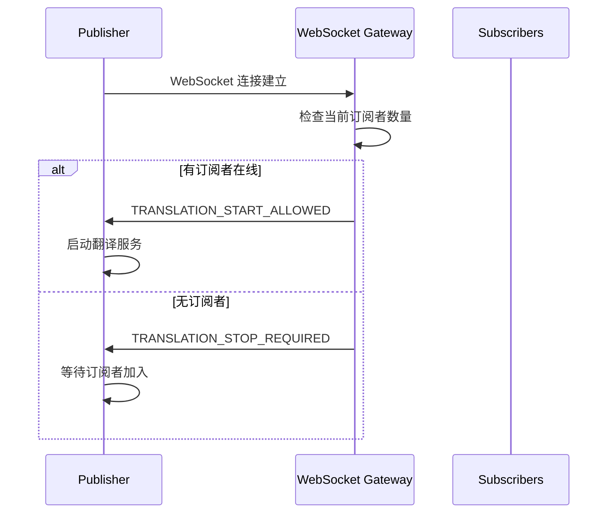
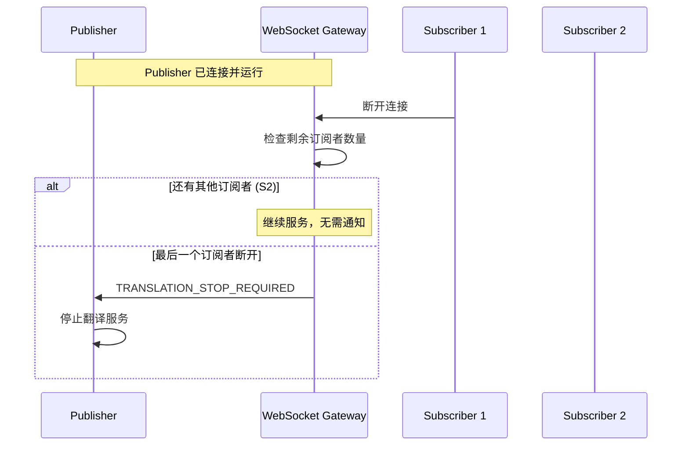

# Publisher 双向通信接口文档

## 概述

本文档描述了 StreamLingua WebSocket Gateway 与 Publisher 之间的双向通信协议。该功能允许系统根据订阅者状态动态控制翻译服务的启动和停止，优化资源使用并提供更好的用户体验。

### 版本信息
- **API 版本**: v1.0
- **协议**: WebSocket
- **消息格式**: JSON

---

## 消息格式

### 控制消息结构

Publisher 将接收到以下格式的控制消息：

```json
{
  "type": "system_control",
  "code": "TRANSLATION_START_ALLOWED" | "TRANSLATION_STOP_REQUIRED",
  "message": "描述性消息"
}
```

#### 字段说明

| 字段 | 类型 | 必需 | 说明 |
|------|------|------|------|
| `type` | string | ✅ | 固定值：`"system_control"` |
| `code` | string | ✅ | 控制代码，详见下表 |
| `message` | string | ✅ | 人类可读的描述信息 |

#### 控制代码定义

| 代码 | 含义 | 触发时机 | 建议操作 |
|------|------|----------|----------|
| `TRANSLATION_START_ALLOWED` | 允许启动翻译服务 | Publisher 连接时有订阅者在线 | 启动音频处理和翻译服务 |
| `TRANSLATION_STOP_REQUIRED` | 要求停止翻译服务 | 最后一个订阅者断开连接 | 停止音频处理，保持连接但暂停服务 |

---

## 通信流程

### 1. Publisher 连接时检查



### 2. 订阅者动态变化



---

## 代码实现示例

### JavaScript/TypeScript 实现

```typescript
class PublisherClient {
  private websocket: WebSocket;
  private isTranslationActive: boolean = false;
  
  constructor(wsUrl: string, token: string, sessionId: string) {
    this.websocket = new WebSocket(`${wsUrl}?token=${token}&sessionId=${sessionId}`);
    this.setupEventHandlers();
  }
  
  private setupEventHandlers(): void {
    this.websocket.onopen = () => {
      console.log('Publisher connected to WebSocket');
    };
    
    this.websocket.onmessage = (event) => {
      try {
        const message = JSON.parse(event.data);
        this.handleControlMessage(message);
      } catch (error) {
        console.error('Failed to parse WebSocket message:', error);
      }
    };
    
    this.websocket.onerror = (error) => {
      console.error('WebSocket error:', error);
    };
    
    this.websocket.onclose = () => {
      console.log('Publisher disconnected from WebSocket');
      this.stopTranslationService();
    };
  }
  
  private handleControlMessage(message: any): void {
    // 检查是否为系统控制消息
    if (message.type !== 'system_control') {
      return; // 忽略非控制消息
    }
    
    switch (message.code) {
      case 'TRANSLATION_START_ALLOWED':
        console.log('Translation start allowed:', message.message);
        this.startTranslationService();
        break;
        
      case 'TRANSLATION_STOP_REQUIRED':
        console.log('Translation stop required:', message.message);
        this.stopTranslationService();
        break;
        
      default:
        console.warn('Unknown control code:', message.code);
    }
  }
  
  private startTranslationService(): void {
    if (this.isTranslationActive) {
      console.log('Translation service already active');
      return;
    }
    
    console.log('Starting translation service...');
    this.isTranslationActive = true;
    
    // 启动音频捕获
    this.startAudioCapture();
    
    // 启动翻译引擎
    this.startTranslationEngine();
    
    // 开始发送音频和字幕数据
    this.startDataStreaming();
  }
  
  private stopTranslationService(): void {
    if (!this.isTranslationActive) {
      console.log('Translation service already stopped');
      return;
    }
    
    console.log('Stopping translation service...');
    this.isTranslationActive = false;
    
    // 停止音频捕获
    this.stopAudioCapture();
    
    // 停止翻译引擎
    this.stopTranslationEngine();
    
    // 停止数据流
    this.stopDataStreaming();
  }
  
  // 实现具体的启动/停止逻辑
  private startAudioCapture(): void {
    // TODO: 实现音频捕获逻辑
  }
  
  private stopAudioCapture(): void {
    // TODO: 实现停止音频捕获逻辑
  }
  
  private startTranslationEngine(): void {
    // TODO: 实现翻译引擎启动逻辑
  }
  
  private stopTranslationEngine(): void {
    // TODO: 实现翻译引擎停止逻辑
  }
  
  private startDataStreaming(): void {
    // TODO: 实现数据流传输逻辑
  }
  
  private stopDataStreaming(): void {
    // TODO: 实现停止数据流逻辑
  }
}

// 使用示例
const publisher = new PublisherClient(
  'wss://your-gateway.com/ws/publish',
  'your-auth-token',
  'session-id-123'
);
```

### Python 实现

```python
import asyncio
import websockets
import json
import logging

class PublisherClient:
    def __init__(self, ws_url: str, token: str, session_id: str):
        self.ws_url = f"{ws_url}?token={token}&sessionId={session_id}"
        self.websocket = None
        self.is_translation_active = False
        
    async def connect(self):
        """连接到 WebSocket 服务器"""
        try:
            self.websocket = await websockets.connect(self.ws_url)
            logging.info("Publisher connected to WebSocket")
            
            # 开始监听消息
            await self.listen_for_messages()
            
        except Exception as e:
            logging.error(f"Failed to connect: {e}")
            
    async def listen_for_messages(self):
        """监听 WebSocket 消息"""
        try:
            async for message in self.websocket:
                await self.handle_message(message)
        except websockets.exceptions.ConnectionClosed:
            logging.info("WebSocket connection closed")
            await self.stop_translation_service()
            
    async def handle_message(self, message: str):
        """处理接收到的消息"""
        try:
            data = json.loads(message)
            await self.handle_control_message(data)
        except json.JSONDecodeError:
            logging.error("Failed to parse WebSocket message")
            
    async def handle_control_message(self, message: dict):
        """处理控制消息"""
        if message.get('type') != 'system_control':
            return  # 忽略非控制消息
            
        code = message.get('code')
        msg = message.get('message', '')
        
        if code == 'TRANSLATION_START_ALLOWED':
            logging.info(f"Translation start allowed: {msg}")
            await self.start_translation_service()
            
        elif code == 'TRANSLATION_STOP_REQUIRED':
            logging.info(f"Translation stop required: {msg}")
            await self.stop_translation_service()
            
        else:
            logging.warning(f"Unknown control code: {code}")
            
    async def start_translation_service(self):
        """启动翻译服务"""
        if self.is_translation_active:
            logging.info("Translation service already active")
            return
            
        logging.info("Starting translation service...")
        self.is_translation_active = True
        
        # 启动各种服务组件
        await self.start_audio_capture()
        await self.start_translation_engine()
        await self.start_data_streaming()
        
    async def stop_translation_service(self):
        """停止翻译服务"""
        if not self.is_translation_active:
            logging.info("Translation service already stopped")
            return
            
        logging.info("Stopping translation service...")
        self.is_translation_active = False
        
        # 停止各种服务组件
        await self.stop_audio_capture()
        await self.stop_translation_engine()
        await self.stop_data_streaming()
        
    # 实现具体的启动/停止逻辑
    async def start_audio_capture(self):
        # TODO: 实现音频捕获逻辑
        pass
        
    async def stop_audio_capture(self):
        # TODO: 实现停止音频捕获逻辑
        pass
        
    async def start_translation_engine(self):
        # TODO: 实现翻译引擎启动逻辑
        pass
        
    async def stop_translation_engine(self):
        # TODO: 实现翻译引擎停止逻辑
        pass
        
    async def start_data_streaming(self):
        # TODO: 实现数据流传输逻辑
        pass
        
    async def stop_data_streaming(self):
        # TODO: 实现停止数据流逻辑
        pass

# 使用示例
async def main():
    publisher = PublisherClient(
        'wss://your-gateway.com/ws/publish',
        'your-auth-token', 
        'session-id-123'
    )
    await publisher.connect()

if __name__ == "__main__":
    asyncio.run(main())
```

---

## 错误处理

### 常见错误场景

1. **WebSocket 连接失败**
   - 检查网络连接
   - 验证认证 token 是否有效
   - 确认 WebSocket URL 是否正确

2. **消息解析失败**
   - 确保 JSON 格式正确
   - 处理非预期的消息格式

3. **翻译服务启动失败**
   - 记录详细错误信息
   - 向 Gateway 发送错误状态（如果需要）
   - 考虑重试机制

### 错误处理建议

```typescript
// 错误处理示例
private handleControlMessage(message: any): void {
  try {
    if (message.type !== 'system_control') {
      return;
    }
    
    switch (message.code) {
      case 'TRANSLATION_START_ALLOWED':
        this.startTranslationService()
          .catch(error => {
            console.error('Failed to start translation service:', error);
            // 可选：向服务器报告错误状态
            this.reportError('TRANSLATION_START_FAILED', error.message);
          });
        break;
        
      case 'TRANSLATION_STOP_REQUIRED':
        this.stopTranslationService()
          .catch(error => {
            console.error('Failed to stop translation service:', error);
          });
        break;
    }
  } catch (error) {
    console.error('Error handling control message:', error);
  }
}
```

---

## 测试建议

### 1. 单元测试

测试消息处理逻辑：

```typescript
describe('Publisher Control Message Handling', () => {
  let publisher: PublisherClient;
  
  beforeEach(() => {
    publisher = new PublisherClient('ws://test', 'token', 'session');
  });
  
  test('should start translation on TRANSLATION_START_ALLOWED', () => {
    const message = {
      type: 'system_control',
      code: 'TRANSLATION_START_ALLOWED',
      message: 'Test message'
    };
    
    const startSpy = jest.spyOn(publisher, 'startTranslationService');
    publisher.handleControlMessage(message);
    
    expect(startSpy).toHaveBeenCalled();
  });
  
  test('should stop translation on TRANSLATION_STOP_REQUIRED', () => {
    const message = {
      type: 'system_control',
      code: 'TRANSLATION_STOP_REQUIRED',
      message: 'Test message'
    };
    
    const stopSpy = jest.spyOn(publisher, 'stopTranslationService');
    publisher.handleControlMessage(message);
    
    expect(stopSpy).toHaveBeenCalled();
  });
});
```

### 2. 集成测试

建议测试以下场景：

1. **Publisher 先连接，后有 Subscriber 加入**
   - 预期：收到 `TRANSLATION_STOP_REQUIRED`，然后收到 `TRANSLATION_START_ALLOWED`

2. **Publisher 后连接，已有 Subscriber 在线**
   - 预期：立即收到 `TRANSLATION_START_ALLOWED`

3. **多个 Subscriber 逐个断开**
   - 预期：只在最后一个断开时收到 `TRANSLATION_STOP_REQUIRED`

4. **Publisher 断开重连**
   - 预期：重连后根据当前状态收到相应消息

### 3. 压力测试

- 快速的 Subscriber 连接/断开
- 长时间运行测试
- 网络中断和恢复测试

---

## 注意事项

### 重要提醒

1. **状态管理**：确保正确跟踪翻译服务状态，避免重复启动或停止

2. **资源清理**：在收到停止信号时，及时释放音频设备、内存等资源

3. **错误恢复**：实现适当的错误处理和重试机制

4. **日志记录**：记录所有控制消息和状态变化，便于调试

5. **性能优化**：避免频繁的服务启停，考虑使用缓冲机制

### 最佳实践

- 使用异步处理避免阻塞 WebSocket 消息循环
- 实现健康检查机制确保服务状态正确
- 考虑实现降级策略，在部分功能失败时保持基本服务可用
- 定期发送心跳消息维持连接稳定性

---

## 更新日志

| 版本 | 日期 | 变更内容 |
|------|------|----------|
| v1.0 | 2024-01-XX | 初始版本，实现基础双向通信功能 |

---

## 联系方式

如有技术问题或需要支持，请联系：

- **技术支持**: tech-support@streamlingua.com
- **API 文档**: https://docs.streamlingua.com
- **GitHub Issues**: https://github.com/streamlingua/issues

---

*本文档最后更新时间：2024-01-XX*