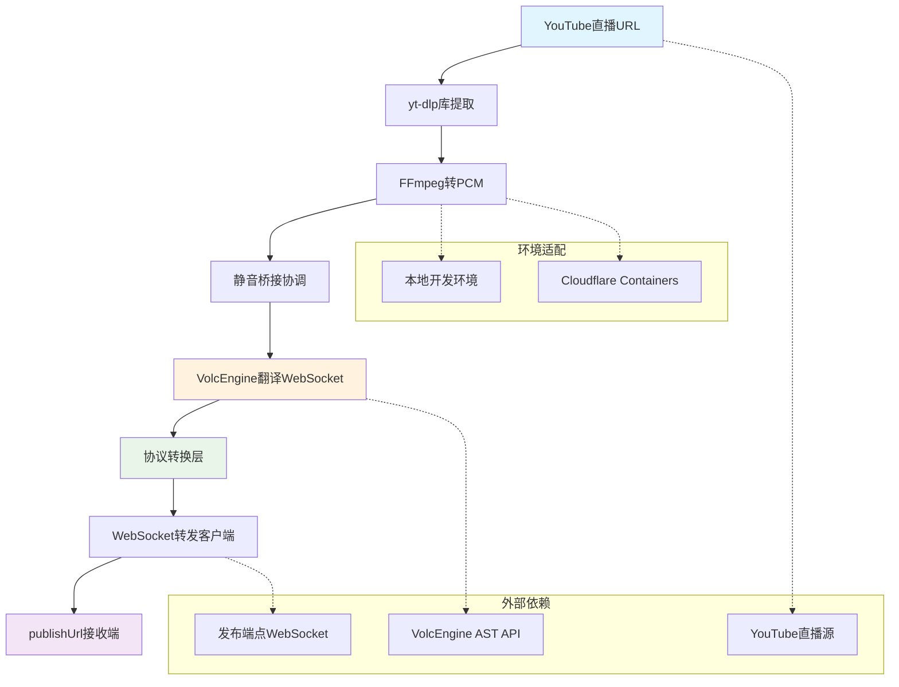
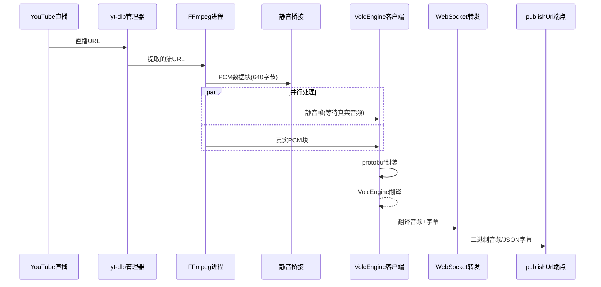
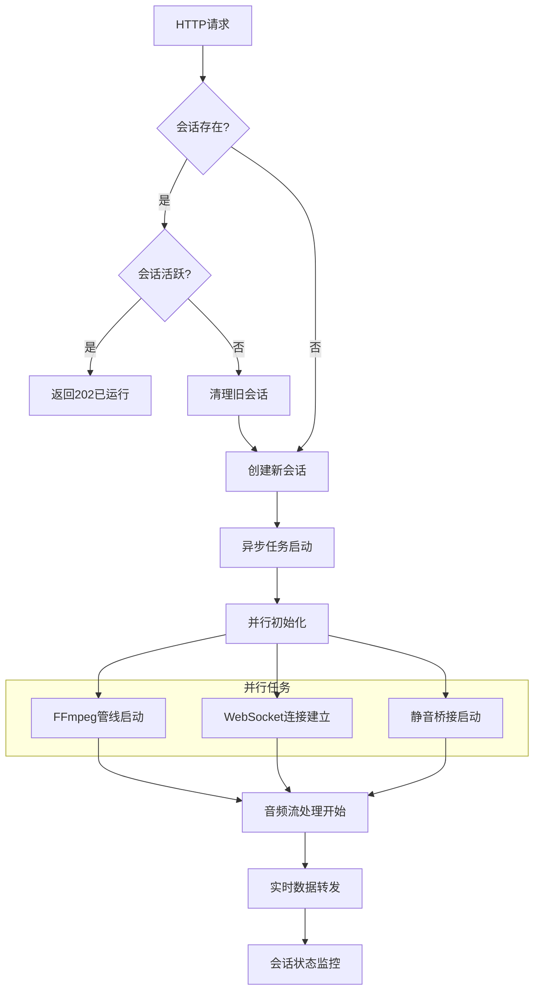

# 系统架构全景图

## 架构概述

`/python/ingest/start` 接口是一个**实时音频流代理服务**，实现了YouTube直播流到WebSocket发布端点的端到端音频翻译管线。系统采用**异步事件驱动架构**，支持本地开发和Cloudflare容器化部署。

## 高层架构图



## 核心组件架构

### 1. 会话管理层
```
FastAPI接口层
├── /python/ingest/start (幂等启动)
├── /python/ingest/stop  (优雅停止)
├── /python/sessions     (状态查询)
└── /python/health       (健康检查)

AudioStreamPublisher (会话管理器)
├── sessions: Dict[str, PublisherSession]
├── start_publishing_session() (幂等操作)
├── stop_publishing_session()  (优雅停止)
└── _cleanup_session()         (资源清理)
```

### 2. YouTube音频提取层
```
YtDlpManager (常驻管理器)
├── ThreadPoolExecutor (专用线程池)
├── warmup() (预热机制)
├── extract_stream_url() (异步URL提取)
└── cleanup() (资源清理)

YouTubeLiveStreamer (FFmpeg处理器)
├── start_streaming_pipeline() (管线启动)
├── _monitor_ffmpeg_stderr()   (日志监控)
├── _monitor_ffmpeg_health()   (健康检查)
└── cleanup() (进程清理)
```

### 3. 音频流处理层
```
PCM数据流管线
├── FFmpeg进程 (YouTube URL → 16kHz PCM)
├── read_pcm_chunks() (640字节块读取)
├── 超时检测 (首块30s，常规10s)
└── 进程健康监控 (实时状态检查)

静音桥接协调
├── SilenceBridge (协调器)
├── audio_ready_event (同步信号)
├── 静音帧生成 (640字节零值)
└── 超时机制 (本地8s，云端18s)
```

### 4. WebSocket通信层
```
VolcEngine协议层
├── 基于protobuf的双向通信
├── 事件序列: StartSession → TaskRequest → FinishSession
├── 音频格式: 16kHz/16bit/mono PCM
└── 认证头部: X-Api-App-Key等4个字段

WebSocket转发层  
├── WebSocketPublishClient (转发客户端)
├── 自动重连机制 (指数退避)
├── 心跳保活 (30秒间隔)
└── 数据类型区分 (音频二进制/字幕JSON)
```

### 5. 协议转换层
```
事件映射处理
├── VolcEngine事件 → 标准JSON格式
├── 650-655字幕事件 → SubtitleMessage
├── 351音频事件 → 直接二进制转发
└── 其他事件过滤和状态管理

数据格式转换
├── 音频数据: resp.data → websocket.send(bytes)
├── 字幕数据: 事件JSON → websocket.send(str)  
└── 错误处理: SessionFailed → 立即停止
```

### 6. 环境适配层
```
环境检测逻辑
├── is_cloudflare_environment() (CF_PAGES检测)
├── FFmpeg日志策略 (文件 vs stderr)
├── 监控任务选择 (文件监控 vs 纯健康检查)
└── 错误输出格式 (CLOUDFLARE_前缀标记)

配置管理
├── 硬编码参数提取 (20ms间隔等关键参数)
├── 环境特定配置 (超时、日志路径)
├── 运行时参数调整 (支持配置热更新)
└── 部署环境适配 (Docker, Cloudflare, 本地)
```

## 数据流架构

### 音频数据流


### 控制流架构


## 关键设计决策

### 1. 异步并发架构
**决策**: 使用asyncio协程而非多线程
**原因**: 
- I/O密集型操作为主（网络、管道读写）
- 避免GIL限制，提高并发性能
- 简化并发协调和状态管理

### 2. yt-dlp库模式
**决策**: 使用yt-dlp Python库而非命令行工具
**原因**:
- 避免进程间通信开销
- 更好的错误处理和日志控制
- 支持预热机制，减少冷启动延迟

### 3. 静音桥接设计
**决策**: 在FFmpeg就绪前发送静音帧保持连接
**原因**:
- VolcEngine连接需要持续音频输入
- FFmpeg启动有不确定延迟（1-10秒）
- 避免连接超时导致的重连开销

### 4. 双WebSocket架构
**决策**: 输入侧VolcEngine protobuf + 输出侧简单二进制/JSON
**原因**:
- VolcEngine协议相对复杂，需专门处理
- publishUrl接收端可能是简单WebSocket服务
- 协议转换层提供灵活的适配能力

### 5. 环境适配策略
**决策**: 运行时环境检测 + 策略切换
**原因**:
- Cloudflare Containers无文件写入权限
- 本地开发需要丰富的调试信息
- 同一代码库支持多部署环境

## 性能特征

### 延迟分析
```
端到端延迟组成:
├── YouTube流提取: 0.5-2秒
├── FFmpeg启动: 1-3秒  
├── VolcEngine翻译: 2-4秒
├── 网络传输: 0.1-0.5秒
└── 总计: 3.6-9.5秒 (目标<5秒)
```

### 吞吐量特征
```
音频处理能力:
├── PCM块处理: 50块/秒 (实时音频要求)
├── WebSocket发送: 50帧/秒
├── 内存使用: <100MB (Cloudflare限制)
└── CPU使用: 主要在FFmpeg进程
```

### 可靠性设计
```
容错机制:
├── WebSocket自动重连 (指数退避，最多10次)
├── FFmpeg进程监控 (5秒检测异常)
├── 会话优雅停止 (资源完整清理)
├── 幂等操作支持 (重复调用安全)
└── 错误边界隔离 (单会话失败不影响其他)
```

## 部署架构

### 本地开发环境
```
本地特征:
├── 文件日志系统 (详细调试信息)
├── 完整进程监控 (FFmpeg日志分析)  
├── 开发工具集成 (热重载、调试器)
└── 资源限制宽松 (内存、存储、网络)
```

### Cloudflare Containers
```
云端限制:
├── 无文件写入权限 (纯stderr日志)
├── 内存限制严格 (<100MB)
├── 网络代理支持 (HTTP_PROXY配置)
├── 进程信号处理 (优雅关闭SIGTERM)
└── 冷启动优化 (预热机制必要)
```

## 扩展性考虑

### 水平扩展
- 无状态服务设计，支持多实例部署
- 会话状态内存存储，可扩展为Redis集群
- 负载均衡器分发请求到不同实例

### 功能扩展
- 音频处理管线支持插件化扩展
- 协议适配层支持多种翻译服务
- 监控指标可集成到APM系统

### 性能扩展  
- 关键参数可运行时调整优化
- FFmpeg参数可针对不同场景调优
- WebSocket连接池支持高并发场景

---

**文档版本**: v1.0.0  
**关联文档**: [业务流程图](business-flow.md) | [实现分析](../01-current-system/implementation-analysis.md)  
**最后更新**: 2025-01-XX