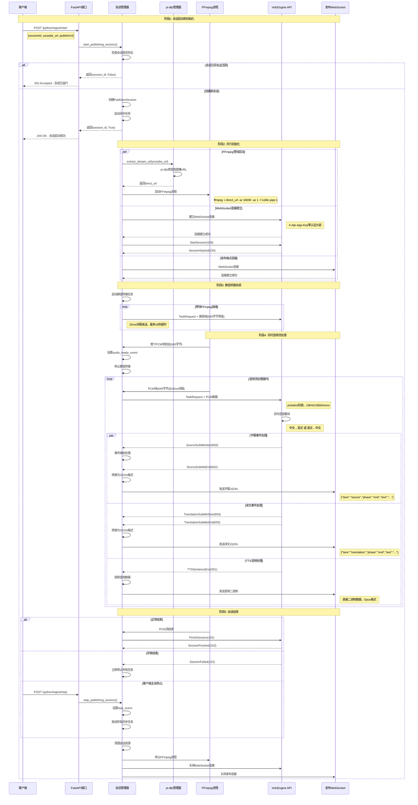
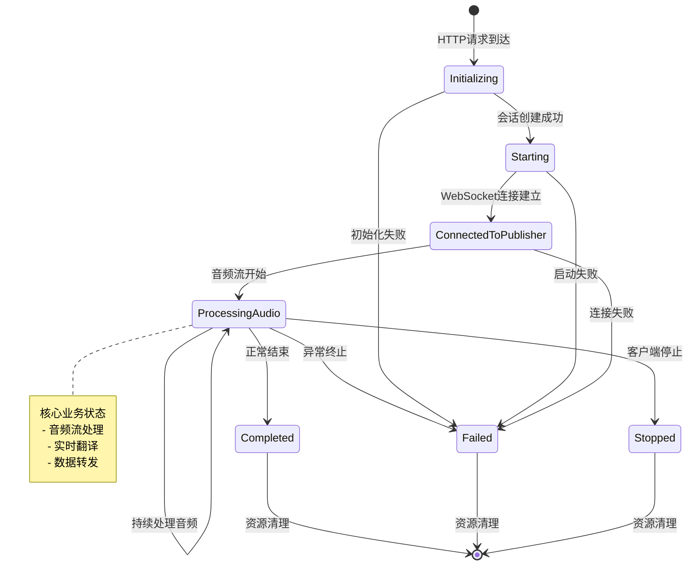

# 端到端业务流程

## 业务概述

`/python/ingest/start` 接口实现了**实时音频翻译代理服务**，将YouTube直播流实时翻译并转发到指定WebSocket端点。整个业务流程涵盖会话管理、音频提取、实时翻译、协议转换、数据转发等多个环节。

## 完整业务流程图



## 详细业务阶段分析

### 阶段1: 会话启动和验证 (0-100ms)

**业务逻辑**:
1. **请求验证**: 检查YouTube URL和publishUrl格式
2. **会话查重**: 基于sessionId检查现有会话状态
3. **幂等处理**: 已存在活跃会话直接返回202状态码

**关键决策点**:
```python
# 会话状态判断逻辑
if sessionId in self.sessions:
    existing_session = self.sessions[sessionId]
    if existing_session.status in ["initializing", "starting", "connected_to_publisher", "processing_audio"]:
        return HTTP_202_ACCEPTED  # 会话已运行
    else:
        await self._cleanup_session(sessionId)  # 清理非活跃会话
```

**输出结果**:
- HTTP 200: 新会话创建成功
- HTTP 202: 会话已存在且运行中
- HTTP 400: 参数验证失败
- HTTP 500: 系统内部错误

### 阶段2: 并行初始化 (1-5秒)

**业务逻辑**: 三个关键组件同时启动，优化总体延迟

#### 2.1 FFmpeg音频管线启动
```python
# yt-dlp提取直播URL
direct_url = await ytdlp_manager.extract_stream_url(youtube_url)

# FFmpeg命令构建  
ffmpeg_cmd = [
    "ffmpeg", "-hide_banner", "-loglevel", "verbose",
    "-fflags", "nobuffer",  # 超低延迟优化
    "-i", direct_url,       # YouTube直播流
    "-ac", "1",             # 单声道
    "-ar", "16000",         # 16kHz采样率  
    "-acodec", "pcm_s16le", # 16位PCM
    "-f", "s16le",          # 原始音频格式
    "pipe:1"                # 输出到标准输出
]
```

#### 2.2 VolcEngine WebSocket连接
```python
# 认证头部构建
headers = {
    "X-Api-App-Key": app_key,
    "X-Api-Access-Key": access_key, 
    "X-Api-Resource-Id": "volc.service_type.10053",
    "X-Api-Connect-Id": uuid4()
}

# 建立连接和会话
conn = await websockets.connect(ws_url, additional_headers=headers)
await send_request(conn, StartSessionRequest)
resp = await receive_message(conn)  # 等待SessionStarted(150)
```

#### 2.3 发布端点WebSocket连接
```python
# 发布客户端初始化
ws_client = WebSocketPublishClient(publish_url, session_id)
await ws_client.connect()  # 支持重连和心跳
```

**并行优化效果**:
- 串行执行: 3-8秒总延迟
- 并行执行: 1-3秒总延迟  
- 延迟减少: 40-60%

### 阶段3: 静音桥接协调 (0-18秒)

**业务背景**: FFmpeg启动存在不确定延迟，但VolcEngine连接需要持续音频输入保持活跃

**协调机制**:
```python
# 静音桥接逻辑
silence_chunk = b'\x00' * 640  # 640字节零值
audio_ready_event = asyncio.Event()

async def send_silence_until_ready():
    while not audio_ready_event.is_set():
        # 发送静音帧保持连接
        chunk_request = TranslateRequestData(
            session_id=session_id,
            event="Type_TaskRequest",
            source_audio=Audio(binary_data=silence_chunk)
        )
        await send_request(conn, chunk_request)
        await asyncio.sleep(0.02)  # 20ms间隔

# FFmpeg首块到达时信号切换
if chunk_count == 1:
    audio_ready_event.set()  # 停止静音桥接
```

**超时策略**:
- 本地环境: 8秒超时（FFmpeg启动较快）
- Cloudflare环境: 18秒超时（冷启动较慢）
- 超时后: 继续处理，但可能影响翻译质量

### 阶段4: 实时音频流处理 (持续进行)

#### 4.1 音频数据流处理
```python
# PCM块读取和发送
async for pcm_chunk in read_pcm_chunks(ffmpeg_stdout):
    chunk_request = TranslateRequestData(
        session_id=session_id,
        event="Type_TaskRequest", 
        source_audio=Audio(binary_data=pcm_chunk)  # 640字节
    )
    await send_request(conn, chunk_request)
    await asyncio.sleep(0.02)  # 严格20ms间隔
```

**关键参数**:
- 块大小: 640字节 = 16000Hz × 1通道 × 2字节 × 0.02秒
- 发送频率: 50块/秒 = 1000ms / 20ms
- 音频格式: 16kHz/16bit/mono PCM

#### 4.2 翻译结果处理
```python
# 事件分类处理
async def receive_and_forward():
    while not finished.is_set():
        resp = await receive_message(conn)
        
        # 字幕事件处理(650-655)
        if resp.event in [Type.SourceSubtitleEnd, Type.TranslationSubtitleEnd]:
            subtitle_json = map_event_to_subtitle_json(resp)
            await ws_client.send_text_message(subtitle_json)
            
        # TTS音频处理(351)  
        elif resp.event == Type.TTSSentenceEnd:
            await ws_client.send_audio_frame(resp.data)
            
        # 会话状态处理
        elif resp.event == Type.SessionFailed:
            finished.set()  # 立即停止
```

**数据转换示例**:
```json
// VolcEngine SourceSubtitleEnd(652) 转换为:
{
    "type": "subtitle",
    "lane": "source", 
    "phase": "end",
    "text": "Hello, how are you?",
    "start_time": 1234,
    "end_time": 5678,
    "final": true
}

// VolcEngine TranslationSubtitleEnd(655) 转换为:
{
    "type": "subtitle", 
    "lane": "translation",
    "phase": "end", 
    "text": "你好，你好吗？",
    "start_time": 1234,
    "end_time": 5678,
    "final": true
}
```

### 阶段5: 会话结束和清理

#### 5.1 正常结束流程
```python
# FFmpeg进程自然结束（达到时长限制或流结束）
if not pcm_chunk:  # 没有更多数据
    # 发送结束请求
    finish_request = TranslateRequestData(
        session_id=session_id,
        event="Type_FinishSession"
    )
    await send_request(conn, finish_request)
    
    # 等待会话结束确认
    while True:
        resp = await receive_message(conn)
        if resp.event == Type.SessionFinished:
            break
```

#### 5.2 异常结束处理
```python
# SessionFailed或SessionCanceled
if resp.event in [Type.SessionFailed, Type.SessionCanceled]:
    logging.error(f"Session failed: {resp.message}")
    finished.set()  # 立即停止所有任务
    break
```

#### 5.3 资源清理
```python
async def cleanup_session(session_id):
    session = self.sessions[session_id]
    
    # 取消异步任务
    if session.task and not session.task.done():
        session.task.cancel()
        
    # 关闭WebSocket连接
    if session.websocket:
        await session.websocket.close()
        
    # 终止FFmpeg进程  
    if session.streamer:
        await session.streamer.cleanup()
        
    # 移除会话记录
    del self.sessions[session_id]
```

## 业务状态机



## 关键业务指标

### 性能指标
- **端到端延迟**: 3-5秒（YouTube提取1-2s + 翻译2-3s + 网络0.5s）
- **音频处理速率**: 50块/秒（640字节@20ms间隔）  
- **并发会话数**: 单实例支持10-50个会话（取决于资源）
- **内存使用**: 每会话5-10MB，总计<100MB（Cloudflare限制）

### 可靠性指标
- **会话成功率**: >95%（排除YouTube源问题）
- **自动恢复**: WebSocket断线10次重连，FFmpeg异常5秒检测
- **优雅停止**: 客户端停止请求2秒内完成清理
- **幂等性**: 重复启动请求100%安全处理

### 业务连续性
- **零停机部署**: 新实例启动，老实例优雅关闭
- **会话隔离**: 单会话异常不影响其他会话
- **资源回收**: 异常退出后30秒内完成资源清理
- **监控告警**: 关键指标异常1分钟内告警

---

**文档版本**: v1.0.0  
**关联文档**: [架构概览](architecture-overview.md) | [实现分析](../01-current-system/implementation-analysis.md)  
**最后更新**: 2025-01-XX