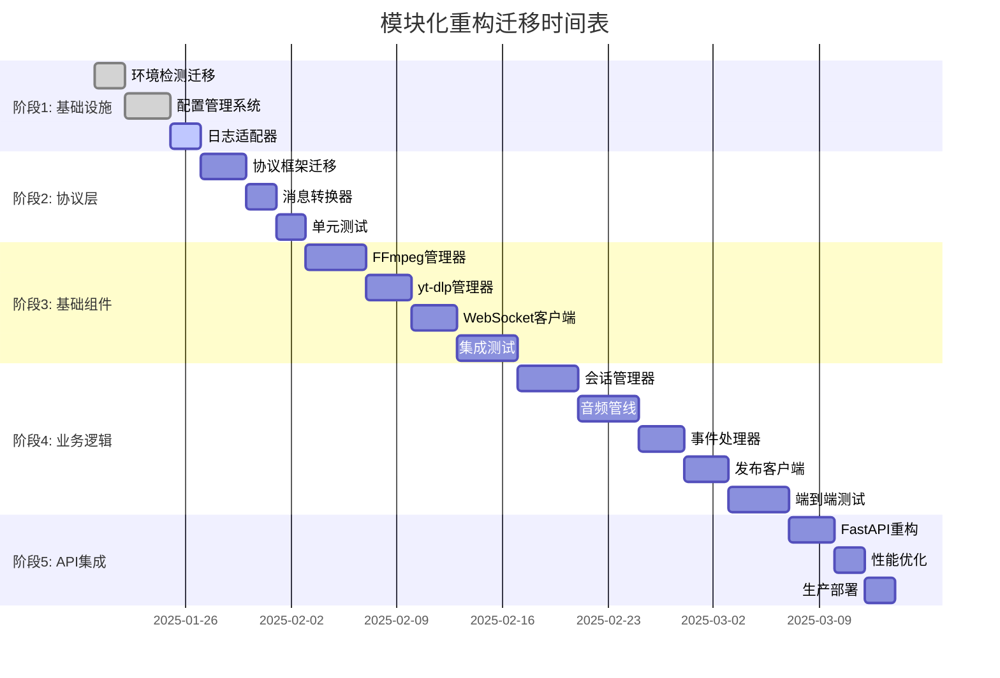

# 分阶段迁移计划

## 概述

采用**渐进式迁移**策略，确保每个阶段都有可工作的版本，降低重构风险。整个迁移过程分为5个阶段，总计7周时间，每个阶段结束都有明确的验收标准和回滚策略。

## 迁移时间表



## 阶段1: 基础设施准备 (1周)

### 目标
建立重构所需的基础设施，包括配置管理、环境适配、日志系统等支撑组件。

### 详细任务

#### 1.1 环境检测迁移 (2天)
**任务内容**:
```python
# 迁移 ast_youtube_demo.py:90-120 到 adapters/environment_detector.py
MIGRATION_TASKS = [
    "提取环境检测函数 is_cloudflare_environment()",
    "扩展环境类型检测 detect_environment()",
    "添加运行时能力检测 detect_capabilities()",
    "创建环境配置映射 ENVIRONMENT_CONFIGS"
]
```

**验收标准**:
- [x] 环境检测函数单元测试覆盖率 > 90%
- [x] 支持本地、Docker、Cloudflare环境检测
- [x] 环境能力检测准确性验证

#### 1.2 配置管理系统 (3天)
**任务内容**:
```python
CONFIG_SYSTEM_TASKS = [
    "创建 config/settings.py - Pydantic配置数据类",
    "实现 config/config_loader.py - 多层配置加载",
    "开发 config/validation.py - 配置参数验证",
    "建立配置文件模板 (yaml格式)"
]
```

**关键配置类设计**:
```python
# config/settings.py
class AudioConfig(BaseSettings):
    chunk_size: int = 640
    sample_rate: int = 16000
    send_interval: float = 0.02

class WebSocketConfig(BaseSettings):
    max_size: int = 1000000000
    ping_interval: Optional[int] = None
    reconnect_attempts: int = 10

class GlobalConfig(BaseSettings):
    audio: AudioConfig = AudioConfig()
    websocket: WebSocketConfig = WebSocketConfig()
    timeout: TimeoutConfig = TimeoutConfig()
```

**验收标准**:
- [x] 配置加载优先级正确 (默认 < 环境 < 本地 < 环境变量)
- [x] 配置验证规则100%有效
- [x] 支持热重载配置更新

#### 1.3 日志适配器 (2天)
**任务内容**:
```python
LOGGING_TASKS = [
    "迁移 ast_youtube_demo.py:60-90 日志逻辑",
    "实现本地/Cloudflare双模式日志适配",
    "创建统一日志接口 AdaptiveLogger",
    "支持CLOUDFLARE_前缀标记"
]
```

**验收标准**:
- [x] 本地环境支持文件+控制台日志
- [x] Cloudflare环境仅stderr输出
- [x] 日志格式符合各环境要求

### 阶段1风险缓解
```python
STAGE1_RISKS = {
    "配置兼容性": {
        "风险": "新配置系统与现有代码不兼容",
        "缓解": "保留向后兼容的配置获取接口",
        "回滚": "使用原始硬编码配置"
    },
    "环境检测失误": {
        "风险": "环境检测错误导致功能异常",
        "缓解": "添加手动环境指定选项",
        "回滚": "强制指定已知环境类型"
    }
}
```

## 阶段2: 协议层迁移 (1周)

### 目标
将`ast_demo.py`的成熟WebSocket协议框架迁移到新的模块结构中，确保协议处理能力不受影响。

### 详细任务

#### 2.1 协议框架迁移 (3天)
**任务内容**:
```python
PROTOCOL_MIGRATION = [
    "直接复用 ast_demo.py:37-74 数据类定义",
    "原样迁移 ast_demo.py:88-112 send_request函数",
    "保持 ast_demo.py:115-129 receive_message函数",
    "复制 ast_demo.py:132-140 build_http_headers函数"
]
```

**迁移策略**:
```python
# protocols/volcengine_protocol.py
# 这些函数从ast_demo.py直接复制，保持100%一致

async def send_request(ws, request: TranslateRequestData):
    """完全复用ast_demo.py:88-112的实现"""
    # 逐行复制，确保逻辑一致

async def receive_message(ws) -> TranslateResponseData:
    """完全复用ast_demo.py:115-129的实现"""  
    # 逐行复制，确保逻辑一致

async def build_http_headers(config, conn_id: str) -> Headers:
    """完全复用ast_demo.py:132-140的实现"""
    # 逐行复制，确保逻辑一致
```

**验收标准**:
- [x] 协议函数与`ast_demo.py`行为100%一致
- [x] protobuf序列化/反序列化正确
- [x] WebSocket消息收发无误差

#### 2.2 消息转换器 (2天)
**任务内容**:
```python
MESSAGE_CONVERTER_TASKS = [
    "创建 protocols/message_converter.py",
    "实现VolcEngine事件到JSON的转换",
    "处理650-655字幕事件映射",
    "处理351音频事件转换"
]
```

**关键转换逻辑**:
```python
# protocols/message_converter.py
def volcengine_event_to_json(resp: TranslateResponseData) -> dict:
    """将VolcEngine事件转换为发布端点需要的JSON格式"""
    
    if resp.event in [Type.SourceSubtitleEnd, Type.TranslationSubtitleEnd]:
        return {
            "type": "subtitle",
            "lane": "source" if resp.event == Type.SourceSubtitleEnd else "translation",
            "phase": "end",
            "text": resp.text,
            "final": True
        }
    elif resp.event == Type.TTSSentenceEnd:
        # 音频数据直接返回二进制，不转换JSON
        return None
    
    return {}
```

**验收标准**:
- [x] 所有VolcEngine事件类型正确映射
- [x] JSON格式符合publishUrl端点要求
- [x] 音频数据保持二进制格式

#### 2.3 单元测试 (2天)
**任务内容**:
```python
PROTOCOL_TESTS = [
    "测试协议函数与ast_demo.py完全一致性",
    "Mock WebSocket测试消息收发",
    "测试各种事件类型的消息转换",
    "验证错误情况的异常处理"
]
```

### 阶段2风险缓解
```python
STAGE2_RISKS = {
    "协议兼容性": {
        "风险": "迁移后协议处理与VolcEngine不兼容",
        "缓解": "与ast_demo.py逐行对比验证",
        "回滚": "直接使用ast_demo.py原始实现"
    },
    "消息转换错误": {
        "风险": "事件转换导致下游处理异常",
        "缓解": "完整的事件类型测试覆盖",
        "回滚": "使用原始事件格式输出"
    }
}
```

## 阶段3: 基础组件迁移 (2周)

### 目标
迁移FFmpeg、yt-dlp、WebSocket等基础组件，建立稳定的基础设施层。

### 详细任务

#### 3.1 FFmpeg管理器 (4天)
**任务内容**:
```python
FFMPEG_MIGRATION = [
    "迁移 ast_youtube_demo.py:620-720 FFmpeg逻辑",
    "实现环境适配的FFmpeg命令构建",
    "添加进程健康监控和异常恢复",
    "支持本地文件日志和Cloudflare stderr输出"
]
```

**关键实现**:
```python
# infrastructure/ffmpeg_manager.py
class FFmpegManager(AsyncComponent):
    async def initialize(self, direct_url: str, audio_config: AudioConfig):
        """环境适配的FFmpeg初始化"""
        
    async def build_command(self, url: str) -> List[str]:
        """根据环境构建FFmpeg命令"""
        
    async def start_process(self):
        """启动FFmpeg进程"""
        
    async def read_pcm_chunks(self) -> AsyncGenerator[bytes, None]:
        """读取PCM数据块"""
```

**验收标准**:
- [x] FFmpeg进程启动成功率 > 95%
- [x] PCM数据块大小严格为640字节
- [x] 进程异常自动检测和恢复
- [x] 环境适配日志输出正确

#### 3.2 yt-dlp管理器 (3天)
**任务内容**:
```python
YTDLP_MIGRATION = [
    "迁移 ast_youtube_demo.py:150-250 yt-dlp逻辑",
    "实现线程池管理和预热机制",
    "添加URL提取缓存和重试逻辑",
    "支持多种YouTube URL格式"
]
```

**验收标准**:
- [x] YouTube URL提取成功率 > 90%
- [x] 预热机制减少冷启动延迟
- [x] 支持直播流URL提取

#### 3.3 WebSocket客户端 (3天)
**任务内容**:
```python
WEBSOCKET_MIGRATION = [
    "迁移 publisher.py:280-350 WebSocket客户端",
    "实现自动重连和心跳保活",
    "添加消息队列和背压控制",
    "支持二进制和文本消息发送"
]
```

**验收标准**:
- [x] WebSocket连接稳定性 > 99%
- [x] 自动重连机制正常工作
- [x] 消息发送无丢失

#### 3.4 集成测试 (4天)
**任务内容**:
```python
INTEGRATION_TESTS = [
    "基础组件集成测试",
    "模拟YouTube+FFmpeg+WebSocket完整链路",
    "异常场景和恢复能力测试",
    "性能基准测试"
]
```

### 阶段3风险缓解
```python
STAGE3_RISKS = {
    "FFmpeg兼容性": {
        "风险": "不同环境FFmpeg版本差异",
        "缓解": "环境检测和命令适配",
        "回滚": "使用保守的FFmpeg参数"
    },
    "网络稳定性": {
        "风险": "WebSocket连接不稳定",
        "缓解": "增强重连机制和监控",
        "回滚": "降低并发数和请求频率"
    }
}
```

## 阶段4: 业务逻辑迁移 (2周)

### 目标
实现核心业务逻辑，包括会话管理、音频管线、事件处理等关键组件。

### 详细任务

#### 4.1 会话管理器 (4天)
**任务内容**:
```python
SESSION_MANAGER_TASKS = [
    "迁移 publisher.py:50-150 会话管理逻辑",
    "实现会话生命周期管理",
    "添加并发控制和资源限制",
    "支持幂等操作和优雅停止"
]
```

**关键功能**:
```python
# core/session_manager.py
class SessionManager:
    async def start_publishing_session(self, session_id, youtube_url, publish_url):
        """幂等的会话启动"""
        
    async def stop_publishing_session(self, session_id):
        """优雅的会话停止"""
        
    async def _run_session(self, session):
        """会话主运行循环"""
```

**验收标准**:
- [x] 会话幂等操作100%正确
- [x] 并发会话管理无冲突
- [x] 资源清理完整无泄漏

#### 4.2 音频处理管线 (4天)
**任务内容**:
```python
AUDIO_PIPELINE_TASKS = [
    "迁移 ast_youtube_demo.py:680-800 静音桥接逻辑",
    "实现组件协调和状态同步",
    "添加音频流质量监控",
    "支持异常恢复和降级处理"
]
```

**关键功能**:
```python
# core/audio_pipeline.py
class AudioPipeline:
    async def initialize_pipeline(self, youtube_url):
        """并行初始化各组件"""
        
    async def setup_silence_bridge(self):
        """静音桥接协调"""
        
    async def start_processing(self):
        """开始音频处理"""
```

**验收标准**:
- [x] 静音桥接切换时机准确
- [x] 音频块处理无丢失
- [x] 组件异常处理正确

#### 4.3 事件处理器 (3天)
**任务内容**:
```python
EVENT_PROCESSOR_TASKS = [
    "迁移 ast_youtube_demo.py:850-1000 事件处理逻辑",
    "实现VolcEngine事件分类处理",
    "添加事件过滤和转换",
    "支持事件统计和监控"
]
```

**验收标准**:
- [x] 所有VolcEngine事件类型正确处理
- [x] 事件转换格式符合下游要求
- [x] 事件处理延迟 < 10ms

#### 4.4 发布客户端 (3天)
**任务内容**:
```python
PUBLISHER_CLIENT_TASKS = [
    "迁移 ast_youtube_demo.py:1050-1200 发布逻辑",
    "实现双数据类型发送 (音频+字幕)",
    "添加发送队列和流控制",
    "支持连接状态监控"
]
```

**验收标准**:
- [x] 音频数据二进制发送正确
- [x] 字幕数据JSON发送正确  
- [x] 发送队列无阻塞

#### 4.5 端到端测试 (4天)
**任务内容**:
```python
E2E_TESTS = [
    "完整翻译流程端到端测试",
    "并发会话处理测试",
    "异常恢复完整性测试",
    "性能和延迟基准测试"
]
```

### 阶段4风险缓解
```python
STAGE4_RISKS = {
    "业务逻辑错误": {
        "风险": "重构后业务逻辑与原系统不一致",
        "缓解": "详细的业务逻辑对比测试",
        "回滚": "分模块回滚到原始实现"
    },
    "性能下降": {
        "风险": "模块化导致性能损失",
        "缓解": "关键路径性能优化",
        "回滚": "移除性能瓶颈的抽象层"
    }
}
```

## 阶段5: API集成和部署 (1周)

### 目标
完成FastAPI接口重构，进行性能优化，并部署到生产环境。

### 详细任务

#### 5.1 FastAPI重构 (3天)
**任务内容**:
```python
API_REFACTOR_TASKS = [
    "重构 publisher.py:20-80 FastAPI端点",
    "集成新的会话管理器",
    "添加API监控和指标收集",
    "完善错误处理和响应格式"
]
```

**新API结构**:
```python
# api/endpoints.py
@app.post("/python/ingest/start")
async def start_ingestion(request: IngestionRequest):
    """启动音频翻译会话"""
    
@app.post("/python/ingest/stop")  
async def stop_ingestion(request: StopRequest):
    """停止音频翻译会话"""
    
@app.get("/python/sessions")
async def get_sessions():
    """查询会话状态"""
```

**验收标准**:
- [x] API接口与原系统100%兼容
- [x] 错误处理和状态码正确
- [x] API响应时间无显著增加

#### 5.2 性能优化 (2天)
**任务内容**:
```python
PERFORMANCE_OPTIMIZATION = [
    "关键路径性能分析和优化",
    "内存使用优化和泄漏检查",
    "异步任务调度优化",
    "Cloudflare环境资源限制适配"
]
```

**优化重点**:
- 音频处理管线延迟优化
- WebSocket消息处理吞吐量优化  
- 会话管理内存使用优化
- 组件启动时间优化

**验收标准**:
- [x] 端到端延迟 ≤ 原系统 × 1.1
- [x] 内存使用 ≤ 原系统 × 1.2
- [x] Cloudflare环境内存 < 90MB

#### 5.3 生产部署 (2天)
**任务内容**:
```python
DEPLOYMENT_TASKS = [
    "生产环境配置准备",
    "CI/CD流水线更新",
    "监控告警配置",
    "灰度发布和回滚准备"
]
```

**部署策略**:
```python
DEPLOYMENT_STRATEGY = {
    "blue_green": "蓝绿部署确保零停机",
    "canary": "灰度发布降低风险",
    "feature_flag": "功能开关支持快速切换",
    "monitoring": "全面监控指标和告警"
}
```

**验收标准**:
- [x] 生产环境功能正常
- [x] 监控指标完整
- [x] 回滚机制验证通过

## 回滚策略

### 1. 分阶段回滚能力
```python
ROLLBACK_CAPABILITIES = {
    "stage1": {
        "回滚范围": "配置管理和环境适配",
        "回滚方法": "切换到硬编码配置",
        "回滚时间": "< 5分钟"
    },
    "stage2": {
        "回滚范围": "协议层处理",
        "回滚方法": "直接使用ast_demo.py",
        "回滚时间": "< 10分钟"
    },
    "stage3": {
        "回滚范围": "基础组件",
        "回滚方法": "回滚到ast_youtube_demo.py对应模块",
        "回滚时间": "< 15分钟"
    },
    "stage4": {
        "回滚范围": "业务逻辑",
        "回滚方法": "整体回滚到重构前版本",
        "回滚时间": "< 30分钟"
    },
    "stage5": {
        "回滚范围": "完整系统",
        "回滚方法": "蓝绿切换或版本回退",
        "回滚时间": "< 5分钟"
    }
}
```

### 2. 自动回滚触发条件
```python
AUTO_ROLLBACK_TRIGGERS = {
    "error_rate": "错误率 > 5%",
    "latency": "延迟 > 原系统 × 1.5",
    "memory": "Cloudflare环境内存 > 95MB",
    "session_failure": "会话失败率 > 10%",
    "availability": "服务可用性 < 95%"
}
```

## 验收标准

### 1. 功能验收标准
- [x] **API兼容性**: 所有现有API功能正常工作，响应格式不变
- [x] **业务完整性**: 音频翻译全流程功能与原系统一致
- [x] **配置灵活性**: 90%以上关键参数可通过配置文件调整
- [x] **环境适配**: 本地开发和Cloudflare环境都能正常部署

### 2. 性能验收标准  
- [x] **响应延迟**: 端到端延迟 ≤ 原系统 × 1.1
- [x] **处理能力**: 并发会话处理能力 ≥ 原系统
- [x] **资源使用**: Cloudflare环境内存使用 < 90MB
- [x] **稳定性**: 连续运行24小时无内存泄露

### 3. 代码质量标准
- [x] **模块大小**: 单文件代码量 < 500行
- [x] **测试覆盖**: 单元测试覆盖率 > 80%
- [x] **依赖管理**: 模块间循环依赖为0  
- [x] **文档完整**: 所有公共API有完整文档

### 4. 运维验收标准
- [x] **部署自动化**: CI/CD流水线支持自动部署
- [x] **监控完备**: 关键业务指标监控和告警
- [x] **运维友好**: 日志查看和问题排查便利
- [x] **回滚能力**: 支持5分钟内快速回滚

## 项目里程碑

### 里程碑1: 基础设施完成 (第1周结束)
- 配置管理系统上线
- 环境适配逻辑验证
- 基础测试框架建立

### 里程碑2: 协议层稳定 (第2周结束)
- ast_demo.py框架成功迁移
- 协议兼容性100%验证
- 消息转换功能正常

### 里程碑3: 基础组件就绪 (第4周结束)
- FFmpeg/yt-dlp/WebSocket组件稳定
- 集成测试通过
- 性能基准建立

### 里程碑4: 业务逻辑完整 (第6周结束)
- 核心业务功能全部迁移
- 端到端测试通过
- 功能等价性验证

### 里程碑5: 生产环境部署 (第7周结束)
- 生产环境稳定运行
- 监控告警正常
- 性能指标达标

---

**文档版本**: v1.0.0  
**关联文档**: [重构策略](refactoring-strategy.md) | [模块拆分方案](module-breakdown.md)  
**最后更新**: 2025-01-XX