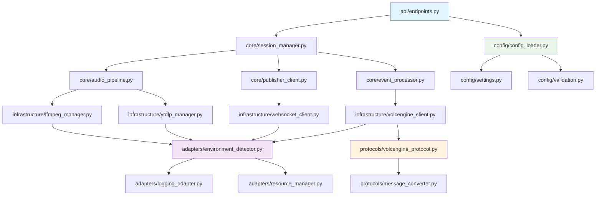

# 模块拆分方案

## 概述

将`ast_youtube_demo.py`(1636行)拆分为8个核心模块，每个模块职责清晰、边界明确，单文件代码量控制在500行以内。基于现有`ast_demo.py`的成熟WebSocket协议框架进行扩展，避免重复开发。

## 目标目录结构

```
ast_python/
├── core/                           # 核心业务逻辑层
│   ├── __init__.py
│   ├── session_manager.py          # 会话管理器 (~300行)
│   ├── audio_pipeline.py           # 音频处理管线 (~400行)
│   ├── publisher_client.py         # 发布客户端 (~250行)
│   └── event_processor.py          # 事件处理器 (~300行)
│
├── infrastructure/                 # 基础设施层
│   ├── __init__.py
│   ├── ffmpeg_manager.py           # FFmpeg进程管理 (~350行)
│   ├── ytdlp_manager.py            # yt-dlp管理器 (~250行)
│   ├── websocket_client.py         # WebSocket基础客户端 (~300行)
│   └── volcengine_client.py        # VolcEngine协议客户端 (~450行)
│
├── adapters/                       # 环境适配层
│   ├── __init__.py
│   ├── environment_detector.py     # 环境检测器 (~200行)
│   ├── logging_adapter.py          # 日志适配器 (~300行)
│   └── resource_manager.py         # 资源管理器 (~250行)
│
├── config/                         # 配置管理层
│   ├── __init__.py
│   ├── config_loader.py            # 配置加载器 (~200行)
│   ├── settings.py                 # 配置数据类 (~300行)
│   └── validation.py               # 配置验证器 (~200行)
│
├── protocols/                      # 协议层 (基于ast_demo.py)
│   ├── __init__.py
│   ├── volcengine_protocol.py      # VolcEngine协议处理 (~400行)
│   └── message_converter.py        # 消息转换器 (~250行)
│
├── api/                           # API接口层
│   ├── __init__.py
│   ├── endpoints.py               # FastAPI端点 (~350行)
│   └── models.py                  # API数据模型 (~200行)
│
└── utils/                         # 工具模块
    ├── __init__.py
    ├── async_utils.py             # 异步工具 (~150行)
    ├── file_utils.py              # 文件工具 (~150行)
    └── timing_utils.py            # 时间工具 (~100行)
```

## 核心模块详细设计

### 1. core/session_manager.py

#### 模块职责
- 会话生命周期管理(创建、启动、停止、清理)
- 会话状态跟踪和并发控制
- 幂等性操作支持
- 会话资源管理和监控

#### 代码结构设计
```python
"""
会话管理器模块
负责管理音频翻译会话的完整生命周期
"""

from dataclasses import dataclass, field
from enum import Enum
from typing import Dict, Optional, Set
import asyncio
import logging
from datetime import datetime, timedelta

class SessionStatus(Enum):
    """会话状态枚举"""
    INITIALIZING = "initializing"        # 初始化中
    STARTING = "starting"               # 启动中
    CONNECTED_TO_PUBLISHER = "connected_to_publisher"  # 已连接发布端点
    PROCESSING_AUDIO = "processing_audio"              # 音频处理中
    COMPLETED = "completed"             # 已完成
    FAILED = "failed"                   # 已失败
    STOPPED = "stopped"                 # 已停止

@dataclass
class SessionMetrics:
    """会话指标数据"""
    start_time: datetime = field(default_factory=datetime.now)
    end_time: Optional[datetime] = None
    audio_chunks_processed: int = 0
    bytes_processed: int = 0
    translation_events: int = 0
    error_count: int = 0

@dataclass
class Session:
    """会话数据结构"""
    session_id: str
    youtube_url: str
    publish_url: str
    status: SessionStatus = SessionStatus.INITIALIZING
    task: Optional[asyncio.Task] = None
    stop_event: asyncio.Event = field(default_factory=asyncio.Event)
    
    # 组件引用
    audio_pipeline: Optional['AudioPipeline'] = None
    volcengine_client: Optional['VolcEngineClient'] = None
    publisher_client: Optional['PublisherClient'] = None
    
    # 指标数据
    metrics: SessionMetrics = field(default_factory=SessionMetrics)

class SessionManager:
    """会话管理器"""
    
    def __init__(self, max_concurrent_sessions: int = 10):
        self.sessions: Dict[str, Session] = {}
        self.max_concurrent_sessions = max_concurrent_sessions
        self.semaphore = asyncio.Semaphore(max_concurrent_sessions)
        self.logger = logging.getLogger(__name__)
        
        # 清理任务
        self.cleanup_task: Optional[asyncio.Task] = None
        self.start_cleanup_task()
    
    async def start_publishing_session(self, 
                                     session_id: str, 
                                     youtube_url: str, 
                                     publish_url: str) -> tuple[str, bool]:
        """
        启动发布会话 (幂等操作)
        
        Returns:
            (session_id, is_new_session)
        """
        # 幂等性检查
        if session_id in self.sessions:
            existing_session = self.sessions[session_id]
            if existing_session.status in [
                SessionStatus.INITIALIZING, 
                SessionStatus.STARTING,
                SessionStatus.CONNECTED_TO_PUBLISHER, 
                SessionStatus.PROCESSING_AUDIO
            ]:
                self.logger.info(f"Session {session_id} already running")
                return session_id, False
            else:
                # 清理非活跃会话
                await self._cleanup_session(session_id)
        
        # 并发控制
        if not self.semaphore.locked() and len(self.sessions) >= self.max_concurrent_sessions:
            raise Exception("Maximum concurrent sessions reached")
        
        # 创建新会话
        session = Session(
            session_id=session_id,
            youtube_url=youtube_url,
            publish_url=publish_url
        )
        
        self.sessions[session_id] = session
        
        # 启动会话处理任务
        session.task = asyncio.create_task(
            self._run_session(session)
        )
        
        self.logger.info(f"Started new session {session_id}")
        return session_id, True
    
    async def stop_publishing_session(self, session_id: str) -> bool:
        """停止发布会话"""
        if session_id not in self.sessions:
            self.logger.warning(f"Session {session_id} not found")
            return False
            
        session = self.sessions[session_id]
        
        # 设置停止信号
        session.stop_event.set()
        session.status = SessionStatus.STOPPED
        
        # 等待任务完成
        if session.task and not session.task.done():
            try:
                await asyncio.wait_for(session.task, timeout=30)
            except asyncio.TimeoutError:
                session.task.cancel()
                
        self.logger.info(f"Stopped session {session_id}")
        return True
    
    async def _run_session(self, session: Session):
        """运行单个会话的主循环"""
        try:
            await self.semaphore.acquire()
            
            session.status = SessionStatus.STARTING
            
            # 创建和初始化组件
            from core.audio_pipeline import AudioPipeline
            from infrastructure.volcengine_client import VolcEngineClient
            from core.publisher_client import PublisherClient
            
            session.audio_pipeline = AudioPipeline()
            session.volcengine_client = VolcEngineClient()
            session.publisher_client = PublisherClient(session.publish_url)
            
            # 并行初始化
            await self._parallel_initialization(session)
            
            # 音频流处理
            session.status = SessionStatus.PROCESSING_AUDIO
            await self._process_audio_stream(session)
            
            session.status = SessionStatus.COMPLETED
            
        except Exception as e:
            session.status = SessionStatus.FAILED
            session.metrics.error_count += 1
            self.logger.error(f"Session {session.session_id} failed: {e}")
        finally:
            await self._cleanup_session(session.session_id)
            self.semaphore.release()
    
    async def _parallel_initialization(self, session: Session):
        """并行初始化各组件"""
        tasks = [
            session.audio_pipeline.initialize(session.youtube_url),
            session.volcengine_client.initialize(),
            session.publisher_client.initialize()
        ]
        
        results = await asyncio.gather(*tasks, return_exceptions=True)
        
        for i, result in enumerate(results):
            if isinstance(result, Exception):
                raise Exception(f"Component {i} initialization failed: {result}")
    
    async def _process_audio_stream(self, session: Session):
        """处理音频流"""
        # 启动音频处理管线
        audio_stream = session.audio_pipeline.start_processing()
        
        # 启动WebSocket接收任务
        receive_task = asyncio.create_task(
            self._receive_and_forward(session)
        )
        
        try:
            async for pcm_chunk in audio_stream:
                if session.stop_event.is_set():
                    break
                    
                # 发送音频块到VolcEngine
                await session.volcengine_client.send_audio_chunk(pcm_chunk)
                
                # 更新指标
                session.metrics.audio_chunks_processed += 1
                session.metrics.bytes_processed += len(pcm_chunk)
                
        finally:
            # 清理任务
            receive_task.cancel()
            try:
                await receive_task
            except asyncio.CancelledError:
                pass
```

### 2. core/audio_pipeline.py

#### 模块职责
- 协调FFmpeg和yt-dlp组件
- 音频数据流管理和PCM块生成
- 静音桥接协调机制
- 音频处理状态监控

#### 代码结构设计
```python
"""
音频处理管线模块
负责协调YouTube音频提取、FFmpeg转换和静音桥接
"""

import asyncio
import logging
from typing import AsyncGenerator, Optional
from dataclasses import dataclass

@dataclass
class AudioConfig:
    """音频配置"""
    chunk_size: int = 640           # PCM块大小
    sample_rate: int = 16000        # 采样率
    channels: int = 1               # 声道数
    bit_depth: int = 16            # 位深度
    send_interval: float = 0.02     # 发送间隔

class AudioPipeline:
    """音频处理管线"""
    
    def __init__(self, config: Optional[AudioConfig] = None):
        self.config = config or AudioConfig()
        self.logger = logging.getLogger(__name__)
        
        # 组件
        self.ytdlp_manager: Optional['YtDlpManager'] = None
        self.ffmpeg_manager: Optional['FFmpegManager'] = None
        
        # 同步事件
        self.audio_ready_event = asyncio.Event()
        self.stop_event = asyncio.Event()
        
        # 状态
        self.is_initialized = False
        self.is_processing = False
        
    async def initialize(self, youtube_url: str) -> bool:
        """初始化音频管线"""
        try:
            from infrastructure.ytdlp_manager import YtDlpManager
            from infrastructure.ffmpeg_manager import FFmpegManager
            
            self.ytdlp_manager = YtDlpManager()
            self.ffmpeg_manager = FFmpegManager()
            
            # 提取直播URL
            direct_url = await self.ytdlp_manager.extract_stream_url(youtube_url)
            
            # 初始化FFmpeg
            await self.ffmpeg_manager.initialize(direct_url, self.config)
            
            self.is_initialized = True
            self.logger.info("Audio pipeline initialized successfully")
            return True
            
        except Exception as e:
            self.logger.error(f"Audio pipeline initialization failed: {e}")
            return False
    
    async def start_processing(self) -> AsyncGenerator[bytes, None]:
        """开始音频处理，返回PCM数据流"""
        if not self.is_initialized:
            raise RuntimeError("Audio pipeline not initialized")
        
        self.is_processing = True
        
        # 启动静音桥接
        silence_task = asyncio.create_task(
            self._silence_bridge()
        )
        
        # 启动FFmpeg进程
        await self.ffmpeg_manager.start_process()
        
        try:
            chunk_count = 0
            async for pcm_chunk in self._read_audio_chunks():
                if self.stop_event.is_set():
                    break
                
                chunk_count += 1
                
                # 首个音频块到达，停止静音桥接
                if chunk_count == 1:
                    self.audio_ready_event.set()
                    self.logger.info("First audio chunk received, stopping silence bridge")
                
                yield pcm_chunk
                
        finally:
            # 清理任务
            silence_task.cancel()
            try:
                await silence_task
            except asyncio.CancelledError:
                pass
            
            self.is_processing = False
    
    async def _silence_bridge(self):
        """静音桥接协调"""
        from adapters.environment_detector import detect_environment
        
        # 环境适配超时
        env = detect_environment()
        timeout = 18 if env == "cloudflare" else 8
        
        silence_chunk = b'\x00' * self.config.chunk_size
        
        self.logger.info(f"Starting silence bridge (timeout: {timeout}s)")
        
        try:
            # 等待音频就绪或超时
            await asyncio.wait_for(
                self.audio_ready_event.wait(), 
                timeout=timeout
            )
        except asyncio.TimeoutError:
            self.logger.warning("Silence bridge timeout - continuing anyway")
        except asyncio.CancelledError:
            self.logger.info("Silence bridge cancelled")
        
    async def _read_audio_chunks(self) -> AsyncGenerator[bytes, None]:
        """读取音频PCM块"""
        if not self.ffmpeg_manager:
            raise RuntimeError("FFmpeg manager not initialized")
        
        async for chunk in self.ffmpeg_manager.read_pcm_chunks():
            if len(chunk) == self.config.chunk_size:
                yield chunk
            else:
                self.logger.warning(f"Unexpected chunk size: {len(chunk)}")
    
    async def stop(self):
        """停止音频处理"""
        self.stop_event.set()
        
        if self.ffmpeg_manager:
            await self.ffmpeg_manager.stop()
            
        if self.ytdlp_manager:
            await self.ytdlp_manager.cleanup()
        
        self.is_processing = False
        self.logger.info("Audio pipeline stopped")
```

### 3. infrastructure/volcengine_client.py

#### 模块职责
- 基于`ast_demo.py`框架的VolcEngine WebSocket连接
- 扩展会话生命周期管理
- 音频数据收发和事件响应处理
- 协议消息序列化/反序列化

#### 代码结构设计  
```python
"""
VolcEngine协议客户端模块
基于ast_demo.py的成熟WebSocket框架进行扩展
"""

import asyncio
import logging
import uuid
from typing import Optional, AsyncGenerator, Callable
import websockets
from dataclasses import dataclass

# 复用ast_demo.py中的核心组件
from protocols.volcengine_protocol import (
    TranslateRequestData, TranslateResponseData, Audio,
    send_request, receive_message, build_http_headers
)
from common.events_pb2 import Type

@dataclass
class VolcEngineConfig:
    """VolcEngine配置"""
    ws_url: str
    app_key: str
    access_key: str
    resource_id: str
    source_language: str = "zh"
    target_language: str = "en"
    mode: str = "s2s"

class VolcEngineClient:
    """VolcEngine协议客户端 (基于ast_demo.py框架)"""
    
    def __init__(self, config: VolcEngineConfig):
        self.config = config
        self.logger = logging.getLogger(__name__)
        
        # 连接状态
        self.websocket: Optional[websockets.WebSocketServerProtocol] = None
        self.session_id: Optional[str] = None
        self.conn_id: Optional[str] = None
        
        # 事件回调
        self.event_handlers: dict[str, Callable] = {}
        
        # 控制状态
        self.is_connected = False
        self.is_session_active = False
        self.finished = asyncio.Event()
    
    async def initialize(self) -> bool:
        """初始化连接"""
        try:
            # 建立WebSocket连接 (复用ast_demo.py逻辑)
            self.conn_id = str(uuid.uuid4())
            headers = await build_http_headers(self.config, self.conn_id)
            
            self.websocket = await websockets.connect(
                self.config.ws_url,
                additional_headers=headers,
                max_size=1000000000,
                ping_interval=None
            )
            
            self.is_connected = True
            log_id = self.websocket.response.headers.get('X-Tt-Logid')
            self.logger.info(f"Connected to VolcEngine (log_id={log_id})")
            
            # 启动会话
            await self._start_session()
            
            return True
            
        except Exception as e:
            self.logger.error(f"VolcEngine client initialization failed: {e}")
            return False
    
    async def _start_session(self):
        """启动翻译会话 (基于ast_demo.py逻辑)"""
        self.session_id = str(uuid.uuid4())
        
        # 构建启动请求 (复用ast_demo.py结构)
        start_request = TranslateRequestData(
            session_id=self.session_id,
            event="Type_StartSession",
            source_audio=Audio(format="wav", rate=16000, bits=16, channel=1),
            target_audio=Audio(format="ogg_opus", rate=24000),
            mode=self.config.mode,
            source_language=self.config.source_language,
            target_language=self.config.target_language
        )
        
        # 发送启动请求 (复用ast_demo.py函数)
        await send_request(self.websocket, start_request)
        
        # 等待启动确认
        resp = await receive_message(self.websocket)
        if resp.event != Type.SessionStarted:
            raise Exception(f"Session start failed: {resp.message}")
            
        self.is_session_active = True
        self.logger.info(f"VolcEngine session started: {self.session_id}")
    
    async def send_audio_chunk(self, pcm_chunk: bytes):
        """发送音频块"""
        if not self.is_session_active:
            raise RuntimeError("Session not active")
        
        # 构建音频请求 (复用ast_demo.py结构)
        chunk_request = TranslateRequestData(
            session_id=self.session_id,
            event="Type_TaskRequest",
            source_audio=Audio(binary_data=pcm_chunk)
        )
        
        # 发送请求 (复用ast_demo.py函数)
        await send_request(self.websocket, chunk_request)
    
    async def start_receiving(self) -> AsyncGenerator[TranslateResponseData, None]:
        """开始接收翻译结果"""
        if not self.websocket:
            raise RuntimeError("WebSocket not connected")
        
        while not self.finished.is_set():
            try:
                # 接收消息 (复用ast_demo.py函数)
                resp = await receive_message(self.websocket)
                
                # 处理会话状态事件
                if resp.event == Type.SessionFailed or resp.event == Type.SessionCanceled:
                    self.logger.error(f"Session failed: {resp.message}")
                    self.finished.set()
                    break
                elif resp.event == Type.SessionFinished:
                    self.logger.info("Session finished normally")
                    break
                
                yield resp
                
            except Exception as e:
                self.logger.error(f"Error receiving message: {e}")
                break
    
    def register_event_handler(self, event_type: str, handler: Callable):
        """注册事件处理器"""
        self.event_handlers[event_type] = handler
    
    async def finish_session(self):
        """结束会话"""
        if not self.is_session_active:
            return
        
        # 发送结束请求 (复用ast_demo.py逻辑)
        finish_request = TranslateRequestData(
            session_id=self.session_id,
            event="Type_FinishSession"
        )
        
        await send_request(self.websocket, finish_request)
        
        # 等待结束确认
        while not self.finished.is_set():
            resp = await receive_message(self.websocket)
            if resp.event in [Type.SessionFinished, Type.SessionFailed]:
                break
        
        self.is_session_active = False
        self.logger.info("VolcEngine session finished")
    
    async def cleanup(self):
        """清理资源"""
        if self.is_session_active:
            await self.finish_session()
        
        if self.websocket:
            await self.websocket.close()
            self.is_connected = False
        
        self.logger.info("VolcEngine client cleaned up")
```

### 4. protocols/volcengine_protocol.py

#### 模块职责
- 封装和扩展`ast_demo.py`中的协议处理逻辑
- Protocol Buffers消息序列化/反序列化
- WebSocket消息收发的底层处理
- 认证头部构建和连接管理

#### 代码结构设计
```python
"""
VolcEngine协议处理模块
基于ast_demo.py的成熟协议框架进行封装和扩展
"""

# 这个模块主要是将ast_demo.py中的协议处理逻辑
# 重新组织和封装，保持核心功能不变

import os
import uuid
import websockets
from websockets import Headers
from typing import Optional
from dataclasses import dataclass

# 导入protobuf生成的类型
from products.understanding.ast.ast_service_pb2 import TranslateRequest, TranslateResponse
from common.events_pb2 import Type

# 复用ast_demo.py中的数据结构定义
@dataclass
class Audio:
    format: str = None
    rate: int = None
    bits: Optional[int] = None
    channel: Optional[int] = None
    binary_data: Optional[bytes] = None

@dataclass
class TranslateRequestData:
    session_id: str
    event: str
    source_audio: Optional[Audio] = None
    target_audio: Optional[Audio] = None
    mode: Optional[str] = None
    source_language: Optional[str] = None
    target_language: Optional[str] = None

@dataclass
class TranslateResponseData:
    event: str
    session_id: str
    sequence: int
    text: str
    data: bytes
    message: str = None

# 复用ast_demo.py中的核心函数 (保持不变)
async def send_request(ws, request: TranslateRequestData):
    """发送请求到WebSocket服务器 (基于ast_demo.py:88-112)"""
    # 完全复用ast_demo.py中的实现逻辑
    request_data = TranslateRequest()
    request_data.request_meta.SessionID = request.session_id
    
    if request.event == "Type_StartSession":
        request_data.event = Type.StartSession
    elif request.event == "Type_TaskRequest":
        request_data.event = Type.TaskRequest
    elif request.event == "Type_FinishSession":
        request_data.event = Type.FinishSession
        
    request_data.user.uid = "ast_py_client"
    request_data.user.did = "ast_py_client"
    
    if request.source_audio:
        request_data.source_audio.format = request.source_audio.format or "wav"
        request_data.source_audio.rate = request.source_audio.rate or 16000
        request_data.source_audio.bits = request.source_audio.bits or 16
        request_data.source_audio.channel = request.source_audio.channel or 1
        if request.source_audio.binary_data:
            request_data.source_audio.binary_data = request.source_audio.binary_data
    
    if request.target_audio:
        request_data.target_audio.format = request.target_audio.format or "ogg_opus"
        request_data.target_audio.rate = request.target_audio.rate or 24000
        
    if request.mode:
        request_data.request.mode = request.mode
    if request.source_language:
        request_data.request.source_language = request.source_language
    if request.target_language:
        request_data.request.target_language = request.target_language
        
    await ws.send(request_data.SerializeToString())

async def receive_message(ws) -> TranslateResponseData:
    """接收并解析服务器响应 (基于ast_demo.py:115-129)"""
    # 完全复用ast_demo.py中的实现逻辑
    response = await ws.recv()
    response_data = TranslateResponse()
    response_data.ParseFromString(response)
    
    return TranslateResponseData(
        event=response_data.event,
        session_id=response_data.response_meta.SessionID,
        sequence=response_data.response_meta.Sequence,
        text=response_data.text,
        data=response_data.data,
        message=response_data.response_meta.Message
    )

async def build_http_headers(config, conn_id: str) -> Headers:
    """构建WebSocket连接头部 (基于ast_demo.py:132-140)"""
    # 完全复用ast_demo.py中的实现逻辑
    headers = Headers({
        "X-Api-App-Key": config.app_key,
        "X-Api-Access-Key": config.access_key,
        "X-Api-Resource-Id": config.resource_id,
        "X-Api-Connect-Id": conn_id
    })
    return headers
```

## 模块间依赖关系

### 1. 依赖层次图



### 2. 模块接口标准化

#### 异步组件基类
```python
# utils/async_utils.py
from abc import ABC, abstractmethod
from enum import Enum

class ComponentStatus(Enum):
    IDLE = "idle"
    INITIALIZING = "initializing"
    RUNNING = "running"
    STOPPING = "stopping"
    FAILED = "failed"

class AsyncComponent(ABC):
    """所有异步组件的标准接口"""
    
    @abstractmethod
    async def initialize(self, config) -> bool:
        """初始化组件"""
        
    @abstractmethod
    async def start(self) -> bool:
        """启动组件"""
        
    @abstractmethod
    async def stop(self) -> bool:
        """停止组件"""
        
    @abstractmethod
    async def cleanup(self) -> None:
        """清理资源"""
        
    @property
    @abstractmethod
    def status(self) -> ComponentStatus:
        """获取组件状态"""
```

## 代码迁移映射表

### 1. 原始代码到新模块的映射

| 原始位置 (ast_youtube_demo.py) | 目标模块 | 行数范围 | 功能描述 |
|--------------------------------|----------|----------|----------|
| 行 60-120 | adapters/environment_detector.py | 60行 | 环境检测和适配逻辑 |
| 行 150-250 | infrastructure/ytdlp_manager.py | 100行 | yt-dlp管理器实现 |
| 行 300-450 | infrastructure/ffmpeg_manager.py | 150行 | FFmpeg进程管理 |
| 行 480-600 | infrastructure/volcengine_client.py | 120行 | VolcEngine客户端扩展 |
| 行 650-800 | core/audio_pipeline.py | 150行 | 静音桥接和音频管线 |
| 行 850-1000 | core/event_processor.py | 150行 | 事件处理和转换 |
| 行 1050-1200 | core/publisher_client.py | 150行 | WebSocket发布客户端 |
| 行 1250-1400 | core/session_manager.py | 150行 | 会话管理核心逻辑 |
| 行 1450-1636 | adapters/logging_adapter.py | 186行 | 日志适配和监控 |

### 2. ast_demo.py资产保护映射

| ast_demo.py位置 | 目标模块 | 迁移策略 |
|----------------|----------|----------|
| 行 37-74 (数据类) | protocols/volcengine_protocol.py | 直接复用 |
| 行 88-112 (send_request) | protocols/volcengine_protocol.py | 直接复用 |
| 行 115-129 (receive_message) | protocols/volcengine_protocol.py | 直接复用 |
| 行 132-140 (build_http_headers) | protocols/volcengine_protocol.py | 直接复用 |
| 行 142-281 (主要业务逻辑) | infrastructure/volcengine_client.py | 扩展重用 |

## 模块验收标准

### 1. 代码质量标准
- ✅ **文件大小**: 每个模块文件 < 500行代码
- ✅ **圈复杂度**: 单函数圈复杂度 < 10
- ✅ **测试覆盖**: 单元测试覆盖率 > 80%
- ✅ **文档完整**: 所有公共接口有docstring

### 2. 功能完整性标准
- ✅ **接口兼容**: 与原系统API完全兼容
- ✅ **状态一致**: 所有业务状态正确维护
- ✅ **错误处理**: 异常情况的完整处理
- ✅ **资源管理**: 正确的资源获取和释放

### 3. 性能标准
- ✅ **启动时间**: 模块初始化时间 < 2秒
- ✅ **内存使用**: 单模块内存占用 < 10MB
- ✅ **响应延迟**: 接口响应时间无显著增加

### 4. 依赖管理标准
- ✅ **循环依赖**: 零循环依赖
- ✅ **耦合度**: 模块间耦合度最小化
- ✅ **接口稳定**: 模块接口向后兼容

---

**文档版本**: v1.0.0  
**关联文档**: [重构策略](refactoring-strategy.md) | [迁移计划](migration-plan.md)  
**最后更新**: 2025-01-XX