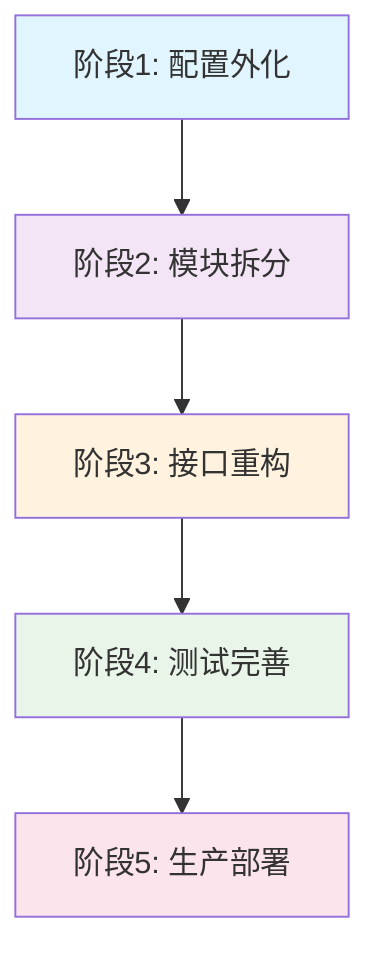
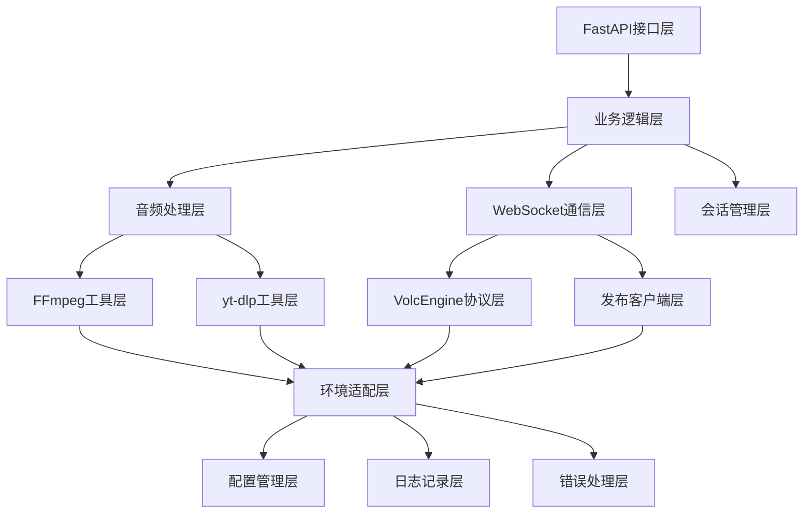

# 重构总体战略

## 重构目标

### 主要目标
1. **模块化架构**: 将1636行单体文件拆分为可维护的模块化组件
2. **配置外化**: 提取硬编码参数，支持环境特定配置
3. **代码复用**: 基于现有VolcEngine WebSocket框架，避免重复开发
4. **环境适配**: 统一本地开发和Cloudflare部署的差异处理
5. **可测试性**: 提高单元测试覆盖率和集成测试能力

### 成功标准
- ✅ 功能等价性: 重构后功能与现有系统完全一致
- ✅ 性能保持: 端到端延迟不超过现有系统+10%
- ✅ 可维护性: 单个模块文件不超过500行代码
- ✅ 可配置性: 90%以上关键参数可通过配置文件调整
- ✅ 部署兼容: 同时支持本地开发和Cloudflare Containers

## 重构原则

### 1. 渐进式重构策略
**原则**: 分阶段重构，确保每个阶段都有可工作的版本



### 2. 基于现有框架的重构
**原则**: 最大化复用`ast_demo.py`中的成熟WebSocket协议框架

#### 现有框架资产保护
```python
# 需要保留的核心框架组件 (ast_demo.py)
PRESERVE_COMPONENTS = {
    "protocol_handling": [
        "TranslateRequest/Response数据类",
        "send_request()函数", 
        "receive_message()函数",
        "build_http_headers()函数"
    ],
    "protobuf_integration": [
        "protobuf序列化/反序列化逻辑",
        "事件类型映射 (Type枚举)",
        "音频数据封装逻辑"
    ],
    "connection_management": [
        "WebSocket连接建立",
        "认证头部构建",
        "连接参数配置"
    ]
}
```

#### 扩展开发策略
```python
# 在现有框架基础上扩展的新组件
EXTEND_COMPONENTS = {
    "session_management": "基于现有连接，添加会话生命周期管理",
    "audio_pipeline": "基于现有音频处理，添加FFmpeg管线",
    "publisher_integration": "基于现有WebSocket，添加转发逻辑",
    "environment_adaptation": "基于现有配置，添加环境适配"
}
```

### 3. 依赖最小化原则
**原则**: 最小化模块间依赖，提高独立性和可测试性

#### 依赖层次结构


## 模块拆分方案

### 1. 核心模块架构

#### 目录结构设计
```
ast_python/
├── core/                           # 核心业务逻辑
│   ├── __init__.py
│   ├── session_manager.py          # 会话管理 (~200行)
│   ├── audio_pipeline.py           # 音频处理管线 (~300行)
│   ├── publisher_client.py         # 发布客户端 (~250行)
│   └── event_processor.py          # 事件处理器 (~200行)
│
├── infrastructure/                 # 基础设施层
│   ├── __init__.py
│   ├── ffmpeg_manager.py           # FFmpeg进程管理 (~300行)
│   ├── ytdlp_manager.py            # yt-dlp管理 (~200行)
│   ├── websocket_client.py         # WebSocket客户端基础 (~250行)
│   └── volcengine_client.py        # VolcEngine协议客户端 (~300行)
│
├── adapters/                       # 环境适配层
│   ├── __init__.py
│   ├── environment_detector.py     # 环境检测 (~150行)
│   ├── logging_adapter.py          # 日志适配器 (~200行)
│   └── resource_manager.py         # 资源管理器 (~200行)
│
├── config/                         # 配置管理
│   ├── __init__.py
│   ├── config_loader.py            # 配置加载器 (~150行)
│   ├── settings.py                 # 配置数据类 (~200行)
│   └── validation.py               # 配置验证 (~150行)
│
├── protocols/                      # 协议层 (基于ast_demo.py)
│   ├── __init__.py
│   ├── volcengine_protocol.py      # VolcEngine协议 (~400行)
│   └── message_converter.py        # 消息转换器 (~200行)
│
├── api/                           # API接口层
│   ├── __init__.py
│   ├── endpoints.py               # FastAPI端点 (~300行)
│   └── models.py                  # API数据模型 (~150行)
│
└── utils/                         # 工具模块
    ├── __init__.py
    ├── async_utils.py             # 异步工具 (~100行)
    ├── file_utils.py              # 文件工具 (~100行)
    └── timing_utils.py            # 时间工具 (~100行)
```

### 2. 模块职责划分

#### core/session_manager.py
```python
"""会话生命周期管理"""
class SessionManager:
    """
    职责:
    - 会话创建、启动、停止、清理
    - 会话状态跟踪和管理  
    - 幂等性操作支持
    - 会话并发控制
    """
    
    async def create_session(self, session_id: str, config: SessionConfig) -> Session:
        """创建新会话"""
        
    async def start_session(self, session: Session) -> bool:
        """启动会话处理"""
        
    async def stop_session(self, session_id: str) -> bool:
        """停止会话处理"""
        
    async def cleanup_session(self, session_id: str):
        """清理会话资源"""
```

#### core/audio_pipeline.py  
```python
"""音频处理管线"""
class AudioPipeline:
    """
    职责:
    - 协调FFmpeg和WebSocket组件
    - 音频数据流管理
    - 静音桥接协调
    - 音频格式转换
    """
    
    async def initialize_pipeline(self, youtube_url: str) -> bool:
        """初始化音频处理管线"""
        
    async def start_processing(self) -> AsyncGenerator[bytes, None]:
        """开始音频处理，返回PCM数据流"""
        
    async def setup_silence_bridge(self) -> None:
        """设置静音桥接"""
```

#### infrastructure/volcengine_client.py
```python
"""VolcEngine协议客户端 (基于ast_demo.py框架)"""
class VolcEngineClient:
    """
    职责:
    - 基于ast_demo.py的WebSocket连接管理
    - 扩展会话生命周期处理
    - 音频数据收发
    - 事件响应处理
    """
    
    # 复用ast_demo.py中的核心函数
    async def send_request(self, request: TranslateRequestData):
        """发送请求 (基于ast_demo.py:send_request)"""
        
    async def receive_message(self) -> TranslateResponseData:
        """接收消息 (基于ast_demo.py:receive_message)"""
```

### 3. 接口设计原则

#### 标准化接口协议
```python
# 所有异步组件的标准接口
class AsyncComponent(ABC):
    @abstractmethod
    async def initialize(self, config: ComponentConfig) -> bool:
        """组件初始化"""
        
    @abstractmethod  
    async def start(self) -> bool:
        """启动组件"""
        
    @abstractmethod
    async def stop(self) -> bool:
        """停止组件"""
        
    @abstractmethod
    async def cleanup(self) -> None:
        """清理资源"""
        
    @property
    @abstractmethod
    def status(self) -> ComponentStatus:
        """获取组件状态"""
```

#### 事件驱动通信
```python
# 组件间事件通信协议
class EventBus:
    """组件间解耦的事件通信"""
    
    async def publish(self, event: Event) -> None:
        """发布事件"""
        
    async def subscribe(self, event_type: str, handler: Callable) -> None:
        """订阅事件"""
        
    async def unsubscribe(self, event_type: str, handler: Callable) -> None:
        """取消订阅"""

# 标准事件类型
EVENT_TYPES = {
    "audio.chunk_ready": "音频块准备就绪",
    "audio.stream_end": "音频流结束", 
    "session.started": "会话启动完成",
    "session.failed": "会话处理失败",
    "websocket.connected": "WebSocket连接建立",
    "websocket.disconnected": "WebSocket连接断开"
}
```

## 配置外化策略

### 1. 配置层次结构

#### 多层配置覆盖机制
```python
CONFIG_LOADING_ORDER = [
    "config/defaults.yaml",          # 默认配置
    "config/base.yaml",              # 基础配置
    f"config/{environment}.yaml",    # 环境特定配置
    "config/local.yaml",             # 本地覆盖配置 (git ignore)
    "environment_variables",         # 环境变量覆盖
    "command_line_arguments"         # 命令行参数覆盖
]
```

#### 配置验证和类型安全
```python
from pydantic import BaseSettings, validator

class AudioConfig(BaseSettings):
    chunk_size: int = 640
    sample_rate: int = 16000
    send_interval: float = 0.02
    
    @validator('chunk_size')
    def validate_chunk_size(cls, v):
        if v % 320 != 0 or v < 320 or v > 1280:
            raise ValueError('chunk_size must be multiple of 320, between 320-1280')
        return v
    
    @validator('send_interval') 
    def validate_send_interval(cls, v):
        if v <= 0 or v > 0.1:
            raise ValueError('send_interval must be between 0 and 0.1 seconds')
        return v

class GlobalConfig(BaseSettings):
    audio: AudioConfig = AudioConfig()
    websocket: WebSocketConfig = WebSocketConfig()
    timeout: TimeoutConfig = TimeoutConfig()
    
    class Config:
        env_file = '.env'
        env_nested_delimiter = '__'  # 支持 AUDIO__CHUNK_SIZE 格式
```

### 2. 环境特定配置

#### 生产环境配置模板
```yaml
# config/cloudflare.yaml
environment:
  type: "cloudflare"
  detection:
    env_vars: ["CF_PAGES", "CF_PAGES_URL"]

logging:
  level: "INFO"
  file_enabled: false
  stderr_enabled: true
  prefix: "CLOUDFLARE_"

resources:
  memory_limit: "90MB"
  max_sessions: 3
  thread_pool_size: 2

timeouts:
  silence_timeout: 18
  ffmpeg_start: 30
  first_chunk: 30

audio:
  chunk_size: 640
  sample_rate: 16000
  send_interval: 0.02

ffmpeg:
  log_level: "error"
  preset: "ultrafast"
  tune: "zerolatency"
```

## 测试策略

### 1. 测试金字塔结构

#### 单元测试 (70%)
```python
# tests/unit/test_session_manager.py
class TestSessionManager:
    async def test_create_session_success(self):
        """测试会话创建成功场景"""
        
    async def test_create_session_duplicate(self):
        """测试重复会话创建处理"""
        
    async def test_session_cleanup(self):
        """测试会话资源清理"""

# tests/unit/test_audio_pipeline.py  
class TestAudioPipeline:
    async def test_pipeline_initialization(self):
        """测试管线初始化"""
        
    async def test_silence_bridge_coordination(self):
        """测试静音桥接协调"""
```

#### 集成测试 (20%)
```python
# tests/integration/test_end_to_end.py
class TestEndToEndFlow:
    async def test_complete_translation_flow(self):
        """测试完整翻译流程"""
        
    async def test_error_recovery_flow(self):
        """测试错误恢复流程"""
        
    async def test_environment_adaptation(self):
        """测试环境适配逻辑"""
```

#### 性能测试 (10%)
```python
# tests/performance/test_latency.py
class TestPerformance:
    async def test_end_to_end_latency(self):
        """测试端到端延迟"""
        
    async def test_memory_usage(self):
        """测试内存使用情况"""
        
    async def test_concurrent_sessions(self):
        """测试并发会话处理"""
```

### 2. Mock和测试工具

#### 外部服务Mock
```python
# tests/mocks/volcengine_mock.py
class MockVolcEngineService:
    """VolcEngine服务模拟器"""
    
    async def simulate_translation_session(self, 
                                         audio_chunks: List[bytes],
                                         response_delay: float = 0.1):
        """模拟翻译会话"""

# tests/mocks/youtube_mock.py  
class MockYouTubeService:
    """YouTube服务模拟器"""
    
    def generate_mock_audio_stream(self, 
                                 duration: int,
                                 sample_rate: int = 16000):
        """生成模拟音频流"""
```

## 迁移计划

### 1. 阶段性迁移路径

#### 阶段1: 基础设施准备 (1周)
- [x] 创建模块目录结构
- [x] 设置配置管理系统
- [x] 建立测试框架
- [x] 环境检测逻辑迁移

#### 阶段2: 协议层迁移 (1周)  
- [ ] 将`ast_demo.py`框架迁移到`protocols/volcengine_protocol.py`
- [ ] 扩展协议处理能力
- [ ] 添加会话管理功能
- [ ] 单元测试覆盖

#### 阶段3: 基础组件迁移 (2周)
- [ ] FFmpeg管理器迁移
- [ ] yt-dlp管理器迁移  
- [ ] WebSocket客户端迁移
- [ ] 音频处理管线构建

#### 阶段4: 业务逻辑迁移 (2周)
- [ ] 会话管理器实现
- [ ] 事件处理器实现
- [ ] 发布客户端实现
- [ ] 集成测试验证

#### 阶段5: API接口迁移 (1周)
- [ ] FastAPI端点重构
- [ ] 错误处理统一
- [ ] API文档更新
- [ ] 端到端测试

### 2. 风险缓解措施

#### 技术风险
```python
RISK_MITIGATION = {
    "功能回归": {
        "风险": "重构后功能不一致",
        "缓解": [
            "完整的端到端测试覆盖",
            "与原系统并行运行对比",
            "分阶段功能验证"
        ]
    },
    "性能下降": {
        "风险": "模块化导致性能损失", 
        "缓解": [
            "关键路径性能基准测试",
            "异步处理优化",
            "内存使用监控"
        ]
    },
    "环境兼容性": {
        "风险": "Cloudflare环境适配问题",
        "缓解": [
            "环境特定测试套件",
            "资源使用监控",
            "降级策略实现"
        ]
    }
}
```

#### 回滚策略
```python
ROLLBACK_STRATEGY = {
    "feature_flag": "使用功能开关控制新旧系统切换",
    "blue_green": "蓝绿部署支持快速回滚", 
    "database_compatibility": "确保数据结构向后兼容",
    "monitoring": "关键指标监控和自动回滚触发"
}
```

## 成功验收标准

### 1. 功能验收标准
- ✅ **功能完整性**: 所有现有API功能正常工作
- ✅ **配置灵活性**: 90%关键参数可配置
- ✅ **环境兼容性**: 本地和Cloudflare环境都能正常部署
- ✅ **错误处理**: 异常情况下的优雅降级

### 2. 性能验收标准
- ✅ **延迟**: 端到端延迟 ≤ 原系统 × 1.1
- ✅ **吞吐量**: 并发处理能力 ≥ 原系统
- ✅ **资源使用**: Cloudflare环境内存使用 < 90MB
- ✅ **稳定性**: 连续运行24小时无内存泄露

### 3. 代码质量标准
- ✅ **模块大小**: 单文件代码量 < 500行
- ✅ **测试覆盖**: 单元测试覆盖率 > 80%
- ✅ **依赖管理**: 模块间循环依赖为0
- ✅ **文档完整**: 所有公共API有文档说明

### 4. 部署验收标准
- ✅ **部署自动化**: CI/CD流水线自动部署
- ✅ **监控完备**: 关键指标监控和告警
- ✅ **运维友好**: 问题排查和日志查看便利
- ✅ **版本管理**: 支持灰度发布和快速回滚

---

**文档版本**: v1.0.0  
**关联文档**: [模块拆分方案](module-breakdown.md) | [迁移计划](migration-plan.md)  
**最后更新**: 2025-01-XX