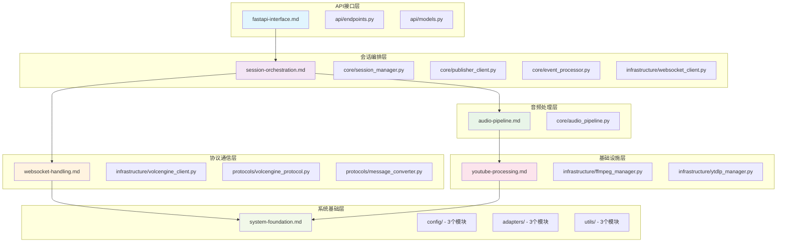

# 模块特定提示词文档架构

## 📋 功能域文档概览

本目录包含6个功能域文档，完整覆盖20个目标模块的AI重写指导。每个文档负责特定功能域的模块重写，通过系统集成视图明确文档间依赖关系。

## 🏗️ 整体系统架构



## 📊 模块覆盖度统计

| 功能域文档 | 覆盖模块数 | 代码行数 | 主要职责 |
|-----------|-----------|---------|----------|
| [fastapi-interface.md](fastapi-interface.md) | 2个模块 | ~550行 | HTTP API接口和数据验证 |
| [session-orchestration.md](session-orchestration.md) | 4个模块 | ~1150行 | 会话管理和事件编排 |
| [audio-pipeline.md](audio-pipeline.md) | 1个模块 | ~400行 | 音频管线协调 |
| [websocket-handling.md](websocket-handling.md) | 3个模块 | ~1100行 | VolcEngine协议通信 |
| [youtube-processing.md](youtube-processing.md) | 2个模块 | ~600行 | 音频基础设施 |
| [system-foundation.md](system-foundation.md) | 9个模块 | ~1600行 | 系统基础设施 |
| **总计** | **20个模块** | **~5400行** | **完整系统覆盖** |

## 🔗 文档间依赖关系

### 依赖层次
```
Level 1 (基础层): system-foundation.md
Level 2 (设施层): youtube-processing.md, websocket-handling.md  
Level 3 (协调层): audio-pipeline.md
Level 4 (编排层): session-orchestration.md
Level 5 (接口层): fastapi-interface.md
```

### 关键依赖说明

**system-foundation.md** (被所有文档依赖)
- 提供配置管理、环境适配、日志系统等基础服务
- 被依赖文档：所有其他5个文档

**youtube-processing.md** (被音频管线依赖)
- 提供YouTube URL提取和FFmpeg PCM转换
- 被依赖文档：audio-pipeline.md, session-orchestration.md(间接)

**websocket-handling.md** (被会话编排依赖)
- 提供VolcEngine协议通信能力
- 被依赖文档：session-orchestration.md

**audio-pipeline.md** (被会话编排依赖)
- 提供音频处理管线协调服务
- 被依赖文档：session-orchestration.md

**session-orchestration.md** (被API接口依赖)
- 提供核心业务逻辑和会话管理
- 被依赖文档：fastapi-interface.md

**fastapi-interface.md** (系统入口)
- 提供HTTP API接口，无被依赖文档

## 🎯 AI重写指导原则

### 1. 分层重写策略
按依赖层次从底层到顶层依次重写：
1. 系统基础层 → 2. 基础设施层 → 3. 协调层 → 4. 编排层 → 5. 接口层

### 2. 接口契约保持
- 模块间接口定义必须与文档中的约定保持一致
- 跨文档引用的组件接口不得随意修改

### 3. 配置参数传递
- 所有硬编码参数必须通过system-foundation.md的配置系统传递
- 环境适配逻辑统一通过environment_detector.py处理

### 4. 错误处理传播
- 底层异常必须向上层传播，不得在中间层吞没
- 异常信息必须包含足够的上下文用于问题排查

## 📋 验证清单

### 模块覆盖验证
- [ ] 20个目标模块全部有对应的重写指导
- [ ] 每个模块都明确归属于某个功能域文档
- [ ] 无模块重复覆盖或遗漏覆盖

### 依赖关系验证  
- [ ] 所有文档的系统集成视图准确反映依赖关系
- [ ] 跨文档的组件接口约定一致
- [ ] 依赖层次无循环依赖

### 功能完整性验证
- [ ] 原系统的所有功能点都有对应的重写指导
- [ ] 关键业务流程的端到端覆盖完整
- [ ] 环境适配和配置管理覆盖全面

---

**文档版本**: v1.0.0  
**总模块数**: 20个模块，~5400行代码  
**文档数量**: 6个功能域文档  
**最后更新**: 2025-01-XX