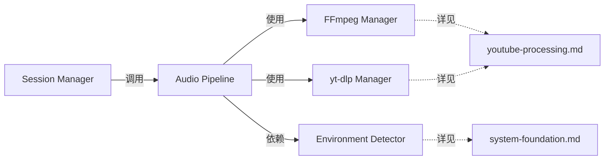

# 音频流处理管线模块 AI 重写指导

## 📍 系统集成视图

本文档在整体架构中的位置：**音频处理核心协调层**

### 文档职责边界
- **本文档职责**：音频管线协调、静音桥接机制、组件集成逻辑
- **依赖文档**：
  - [youtube-processing.md](youtube-processing.md) - FFmpeg和yt-dlp组件的详细实现
  - [session-orchestration.md](session-orchestration.md) - 会话级别的管线调用
  - [system-foundation.md](system-foundation.md) - 环境检测和配置管理

### 关键集成点


## 概述

本文档为AI工具提供重写音频流处理管线协调相关模块的专门指导。重点覆盖音频管线的组件协调、静音桥接机制、数据流控制等核心协调功能，确保重写后的模块保持与原系统完全一致的音频处理能力和性能表现。

## 🎯 模块范围和职责

### 核心模块

#### core/audio_pipeline.py (~400行)
**主要职责**:
- 协调FFmpeg和yt-dlp组件的音频处理流程
- 管理音频数据流和PCM块生成
- 实现静音桥接协调机制，处理冷启动问题
- 监控音频处理状态和质量

### 依赖组件 (详细实现参见其他文档)

#### infrastructure/ffmpeg_manager.py (~350行)
**详细实现**: 参见 [youtube-processing.md](youtube-processing.md#ffmpeg-manager)

**在音频管线中的集成要点**:
- 由 AudioPipeline 负责初始化和生命周期管理
- 提供PCM数据流的异步生成器接口
- 支持环境适配的命令参数配置

#### infrastructure/ytdlp_manager.py (~250行)  
**详细实现**: 参见 [youtube-processing.md](youtube-processing.md#ytdlp-manager)

**在音频管线中的集成要点**:
- 由 AudioPipeline 在初始化阶段调用
- 提供HLS流URL供FFmpeg使用
- 支持预热机制减少冷启动延迟

## 🔧 关键实现要求

### 1. 音频参数严格保持
```python
CRITICAL_AUDIO_PARAMETERS = {
    "chunk_size": 640,              # 必须精确为640字节 (20ms @ 16kHz)
    "sample_rate": 16000,           # 必须为16kHz采样率
    "channels": 1,                  # 必须为单声道
    "bit_depth": 16,               # 必须为16位深度
    "send_interval": 0.02,          # 必须为20ms间隔
    "audio_format": "pcm_s16le"     # 必须为小端16位PCM
}
```

### 2. 静音桥接协调机制
**核心职责**: 解决YouTube/FFmpeg冷启动延迟问题，确保VolcEngine会话启动后立即有音频数据流

**关键时序控制**:
```python
# 基于 ast_youtube_demo.py:680-690 的关键逻辑
async def setup_silence_bridge(self):
    """静音桥接协调机制 - 环境适配的超时控制"""
    
    # 环境适配超时设置 (关键参数)
    env = detect_environment()
    timeout = 18 if env.startswith("cloudflare") else 8
    
    # 生成标准静音块
    silence_chunk = b'\x00' * self.config.chunk_size  # 640字节零填充
    
    # 协调真实音频流就绪事件
    try:
        await asyncio.wait_for(
            self.audio_ready_event.wait(), 
            timeout=timeout
        )
        # 真实音频流就绪，停止静音桥接
    except asyncio.TimeoutError:
        # 超时后继续，依赖现有音频流
        pass
```

**验证要求**:
- 静音块必须为640字节的零填充数据
- 环境适配超时：本地8秒，Cloudflare 18秒
- 音频流就绪事件必须准确触发

### 3. 组件协调流程
**初始化阶段协调**:
```python
async def initialize(self, youtube_url: str) -> bool:
    """并行初始化组件，最小化启动延迟"""
    
    # 创建组件实例
    self.ytdlp_manager = YtDlpManager()  # 详见: youtube-processing.md
    self.ffmpeg_manager = FFmpegManager()  # 详见: youtube-processing.md
    
    # 并行执行初始化
    tasks = [
        self.ytdlp_manager.preform_pool(),  # 预热线程池
        self.ytdlp_manager.extract_stream_url(youtube_url),  # 提取流URL
    ]
    
    results = await asyncio.gather(*tasks, return_exceptions=True)
    stream_url = results[1]
    
    # 初始化FFmpeg
    await self.ffmpeg_manager.initialize(stream_url, self.config)
```

**处理阶段协调**:
```python
async def start_processing(self) -> AsyncGenerator[bytes, None]:
    """协调音频处理流程"""
    
    # 启动静音桥接协调
    silence_task = asyncio.create_task(self._silence_bridge_coordinator())
    
    # 启动FFmpeg进程
    await self.ffmpeg_manager.start_process()
    
    try:
        chunk_count = 0
        async for pcm_chunk in self.ffmpeg_manager.read_pcm_chunks():
            # 首个音频块触发真实流就绪
            if chunk_count == 0:
                self.audio_ready_event.set()  # 停止静音桥接
                
            # 严格验证块大小
            if len(pcm_chunk) == self.config.chunk_size:
                yield pcm_chunk
            
            chunk_count += 1
    finally:
        silence_task.cancel()
```

## 📋 核心实现结构

### core/audio_pipeline.py 实现框架
```python
"""
音频处理管线模块 - 协调层实现
基于 ast_youtube_demo.py:650-800 的管线协调逻辑
"""

import asyncio
import logging
from typing import AsyncGenerator, Optional
from dataclasses import dataclass

@dataclass
class AudioConfig:
    """音频配置参数"""
    chunk_size: int = 640           # PCM块大小 (20ms @ 16kHz)
    sample_rate: int = 16000        # 采样率
    channels: int = 1               # 声道数
    bit_depth: int = 16            # 位深度
    send_interval: float = 0.02     # 发送间隔(20ms)

class AudioPipeline:
    """
    音频处理管线协调器
    负责YouTube音频提取、FFmpeg转换和静音桥接的协调
    """
    
    def __init__(self, config: Optional[AudioConfig] = None):
        self.config = config or AudioConfig()
        self.logger = logging.getLogger(__name__)
        
        # 组件引用 (具体实现在依赖文档中)
        self.ytdlp_manager = None
        self.ffmpeg_manager = None
        
        # 协调事件
        self.audio_ready_event = asyncio.Event()
        self.stop_event = asyncio.Event()
        
        # 状态追踪
        self.is_initialized = False
        self.is_processing = False
    
    async def initialize(self, youtube_url: str) -> bool:
        """初始化音频管线 - 并行组件初始化"""
        # 实现组件协调逻辑...
        
    async def start_processing(self) -> AsyncGenerator[bytes, None]:
        """开始音频处理 - 静音桥接协调"""
        # 实现静音桥接和数据流协调...
    
    async def _silence_bridge_coordinator(self):
        """静音桥接协调器 - 环境适配超时控制"""
        # 实现静音桥接逻辑...
    
    async def stop(self):
        """停止音频处理 - 组件清理协调"""
        # 实现组件清理协调...
    
    def get_metrics(self) -> dict:
        """获取管线处理指标"""
        # 实现状态和指标收集...
```

### 组件接口约定
**与FFmpeg Manager的接口约定**:
```python
# FFmpegManager必须提供的接口 (详见: youtube-processing.md)
async def initialize(self, stream_url: str, config: AudioConfig)
async def start_process(self)
async def read_pcm_chunks(self) -> AsyncGenerator[bytes, None]
async def stop(self)
```

**与yt-dlp Manager的接口约定**:
```python  
# YtDlpManager必须提供的接口 (详见: youtube-processing.md)
async def preform_pool(self)
async def extract_stream_url(self, youtube_url: str) -> str
async def cleanup(self)
```

## 🧪 验证清单

### 协调逻辑验证
- [ ] **静音桥接时序**: 环境适配超时准确，真实音频流切换时机正确
- [ ] **组件初始化**: 并行初始化无竞态条件，异常处理完整
- [ ] **数据流协调**: PCM块大小验证，流控制无阻塞
- [ ] **资源清理**: 组件停止顺序正确，无资源泄露

### 集成验证
- [ ] **与Session Manager集成**: 管线启动/停止接口正确
- [ ] **与基础组件集成**: FFmpeg和yt-dlp组件调用接口正确  
- [ ] **与配置系统集成**: 音频参数配置加载正确
- [ ] **与环境适配集成**: 环境检测结果应用正确

### 性能验证  
- [ ] **协调延迟**: 组件协调增加延迟<20ms
- [ ] **内存使用**: 协调层内存占用<5MB
- [ ] **异步性能**: 无协程阻塞，事件循环流畅

## ⚠️ 关键注意事项

### 必须保持的协调机制
1. **静音桥接时序**: 环境适配的超时参数经过生产验证
2. **组件初始化顺序**: yt-dlp预热→URL提取→FFmpeg初始化的顺序
3. **异步协调模式**: 所有组件使用asyncio协调，避免同步阻塞
4. **事件驱动控制**: 使用asyncio.Event进行组件间状态同步

### 不要修改的核心参数
1. **音频块大小**: 640字节是VolcEngine API的严格要求
2. **静音桥接超时**: 本地8秒/Cloudflare 18秒是经过调优的参数
3. **组件接口约定**: 与FFmpeg/yt-dlp的接口契约必须保持

---

**文档版本**: v1.0.0  
**关联文档**: [youtube-processing.md](youtube-processing.md) | [session-orchestration.md](session-orchestration.md) | [system-foundation.md](system-foundation.md)  
**最后更新**: 2025-01-XX