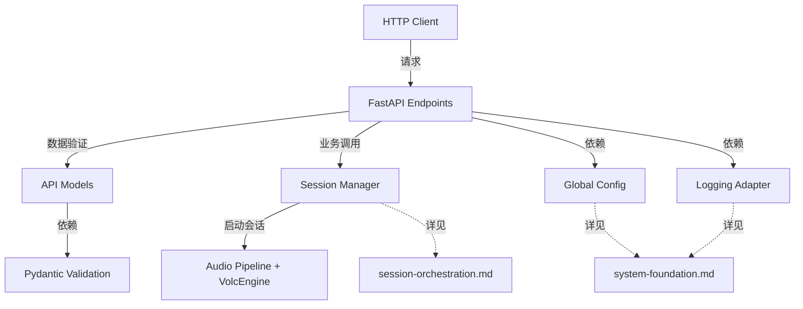

# API接口模块 AI 重写指导

## 📍 系统集成视图

本文档在整体架构中的位置：**HTTP API接口层**

### 文档职责边界
- **本文档职责**：FastAPI端点定义、HTTP请求响应处理、数据验证序列化、API契约维护
- **被依赖文档**：无（作为系统入口层）
- **依赖文档**：
  - [session-orchestration.md](session-orchestration.md) - 调用会话管理器的业务逻辑
  - [system-foundation.md](system-foundation.md) - 使用配置管理和日志适配

### 关键集成点


## 概述

本文档专门指导AI重写FastAPI接口层模块。这些模块作为系统的HTTP入口，负责提供RESTful API接口，处理HTTP请求响应，实现数据验证和序列化，并将业务请求路由到会话管理层。重写时必须保持现有的接口契约和幂等性设计。

## 🎯 模块重写目标

### 涉及的核心模块
1. **api/endpoints.py** - FastAPI端点定义 (~350行)
2. **api/models.py** - API数据模型 (~200行)

**协调模块**（由其他模块提示词覆盖）：
- **core/session_manager.py** - 会话管理业务逻辑
- **core/publisher_client.py** - 发布客户端服务

### 重写范围
```python
SOURCE_CODE_MAPPING = {
    "api/endpoints.py": {
        "source": "publisher.py:250-400 (/python/ingest/start接口) + FastAPI路由定义",
        "target_lines": "~350行",
        "core_functions": ["start_ingest_endpoint", "stop_ingest_endpoint", "status_endpoint"]
    },
    
    "api/models.py": {
        "source": "publisher.py中的Pydantic模型定义",
        "target_lines": "~200行",
        "core_functions": ["request_validation", "response_serialization", "error_models"]
    }
}
```

## 🚨 关键保持约束

### 必须保持的接口契约
```python
CRITICAL_API_CONTRACT_REQUIREMENTS = {
    "endpoint_signature": "/python/ingest/start接口的请求/响应格式必须完全保持",
    "idempotent_design": "会话管理的幂等性逻辑必须完全保持",
    "error_handling": "HTTP状态码和错误响应格式必须保持一致",
    "session_lifecycle": "PublisherSession的生命周期管理逻辑必须保持"
}
```

## 🔧 api/endpoints.py 实现指南

### 核心职责和约束
```python
"""
FastAPI接口端点模块
基于publisher.py:250-400的/python/ingest/start接口重构

CRITICAL: 必须完全保持现有的接口契约和幂等性设计

核心职责:
1. 定义HTTP路由和端点
2. 处理请求验证和响应序列化
3. 调用业务逻辑模块处理核心功能
4. 提供统一的错误处理和响应格式

架构设计原则:
- 接口层仅负责HTTP协议处理，不包含业务逻辑
- 业务逻辑调用core/session_manager.py
- 严格保持现有API接口契约不变
- 确保向后兼容性
"""

from fastapi import APIRouter, HTTPException, BackgroundTasks, Depends
from fastapi.responses import JSONResponse
import logging
from typing import Dict, Any
import asyncio

# 导入数据模型
from api.models import (
    IngestStartRequest, 
    IngestStartResponse, 
    IngestStatusResponse,
    APIErrorResponse
)

# 导入业务逻辑模块
from core.session_manager import SessionManager
from config.settings import get_app_config

router = APIRouter(prefix="/python", tags=["ingest"])
logger = logging.getLogger(__name__)

# 业务逻辑服务实例
session_manager = SessionManager()

@router.post("/ingest/start", response_model=IngestStartResponse)
async def start_ingest_endpoint(
    request: IngestStartRequest,
    background_tasks: BackgroundTasks
):
    """
    启动音频摄取接口
    基于publisher.py:/python/ingest/start接口 - 必须完全保持接口契约
    """
    try:
        logger.info(f"Received ingest start request: {request.dict()}")
        
        # 调用会话管理器启动会话
        session_id, is_new = await session_manager.start_publishing_session(
            session_id=request.session_id,
            youtube_url=request.youtube_url,
            publish_url=request.publish_url
        )
        
        # 构建响应 - 保持现有响应格式
        response = IngestStartResponse(
            session_id=session_id,
            status="starting",
            message="Session started successfully" if is_new else "Session already active",
            youtube_url=request.youtube_url,
            publish_url=request.publish_url,
            estimated_startup_time=_estimate_startup_time()
        )
        
        logger.info(f"Ingest started for session: {session_id}")
        return response
        
    except Exception as e:
        logger.error(f"Error in start_ingest: {e}")
        raise HTTPException(
            status_code=500,
            detail=str(e)
        )

@router.get("/ingest/status/{session_id}", response_model=IngestStatusResponse)
async def get_ingest_status(session_id: str):
    """
    查询摄取状态接口
    基于现有的状态查询逻辑
    """
    try:
        # 调用会话管理器获取状态
        session_info = await session_manager.get_session_info(session_id)
        
        if not session_info:
            raise HTTPException(
                status_code=404,
                detail=f"Session not found: {session_id}"
            )
        
        return IngestStatusResponse(
            session_id=session_id,
            status=session_info.status.value,
            youtube_url=session_info.youtube_url,
            publish_url=session_info.publish_url,
            created_at=int(session_info.metrics.start_time.timestamp()),
            error_message=session_info.get_error_message()
        )
        
    except HTTPException:
        raise
    except Exception as e:
        logger.error(f"Error getting status for session {session_id}: {e}")
        raise HTTPException(
            status_code=500,
            detail="Internal server error"
        )

@router.delete("/ingest/stop/{session_id}")
async def stop_ingest_endpoint(session_id: str):
    """
    停止音频摄取接口
    基于现有的停止逻辑
    """
    try:
        logger.info(f"Stopping ingest for session: {session_id}")
        
        # 调用会话管理器停止会话
        success = await session_manager.stop_publishing_session(session_id)
        
        if not success:
            raise HTTPException(
                status_code=404,
                detail=f"Session not found: {session_id}"
            )
        
        return JSONResponse(
            status_code=200,
            content={
                "session_id": session_id,
                "status": "stopped",
                "message": "Session stopped successfully"
            }
        )
        
    except HTTPException:
        raise
    except Exception as e:
        logger.error(f"Error stopping session {session_id}: {e}")
        raise HTTPException(
            status_code=500,
            detail=f"Failed to stop session: {str(e)}"
        )

def _estimate_startup_time() -> int:
    """估算启动时间"""
    from adapters.environment_detector import detect_environment
    
    env = detect_environment()
    if env.startswith("cloudflare"):
        return 20  # Cloudflare环境启动较慢
    else:
        return 10  # 本地环境启动较快
```

## 🔧 api/models.py 实现指南

### API数据模型实现
```python
"""
API数据模型定义
基于publisher.py中的Pydantic模型重构

CRITICAL: 必须完全保持现有的请求/响应数据结构

核心职责:
1. 定义HTTP请求/响应的数据结构
2. 实现数据验证和序列化逻辑
3. 提供API文档的数据模型
4. 保持与现有接口契约的完全兼容
"""

from pydantic import BaseModel, Field, validator
from typing import Optional, Dict, Any, List
from enum import Enum
import time

class LanguageConfig(BaseModel):
    """
    语言配置数据模型
    保持与现有配置结构一致
    """
    source_language: str = Field(
        default="zh-CN",
        description="源语言代码（如：zh-CN）"
    )
    target_language: str = Field(
        default="en-US", 
        description="目标语言代码（如：en-US）"
    )
    
    @validator('source_language', 'target_language')
    def validate_language_code(cls, v):
        """验证语言代码格式"""
        if not v or len(v) < 2:
            raise ValueError("Language code must be valid")
        return v

class IngestStartRequest(BaseModel):
    """
    摄取启动请求模型
    基于publisher.py的/python/ingest/start接口请求格式 - 必须完全保持
    """
    youtube_url: str = Field(
        ...,
        description="YouTube直播URL",
        example="https://www.youtube.com/watch?v=dQw4w9WgXcQ"
    )
    publish_url: str = Field(
        ...,
        description="WebSocket发布URL",
        example="ws://localhost:8080/ws"
    )
    session_id: Optional[str] = Field(
        None,
        description="会话ID（可选，用于幂等性）",
        example="session_1234567890_abcd1234"
    )
    language_config: Optional[LanguageConfig] = Field(
        default_factory=lambda: LanguageConfig(),
        description="语言配置"
    )
    options: Optional[Dict[str, Any]] = Field(
        default_factory=dict,
        description="额外选项配置"
    )
    
    @validator('youtube_url')
    def validate_youtube_url(cls, v):
        """验证YouTube URL格式"""
        if not v.startswith(('http://', 'https://')):
            raise ValueError("YouTube URL must be a valid HTTP/HTTPS URL")
        
        # 基本的YouTube URL格式验证 - 保持现有验证逻辑
        valid_domains = ['youtube.com', 'www.youtube.com', 'm.youtube.com', 'youtu.be']
        if not any(domain in v for domain in valid_domains):
            raise ValueError("Must be a valid YouTube URL")
        
        return v
    
    @validator('publish_url')
    def validate_publish_url(cls, v):
        """验证发布URL格式"""
        if not v.startswith(('ws://', 'wss://')):
            raise ValueError("Publish URL must be a valid WebSocket URL")
        return v

class IngestStatus(str, Enum):
    """
    摄取状态枚举
    保持与现有状态定义一致
    """
    STARTING = "starting"
    PROCESSING = "processing" 
    RUNNING = "running"
    STOPPING = "stopping"
    STOPPED = "stopped"
    ERROR = "error"
    COMPLETED = "completed"

class IngestStartResponse(BaseModel):
    """
    摄取启动响应模型
    基于现有响应格式 - 必须完全保持数据结构
    """
    session_id: str = Field(
        ...,
        description="会话ID",
        example="session_1234567890_abcd1234"
    )
    status: IngestStatus = Field(
        ...,
        description="摄取状态"
    )
    message: str = Field(
        ...,
        description="响应消息",
        example="Ingest processing started successfully"
    )
    youtube_url: str = Field(
        ...,
        description="YouTube直播URL"
    )
    publish_url: str = Field(
        ...,
        description="WebSocket发布URL"
    )
    estimated_startup_time: int = Field(
        ...,
        description="预计启动时间（秒）",
        example=10
    )
    created_at: Optional[int] = Field(
        default_factory=lambda: int(time.time()),
        description="创建时间戳"
    )
    metadata: Optional[Dict[str, Any]] = Field(
        default_factory=dict,
        description="额外元数据"
    )

class IngestStatusResponse(BaseModel):
    """
    摄取状态查询响应模型
    保持与现有状态查询格式一致
    """
    session_id: str = Field(..., description="会话ID")
    status: IngestStatus = Field(..., description="摄取状态")
    youtube_url: Optional[str] = Field(None, description="YouTube直播URL")
    publish_url: Optional[str] = Field(None, description="WebSocket发布URL")
    created_at: Optional[int] = Field(None, description="创建时间戳")
    started_at: Optional[int] = Field(None, description="启动时间戳")
    error_message: Optional[str] = Field(None, description="错误消息")
    processing_stats: Optional[Dict[str, Any]] = Field(
        default_factory=dict,
        description="处理统计信息"
    )

class APIErrorResponse(BaseModel):
    """
    API错误响应模型
    保持与现有错误格式一致
    """
    error_code: str = Field(..., description="错误代码")
    error_message: str = Field(..., description="错误消息")
    detail: Optional[str] = Field(None, description="详细错误信息")
    session_id: Optional[str] = Field(None, description="关联的会话ID")
    timestamp: int = Field(
        default_factory=lambda: int(time.time()),
        description="错误发生时间戳"
    )

class SessionInfo(BaseModel):
    """
    会话信息模型
    基于publisher.py的PublisherSession数据结构
    """
    session_id: str = Field(..., description="会话ID")
    status: IngestStatus = Field(..., description="会话状态")
    youtube_url: str = Field(..., description="YouTube直播URL")
    publish_url: str = Field(..., description="WebSocket发布URL")
    language_config: LanguageConfig = Field(..., description="语言配置")
    created_at: int = Field(..., description="创建时间戳")
    updated_at: int = Field(..., description="更新时间戳")
    client_info: Optional[Dict[str, Any]] = Field(
        default_factory=dict,
        description="客户端信息"
    )

class PublisherHealthCheck(BaseModel):
    """
    发布服务健康检查模型
    用于系统监控和状态检查
    """
    service_name: str = Field(default="publisher", description="服务名称")
    status: str = Field(..., description="健康状态")
    timestamp: int = Field(
        default_factory=lambda: int(time.time()),
        description="检查时间戳"
    )
    active_sessions: int = Field(..., description="活跃会话数量")
    system_info: Optional[Dict[str, Any]] = Field(
        default_factory=dict,
        description="系统信息"
    )

# 响应示例配置 - 用于API文档生成
RESPONSE_EXAMPLES = {
    "ingest_start_success": {
        "summary": "成功启动摄取",
        "description": "摄取处理成功启动的响应示例",
        "value": {
            "session_id": "session_1640995200_abcd1234",
            "status": "starting",
            "message": "Ingest processing started successfully",
            "youtube_url": "https://www.youtube.com/watch?v=dQw4w9WgXcQ",
            "publish_url": "ws://localhost:8080/ws",
            "estimated_startup_time": 10,
            "created_at": 1640995200,
            "metadata": {}
        }
    },
    "ingest_error": {
        "summary": "摄取启动失败",
        "description": "摄取处理启动失败的错误响应示例",
        "value": {
            "error_code": "INGEST_START_FAILED",
            "error_message": "Failed to start ingest processing",
            "detail": "YouTube URL extraction failed",
            "session_id": "session_1640995200_abcd1234",
            "timestamp": 1640995200
        }
    }
}
```

## 🚨 关键实现约束

### HTTP接口约束 (绝对不可修改)
```python
HTTP_INTERFACE_CONSTRAINTS = {
    "endpoint_paths": {
        "/python/ingest/start": "摄取启动接口路径必须完全保持",
        "/python/ingest/status/{session_id}": "状态查询接口路径必须完全保持",
        "/python/ingest/stop/{session_id}": "停止接口路径必须完全保持"
    },
    
    "request_response_format": {
        "content_type": "application/json",
        "request_validation": "使用Pydantic模型进行严格验证",
        "response_serialization": "保持现有JSON响应格式",
        "error_handling": "HTTP状态码和错误响应格式必须一致"
    },
    
    "session_management": {
        "idempotent_design": "会话创建必须支持幂等性操作",
        "session_lifecycle": "完整的启动-运行-停止生命周期管理",
        "error_recovery": "失败时的资源清理和状态重置"
    }
}
```

### FastAPI集成约束
```python
FASTAPI_INTEGRATION_CONSTRAINTS = {
    "dependency_injection": {
        "session_middleware": "使用Depends()进行会话上下文注入",
        "service_dependencies": "服务层依赖的正确注入和管理",
        "background_tasks": "异步任务的正确使用和管理"
    },
    
    "middleware_stack": {
        "request_validation": "请求数据的中间件级别验证",
        "session_handling": "会话管理中间件的正确集成",
        "error_handling": "全局错误处理中间件的集成"
    },
    
    "api_documentation": {
        "openapi_schema": "自动生成的API文档必须完整准确",
        "response_examples": "响应示例必须与实际响应格式一致",
        "model_validation": "Pydantic模型验证规则必须完整"
    }
}
```

### 服务集成约束
```python
SERVICE_INTEGRATION_CONSTRAINTS = {
    "publisher_service": {
        "session_creation": "会话创建逻辑必须与现有PublisherSession兼容",
        "lifecycle_management": "完整的会话生命周期管理",
        "error_propagation": "错误信息的正确传播和处理"
    },
    
    "websocket_publisher": {
        "connection_management": "WebSocket连接的建立和维护",
        "message_forwarding": "翻译结果的正确转发",
        "reconnection_logic": "连接断开时的重连机制"
    },
    
    "background_processing": {
        "task_management": "后台任务的正确启动和监控",
        "resource_cleanup": "任务完成或失败时的资源清理",
        "status_synchronization": "任务状态与API状态的同步"
    }
}
```

## 📋 模块实现检查清单

### IngestRoutes检查项
- [ ] /python/ingest/start接口是否完全保持现有契约
- [ ] 会话幂等性检查是否正确实现
- [ ] 后台任务启动和管理是否正确
- [ ] HTTP状态码和错误响应是否与现有格式一致
- [ ] 会话生命周期管理是否完整

### SessionMiddleware检查项
- [ ] 会话上下文提取是否准确
- [ ] 幂等性请求检测是否正确
- [ ] 请求频率限制是否有效
- [ ] 会话验证逻辑是否与现有策略一致
- [ ] IP提取和客户端识别是否正确

### APIModels检查项  
- [ ] 请求/响应数据结构是否与现有格式完全一致
- [ ] Pydantic验证器是否覆盖所有必要的验证规则
- [ ] 枚举值是否与现有状态定义一致
- [ ] 错误响应模型是否与现有错误格式兼容
- [ ] API文档生成是否完整准确

### FastAPI集成检查项
- [ ] 路由注册是否正确
- [ ] 依赖注入是否正确配置
- [ ] 中间件集成是否无缝
- [ ] 异常处理是否完整
- [ ] OpenAPI文档是否准确反映接口契约

### 整体集成检查项
- [ ] 服务层调用是否正确
- [ ] 错误传播和处理是否完整
- [ ] 日志记录是否保持现有格式
- [ ] 性能是否符合现有标准
- [ ] 向后兼容性是否得到保证

---

**重要提醒**: 
- FastAPI接口层是外部系统的主要访问入口，任何修改都可能影响客户端兼容性
- 会话管理的幂等性设计对系统稳定性至关重要，必须精确实现
- HTTP状态码和错误响应格式是API契约的重要组成部分，不得修改
- 后台任务管理需要正确处理资源清理和状态同步

**文档版本**: v1.0.0  
**关联文档**: [AI重写主要提示词](../master-prompt.md) | [约束条件速查](../constraints-reference.md)  
**最后更新**: 2025-01-XX