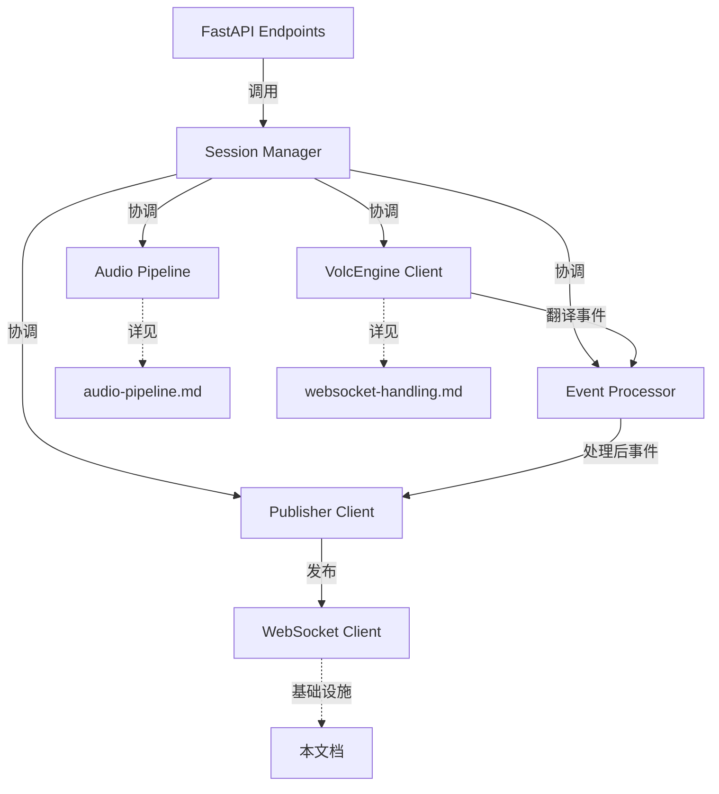

# 会话编排模块 AI 重写指导

## 📍 系统集成视图

本文档在整体架构中的位置：**会话编排核心控制层**

### 文档职责边界
- **本文档职责**：会话生命周期管理、事件处理转换、WebSocket转发、发布客户端
- **依赖文档**：
  - [audio-pipeline.md](audio-pipeline.md) - 音频处理管线集成
  - [websocket-handling.md](websocket-handling.md) - VolcEngine协议通信
  - [system-foundation.md](system-foundation.md) - 配置管理和环境适配
  - [fastapi-interface.md](fastapi-interface.md) - API接口层调用

### 关键集成点


## 概述

本文档为AI工具提供重写会话编排相关模块的专门指导。涵盖会话生命周期管理、事件处理流程、WebSocket转发机制等核心编排功能，确保重写后的模块保持与原系统完全一致的会话管理能力和事件处理性能。

## 🎯 模块范围和职责

### 核心编排模块

#### 1. core/session_manager.py (~300行)
**主要职责**:
- 会话生命周期管理(创建、启动、停止、清理)
- 会话状态跟踪和并发控制
- 幂等性操作支持，确保会话启动的可靠性
- 组件协调和资源管理

**关键功能点**:
```python
class SessionManager:
    async def start_publishing_session(session_id, youtube_url, publish_url) -> tuple[str, bool]
    async def stop_publishing_session(session_id) -> bool
    async def get_session_status(session_id) -> dict
    async def _run_session(session)  # 会话主控制循环
    async def _parallel_initialization(session)  # 并行组件初始化
```

#### 2. core/publisher_client.py (~250行)
**主要职责**:
- WebSocket连接管理和数据转发
- 双数据类型发送(音频二进制 + 字幕JSON)
- 发送队列和流控制
- 连接状态监控和自动重连

**关键功能点**:
```python
class PublisherClient:
    async def initialize(publish_url: str) -> bool
    async def send_audio_frame(audio_data: bytes)
    async def send_text_message(json_data: str) 
    async def start_heartbeat()
    async def cleanup()
```

#### 3. core/event_processor.py (~300行)
**主要职责**:
- VolcEngine事件分类和处理
- 事件格式转换(protobuf → JSON)
- 事件过滤和路由
- 事件统计和监控

**关键功能点**:
```python
class EventProcessor:
    async def process_volcengine_event(event: TranslateResponseData) -> ProcessedEvent
    def convert_subtitle_event(event) -> dict
    def convert_audio_event(event) -> bytes
    async def route_event(event, publisher_client)
```

#### 4. infrastructure/websocket_client.py (~300行)
**主要职责**:
- 通用WebSocket基础客户端实现
- 自动重连和心跳保活
- 消息队列和背压控制
- 支持二进制和文本消息发送

**关键功能点**:
```python
class WebSocketClient:
    async def connect(url: str, headers: dict = None)
    async def send_binary(data: bytes)
    async def send_text(message: str)
    async def start_heartbeat(interval: float = 30)
    async def close()
```

## 🔧 关键实现要求

### 1. 会话幂等性机制
**核心要求**: 确保多次调用`start_publishing_session`不会创建重复会话

```python
# 基于 publisher.py:50-150 的幂等性逻辑
async def start_publishing_session(self, session_id: str, youtube_url: str, publish_url: str) -> tuple[str, bool]:
    """
    启动发布会话 - 幂等操作
    
    Returns:
        (session_id, is_new_session)
    """
    # 幂等性检查 - 关键逻辑
    if session_id in self.sessions:
        existing_session = self.sessions[session_id]
        # 检查会话状态，决定是否复用
        if existing_session.status in [
            SessionStatus.INITIALIZING, 
            SessionStatus.STARTING,
            SessionStatus.CONNECTED_TO_PUBLISHER, 
            SessionStatus.PROCESSING_AUDIO
        ]:
            self.logger.info(f"Session {session_id} already running")
            return session_id, False  # 复用现有会话
        else:
            # 清理非活跃会话，创建新会话
            await self._cleanup_session(session_id)
    
    # 创建新会话流程...
    return session_id, True
```

**验证要求**:
- 相同session_id的重复调用必须返回相同结果
- 会话状态转换必须原子性
- 并发调用时不能产生竞态条件

### 2. 组件并行初始化机制
**核心要求**: 最小化会话启动延迟，并行初始化各组件

```python
# 基于 ast_youtube_demo.py:1250-1400 的组件协调逻辑  
async def _parallel_initialization(self, session: Session):
    """并行初始化各组件，最小化启动延迟"""
    
    # 创建组件实例
    from core.audio_pipeline import AudioPipeline
    from infrastructure.volcengine_client import VolcEngineClient  
    from core.publisher_client import PublisherClient
    
    session.audio_pipeline = AudioPipeline()
    session.volcengine_client = VolcEngineClient(self.volcengine_config)
    session.publisher_client = PublisherClient()
    
    # 并行执行初始化任务
    init_tasks = [
        session.audio_pipeline.initialize(session.youtube_url),
        session.volcengine_client.initialize(),
        session.publisher_client.initialize(session.publish_url)
    ]
    
    results = await asyncio.gather(*init_tasks, return_exceptions=True)
    
    # 检查初始化结果
    for i, result in enumerate(results):
        if isinstance(result, Exception):
            raise Exception(f"Component {i} initialization failed: {result}")
```

**验证要求**:
- 组件初始化失败时必须能正确回滚
- 初始化超时控制(30秒)
- 异常信息明确指出失败组件

### 3. 事件处理和转发机制
**核心要求**: 准确处理VolcEngine事件并转发到发布端点

```python
# 基于 ast_youtube_demo.py:850-1000 的事件处理逻辑
class EventProcessor:
    async def process_volcengine_event(self, event: TranslateResponseData) -> Optional[ProcessedEvent]:
        """处理VolcEngine翻译事件"""
        
        # 字幕事件处理
        if event.event in [Type.SourceSubtitleEnd, Type.TranslationSubtitleEnd]:
            return ProcessedEvent(
                type="subtitle",
                data=self._convert_subtitle_to_json(event),
                target="text_websocket"
            )
        
        # TTS音频事件处理  
        elif event.event == Type.TTSSentenceEnd:
            return ProcessedEvent(
                type="audio",
                data=event.data,  # 保持二进制格式
                target="binary_websocket"
            )
        
        # 会话控制事件
        elif event.event in [Type.SessionFinished, Type.SessionFailed]:
            return ProcessedEvent(
                type="control",
                data={"status": event.event, "message": event.message},
                target="session_manager"
            )
        
        # 忽略其他事件
        return None
    
    def _convert_subtitle_to_json(self, event: TranslateResponseData) -> dict:
        """转换字幕事件为JSON格式"""
        return {
            "type": "subtitle", 
            "lane": "source" if event.event == Type.SourceSubtitleEnd else "translation",
            "phase": "end",
            "text": event.text,
            "final": True,
            "sequence": event.sequence
        }
```

**验证要求**:
- 所有VolcEngine事件类型必须正确识别
- JSON格式转换必须符合发布端点要求
- 音频数据必须保持二进制格式不变

### 4. WebSocket转发和重连机制
**核心要求**: 稳定的WebSocket连接和可靠的数据转发

```python
# 基于 publisher.py:280-350 的WebSocket客户端逻辑
class PublisherClient:
    async def initialize(self, publish_url: str) -> bool:
        """初始化发布客户端"""
        from infrastructure.websocket_client import WebSocketClient
        
        self.ws_client = WebSocketClient()
        self.publish_url = publish_url
        
        # 建立WebSocket连接
        success = await self.ws_client.connect(
            self.publish_url,
            headers={"User-Agent": "AST-Publisher/1.0"}
        )
        
        if success:
            # 启动心跳保活
            await self.ws_client.start_heartbeat(interval=30)
            return True
        
        return False
    
    async def send_audio_frame(self, audio_data: bytes):
        """发送音频二进制数据"""
        if not self.ws_client or not self.ws_client.is_connected:
            raise RuntimeError("WebSocket not connected")
            
        await self.ws_client.send_binary(audio_data)
    
    async def send_text_message(self, json_data: str):
        """发送字幕JSON数据"""  
        if not self.ws_client or not self.ws_client.is_connected:
            raise RuntimeError("WebSocket not connected")
            
        await self.ws_client.send_text(json_data)
```

**验证要求**:
- WebSocket连接断开时能自动重连
- 心跳保活机制正常工作
- 二进制和文本消息发送无丢失

## 📋 核心实现结构

### 1. core/session_manager.py 实现框架
```python
"""
会话管理器模块 - 系统核心控制器
基于 publisher.py:50-150 和 ast_youtube_demo.py:1250-1400 的会话管理逻辑
"""

import asyncio
import logging
import uuid
from dataclasses import dataclass, field
from enum import Enum
from typing import Dict, Optional
from datetime import datetime

class SessionStatus(Enum):
    """会话状态枚举"""
    INITIALIZING = "initializing"        
    STARTING = "starting"               
    CONNECTED_TO_PUBLISHER = "connected_to_publisher"  
    PROCESSING_AUDIO = "processing_audio"              
    COMPLETED = "completed"             
    FAILED = "failed"                   
    STOPPED = "stopped"                 

@dataclass
class SessionMetrics:
    """会话指标数据"""
    start_time: datetime = field(default_factory=datetime.now)
    end_time: Optional[datetime] = None
    audio_chunks_processed: int = 0
    bytes_processed: int = 0
    translation_events: int = 0
    error_count: int = 0

@dataclass
class Session:
    """会话数据结构"""
    session_id: str
    youtube_url: str
    publish_url: str
    status: SessionStatus = SessionStatus.INITIALIZING
    task: Optional[asyncio.Task] = None
    stop_event: asyncio.Event = field(default_factory=asyncio.Event)
    
    # 组件引用
    audio_pipeline: Optional['AudioPipeline'] = None
    volcengine_client: Optional['VolcEngineClient'] = None
    publisher_client: Optional['PublisherClient'] = None
    event_processor: Optional['EventProcessor'] = None
    
    # 指标数据
    metrics: SessionMetrics = field(default_factory=SessionMetrics)

class SessionManager:
    """
    会话管理器 - 系统核心控制器
    负责会话生命周期、组件协调和资源管理
    """
    
    def __init__(self, max_concurrent_sessions: int = 10):
        self.sessions: Dict[str, Session] = {}
        self.max_concurrent_sessions = max_concurrent_sessions
        self.semaphore = asyncio.Semaphore(max_concurrent_sessions)
        self.logger = logging.getLogger(__name__)
        
        # 清理任务
        self.cleanup_task: Optional[asyncio.Task] = None
        self._start_cleanup_task()
    
    async def start_publishing_session(self, session_id: str, youtube_url: str, publish_url: str) -> tuple[str, bool]:
        """启动发布会话 - 幂等操作"""
        # 实现幂等性检查和会话创建...
        
    async def stop_publishing_session(self, session_id: str) -> bool:
        """停止发布会话"""
        # 实现优雅停止逻辑...
        
    async def get_session_status(self, session_id: str) -> Optional[dict]:
        """获取会话状态"""
        # 实现状态查询...
    
    async def _run_session(self, session: Session):
        """运行单个会话的主控制循环"""
        # 实现会话主循环逻辑...
        
    async def _parallel_initialization(self, session: Session):
        """并行初始化各组件"""
        # 实现并行初始化逻辑...
    
    async def _process_session_events(self, session: Session):
        """处理会话事件循环"""
        # 实现事件处理循环...
```

### 2. core/event_processor.py 实现框架
```python
"""
事件处理器模块 - 事件转换和路由
基于 ast_youtube_demo.py:850-1000 的事件处理逻辑
"""

import logging
from typing import Optional, Dict, Any
from dataclasses import dataclass

from protocols.volcengine_protocol import TranslateResponseData
from common.events_pb2 import Type

@dataclass
class ProcessedEvent:
    """处理后的事件数据结构"""
    type: str           # "subtitle", "audio", "control"
    data: Any          # 事件数据（JSON dict或bytes）
    target: str        # 目标处理器："text_websocket", "binary_websocket", "session_manager"
    metadata: Dict[str, Any] = None

class EventProcessor:
    """
    事件处理器
    负责VolcEngine事件的分类、转换和路由
    """
    
    def __init__(self):
        self.logger = logging.getLogger(__name__)
        self.event_stats = {
            "subtitle_events": 0,
            "audio_events": 0,
            "control_events": 0,
            "unknown_events": 0
        }
    
    async def process_volcengine_event(self, event: TranslateResponseData) -> Optional[ProcessedEvent]:
        """处理VolcEngine翻译事件"""
        # 实现事件分类和处理逻辑...
    
    def _convert_subtitle_to_json(self, event: TranslateResponseData) -> dict:
        """转换字幕事件为JSON格式"""
        # 实现字幕格式转换...
    
    async def route_event(self, processed_event: ProcessedEvent, publisher_client: 'PublisherClient'):
        """路由处理后的事件到目标处理器"""
        # 实现事件路由逻辑...
```

### 3. core/publisher_client.py 实现框架
```python
"""
发布客户端模块 - WebSocket转发客户端
基于 publisher.py:280-350 的WebSocket发布逻辑
"""

import asyncio
import logging
from typing import Optional

class PublisherClient:
    """
    发布客户端
    负责向发布端点转发处理后的音频和字幕数据
    """
    
    def __init__(self):
        self.logger = logging.getLogger(__name__)
        self.ws_client: Optional['WebSocketClient'] = None
        self.publish_url: Optional[str] = None
        self.is_connected = False
        
        # 统计信息
        self.messages_sent = 0
        self.bytes_sent = 0
        self.connection_errors = 0
    
    async def initialize(self, publish_url: str) -> bool:
        """初始化发布客户端"""
        # 实现WebSocket连接初始化...
    
    async def send_audio_frame(self, audio_data: bytes):
        """发送音频二进制数据"""
        # 实现音频数据发送...
    
    async def send_text_message(self, json_data: str):
        """发送字幕JSON数据"""
        # 实现文本消息发送...
    
    async def cleanup(self):
        """清理资源"""
        # 实现资源清理...
```

### 4. infrastructure/websocket_client.py 实现框架
```python
"""
WebSocket基础客户端模块 - 通用WebSocket通信
提供可复用的WebSocket连接、重连、心跳等基础功能
"""

import asyncio
import logging
import websockets
from typing import Optional, Dict, Callable

class WebSocketClient:
    """
    通用WebSocket客户端
    提供自动重连、心跳保活、消息队列等基础功能
    """
    
    def __init__(self):
        self.logger = logging.getLogger(__name__)
        self.websocket: Optional[websockets.WebSocketServerProtocol] = None
        self.url: Optional[str] = None
        self.headers: Optional[Dict[str, str]] = None
        
        # 连接状态
        self.is_connected = False
        self.is_reconnecting = False
        
        # 心跳控制
        self.heartbeat_task: Optional[asyncio.Task] = None
        self.heartbeat_interval = 30
        
        # 重连配置
        self.max_reconnect_attempts = 10
        self.reconnect_delay = 5
    
    async def connect(self, url: str, headers: Optional[Dict[str, str]] = None) -> bool:
        """建立WebSocket连接"""
        # 实现连接建立逻辑...
    
    async def send_binary(self, data: bytes):
        """发送二进制数据"""
        # 实现二进制发送...
    
    async def send_text(self, message: str):
        """发送文本消息"""
        # 实现文本发送...
    
    async def start_heartbeat(self, interval: float = 30):
        """启动心跳保活"""
        # 实现心跳机制...
    
    async def close(self):
        """关闭连接"""
        # 实现连接关闭...
```

## 🧪 验证清单

### 会话管理验证
- [ ] **幂等性操作**: 相同参数多次调用结果一致，无重复会话
- [ ] **并发控制**: 最大并发会话限制生效，超限请求正确拒绝
- [ ] **状态管理**: 会话状态转换正确，状态查询准确
- [ ] **资源清理**: 会话结束后所有资源正确释放，无内存泄露

### 事件处理验证  
- [ ] **事件分类**: 所有VolcEngine事件类型正确识别和分类
- [ ] **格式转换**: 字幕JSON格式符合发布端点要求
- [ ] **音频保持**: TTS音频数据保持二进制格式不变
- [ ] **事件路由**: 处理后事件正确路由到目标处理器

### WebSocket转发验证
- [ ] **连接稳定**: WebSocket连接稳定，断线自动重连
- [ ] **数据完整**: 音频和文本数据发送无丢失
- [ ] **心跳保活**: 心跳机制正常，连接保持活跃
- [ ] **错误处理**: 发送失败时正确重试或报错

### 组件协调验证
- [ ] **并行初始化**: 组件并行初始化减少启动延迟
- [ ] **异常处理**: 任一组件失败时整体会话正确回滚
- [ ] **生命周期**: 组件启动/停止顺序正确
- [ ] **接口对接**: 与音频管线、VolcEngine客户端接口正确

## ⚠️ 关键注意事项

### 必须保持的核心机制
1. **会话幂等性**: 多次启动调用的幂等行为是现有系统的关键特性
2. **事件格式兼容**: 字幕JSON格式必须与发布端点完全兼容  
3. **音频数据完整**: TTS音频必须保持二进制格式，不能有任何转换
4. **组件协调时序**: 并行初始化的时序经过优化，不可随意调整

### 不要修改的关键参数
1. **会话状态枚举**: 状态值必须与现有API响应保持一致
2. **事件类型映射**: VolcEngine事件类型到JSON的映射关系固定
3. **WebSocket心跳间隔**: 30秒心跳间隔是经过测试的最优值
4. **并发会话限制**: 默认10个并发会话的限制基于性能测试

---

**文档版本**: v1.0.0  
**关联文档**: [audio-pipeline.md](audio-pipeline.md) | [websocket-handling.md](websocket-handling.md) | [system-foundation.md](system-foundation.md) | [fastapi-interface.md](fastapi-interface.md)  
**最后更新**: 2025-01-XX