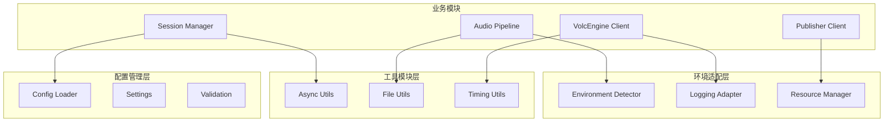

# 系统基础模块 AI 重写指导

## 📍 系统集成视图

本文档在整体架构中的位置：**系统基础设施和支撑组件层**

### 文档职责边界
- **本文档职责**：配置管理、环境适配、日志处理、资源管理、工具组件
- **服务对象**：所有业务模块都依赖本文档覆盖的基础设施
- **依赖关系**：本文档覆盖的模块为系统底层，无外部依赖

### 关键集成点


## 概述

本文档为AI工具提供重写系统基础设施相关模块的专门指导。涵盖配置管理、环境适配、日志处理、资源管理和通用工具等基础功能，确保重写后的模块为上层业务提供稳定可靠的基础设施支撑。

## 🎯 模块范围和职责

## 📋 配置管理层

### 1. config/settings.py (~300行)
**主要职责**:
- 定义全系统配置数据结构
- 支持分层配置(默认 < 环境 < 本地 < 环境变量)
- 提供类型安全的配置访问
- 支持配置热重载和验证

**关键配置类设计**:
```python
# 基于现有硬编码参数外化的配置结构
from pydantic import BaseSettings, validator
from typing import Optional

class AudioConfig(BaseSettings):
    """音频处理配置"""
    chunk_size: int = 640              # PCM块大小 (关键参数)
    sample_rate: int = 16000           # 采样率
    channels: int = 1                  # 声道数
    bit_depth: int = 16               # 位深度  
    send_interval: float = 0.02        # 发送间隔(20ms)
    target_sample_rate: int = 24000    # 目标采样率
    
    @validator('chunk_size')
    def validate_chunk_size(cls, v):
        if v % 320 != 0 or v < 320 or v > 1280:
            raise ValueError('chunk_size must be multiple of 320')
        return v

class VolcEngineConfig(BaseSettings):
    """VolcEngine服务配置"""
    ws_url: str = "wss://openspeech.bytedance.com/api/v2/ast"
    app_key: str
    access_key: str  
    resource_id: str
    source_language: str = "zh"
    target_language: str = "en"
    mode: str = "s2s"
    
    # WebSocket连接配置
    max_size: int = 1000000000
    ping_interval: Optional[int] = None
    ping_timeout: Optional[int] = None

class TimeoutConfig(BaseSettings):
    """超时配置 - 环境适配"""
    ffmpeg_start_timeout: int = 30
    first_chunk_timeout: int = 30  
    chunk_read_timeout: int = 10
    session_start_timeout: int = 10
    session_finish_timeout: int = 30
    silence_timeout_local: int = 8      # 本地环境静音桥接超时
    silence_timeout_cloudflare: int = 18  # Cloudflare环境静音桥接超时

class GlobalConfig(BaseSettings):
    """全局配置根节点"""
    audio: AudioConfig = AudioConfig()
    volcengine: VolcEngineConfig = VolcEngineConfig()
    timeout: TimeoutConfig = TimeoutConfig()
    
    class Config:
        env_file = '.env'
        env_nested_delimiter = '__'  # 支持 AUDIO__CHUNK_SIZE 格式
```

### 2. config/config_loader.py (~200行)
**主要职责**:
- 多层配置加载和合并
- 支持YAML、JSON、环境变量
- 配置文件监控和热重载
- 配置加载优先级管理

**关键功能点**:
```python
class ConfigLoader:
    async def load_config() -> GlobalConfig
    async def reload_config() -> bool
    def watch_config_changes(callback: Callable)
    def get_config_source_info() -> dict
```

### 3. config/validation.py (~200行)
**主要职责**:
- 配置参数有效性验证
- 环境特定配置检查
- 配置兼容性验证
- 提供配置诊断信息

**关键功能点**:
```python
class ConfigValidator:
    def validate_audio_config(config: AudioConfig) -> ValidationResult
    def validate_environment_compatibility(config: GlobalConfig, env: str) -> bool
    def diagnose_config_issues(config: GlobalConfig) -> list[str]
```

## 🌍 环境适配层

### 4. adapters/environment_detector.py (~200行)
**主要职责**:
- 运行环境检测(本地、Docker、Cloudflare)
- 环境能力检测(FFmpeg、网络、存储)
- 提供环境特定配置映射
- 支持手动环境指定

**核心实现要求**:
```python
# 基于 ast_youtube_demo.py:90-120 的环境检测逻辑
def detect_environment() -> str:
    """
    检测运行环境类型
    返回: "local", "docker", "cloudflare_pages", "cloudflare_worker"
    """
    # Cloudflare环境检测 (关键逻辑)
    if os.getenv("CF_PAGES") or os.getenv("CF_PAGES_URL"):
        return "cloudflare_pages"
    elif os.getenv("CF_WORKER"):
        return "cloudflare_worker" 
    # Docker环境检测
    elif os.getenv("DOCKER_CONTAINER") or os.path.exists("/.dockerenv"):
        return "docker"
    else:
        return "local"

def is_cloudflare_environment() -> bool:
    """检查是否为Cloudflare环境"""
    cloudflare_indicators = ["CF_PAGES", "CF_PAGES_URL", "CF_WORKER"]
    return any(os.getenv(indicator) for indicator in cloudflare_indicators)

def get_environment_config() -> dict:
    """获取环境特定配置"""
    env = detect_environment()
    
    if env.startswith("cloudflare"):
        return {
            "logging": {
                "file_enabled": False,      # Cloudflare不支持文件日志
                "stderr_enabled": True,
                "log_prefix": "CLOUDFLARE_",
                "log_level": "INFO"
            },
            "timeouts": {
                "silence_timeout": 18,      # 关键：Cloudflare环境18秒
                "ffmpeg_start_timeout": 30
            },
            "resources": {
                "memory_limit": "90MB",     # Cloudflare内存限制
                "max_sessions": 3           # 并发限制
            }
        }
    else:
        return {
            "logging": {
                "file_enabled": True,       # 本地支持文件日志
                "stderr_enabled": True,
                "log_prefix": "",
                "log_level": "DEBUG"
            },
            "timeouts": {
                "silence_timeout": 8,       # 关键：本地环境8秒
                "ffmpeg_start_timeout": 15
            },
            "resources": {
                "memory_limit": None,
                "max_sessions": 20
            }
        }
```

**验证要求**:
- Cloudflare环境检测准确率100%
- 环境配置映射与现有系统完全一致
- 静音桥接超时参数环境适配正确

### 5. adapters/logging_adapter.py (~300行)
**主要职责**:
- 环境适配的日志配置
- 统一日志格式和输出
- 支持结构化日志
- 日志级别动态调整

**核心实现要求**:
```python
# 基于 ast_youtube_demo.py:60-90 的日志适配逻辑
class LoggingAdapter:
    def setup_logging(self, env_config: dict) -> bool:
        """根据环境配置设置日志系统"""
        
        # Cloudflare环境配置
        if not env_config["logging"]["file_enabled"]:
            # 只输出到stderr，添加Cloudflare前缀
            handler = logging.StreamHandler(sys.stderr)
            formatter = logging.Formatter(
                f'{env_config["logging"]["log_prefix"]}%(levelname)s:%(name)s:%(message)s'
            )
        else:
            # 本地环境：文件+控制台双输出
            handler = logging.handlers.RotatingFileHandler(
                "logs/ast_system.log", 
                maxBytes=10*1024*1024, 
                backupCount=5
            )
            
        # 设置日志级别
        logging.getLogger().setLevel(env_config["logging"]["log_level"])
        
    def get_structured_logger(self, module_name: str) -> StructuredLogger:
        """获取结构化日志记录器"""
        # 提供结构化日志功能...
```

### 6. adapters/resource_manager.py (~250行)
**主要职责**:
- 系统资源监控和限制
- 内存使用优化
- 进程资源管理
- 环境特定资源适配

**关键功能点**:
```python
class ResourceManager:
    def monitor_memory_usage() -> dict
    def enforce_memory_limits(limit: str)
    def manage_process_resources(max_processes: int)
    def cleanup_expired_resources()
```

## 🔧 工具模块层

### 7. utils/async_utils.py (~150行)
**主要职责**:
- 异步组件标准化接口
- 并发控制工具
- 异步任务管理
- 超时和重试机制

**核心实现**:
```python
# 基于模块化设计的异步组件基类
from abc import ABC, abstractmethod
from enum import Enum

class ComponentStatus(Enum):
    IDLE = "idle"
    INITIALIZING = "initializing"
    RUNNING = "running"
    STOPPING = "stopping"
    FAILED = "failed"

class AsyncComponent(ABC):
    """所有异步组件的标准接口"""
    
    @abstractmethod
    async def initialize(self, config) -> bool:
        """初始化组件"""
        
    @abstractmethod
    async def start(self) -> bool:
        """启动组件"""
        
    @abstractmethod
    async def stop(self) -> bool:
        """停止组件"""
        
    @abstractmethod
    async def cleanup(self) -> None:
        """清理资源"""
        
    @property
    @abstractmethod
    def status(self) -> ComponentStatus:
        """获取组件状态"""

class ConcurrencyUtils:
    """并发控制工具"""
    
    @staticmethod
    async def run_with_semaphore(semaphore: asyncio.Semaphore, coro):
        """信号量控制的协程执行"""
        async with semaphore:
            return await coro
    
    @staticmethod
    async def run_with_timeout(coro, timeout: float, default=None):
        """超时控制的协程执行"""
        try:
            return await asyncio.wait_for(coro, timeout=timeout)
        except asyncio.TimeoutError:
            return default
    
    @staticmethod
    async def retry_async(coro_func, max_attempts: int = 3, delay: float = 1.0):
        """异步重试机制"""
        for attempt in range(max_attempts):
            try:
                return await coro_func()
            except Exception as e:
                if attempt == max_attempts - 1:
                    raise
                await asyncio.sleep(delay * (2 ** attempt))
```

### 8. utils/file_utils.py (~150行)
**主要职责**:
- 文件操作工具
- 路径处理和验证
- 临时文件管理
- 环境适配的文件操作

**关键功能点**:
```python
class FileUtils:
    @staticmethod
    def ensure_directory(path: str) -> bool
    
    @staticmethod
    def safe_write_file(path: str, content: str, encoding: str = "utf-8")
    
    @staticmethod  
    def cleanup_temp_files(pattern: str, max_age_hours: int = 24)
    
    @staticmethod
    def get_file_size_mb(path: str) -> float
```

### 9. utils/timing_utils.py (~100行)
**主要职责**:
- 时间测量和统计
- 性能监控工具
- 定时任务支持
- 时间格式化工具

**关键功能点**:
```python
class TimingUtils:
    @staticmethod
    @contextmanager
    def measure_time() -> float
    
    @staticmethod
    def format_duration(seconds: float) -> str
    
    @staticmethod
    async def periodic_task(interval: float, coro_func, *args)
```

## 📋 核心实现结构

### 配置管理完整实现
```python
"""
config/settings.py - 全局配置数据结构
基于现有硬编码参数的外化配置设计
"""

from pydantic import BaseSettings, validator, Field
from typing import Optional, Dict, Any
import os

class AudioConfig(BaseSettings):
    """音频处理配置 - 核心参数"""
    chunk_size: int = Field(640, description="PCM块大小，VolcEngine API要求")
    sample_rate: int = Field(16000, description="输入采样率")
    channels: int = Field(1, description="声道数") 
    bit_depth: int = Field(16, description="位深度")
    send_interval: float = Field(0.02, description="发送间隔20ms")
    target_sample_rate: int = Field(24000, description="输出采样率")
    
    @validator('chunk_size')
    def validate_chunk_size(cls, v):
        """验证音频块大小"""
        if v != 640:
            raise ValueError('chunk_size must be exactly 640 bytes for VolcEngine API')
        return v
    
    @validator('sample_rate') 
    def validate_sample_rate(cls, v):
        """验证采样率"""
        if v != 16000:
            raise ValueError('sample_rate must be 16000Hz for VolcEngine API')
        return v

class VolcEngineConfig(BaseSettings):
    """VolcEngine API配置"""
    ws_url: str = "wss://openspeech.bytedance.com/api/v2/ast"
    app_key: str = Field(..., env="VOLCENGINE_APP_KEY")
    access_key: str = Field(..., env="VOLCENGINE_ACCESS_KEY") 
    resource_id: str = Field(..., env="VOLCENGINE_RESOURCE_ID")
    source_language: str = "zh"
    target_language: str = "en"
    mode: str = "s2s"
    
    # WebSocket配置
    max_size: int = 1000000000
    ping_interval: Optional[int] = None

class EnvironmentConfig(BaseSettings):
    """环境特定配置"""
    # 静音桥接超时 (关键环境适配参数)
    silence_timeout_local: int = 8
    silence_timeout_cloudflare: int = 18
    
    # FFmpeg超时配置
    ffmpeg_start_timeout_local: int = 15
    ffmpeg_start_timeout_cloudflare: int = 30
    
    # 会话并发限制
    max_sessions_local: int = 20
    max_sessions_cloudflare: int = 3
    
    # 内存限制
    memory_limit_cloudflare: str = "90MB"

class LoggingConfig(BaseSettings):
    """日志配置"""
    level: str = Field("INFO", env="LOG_LEVEL")
    file_enabled: bool = True
    console_enabled: bool = True
    max_file_size_mb: int = 10
    backup_count: int = 5
    
    # Cloudflare特定配置
    cloudflare_prefix: str = "CLOUDFLARE_"
    stderr_only_in_cloudflare: bool = True

class GlobalConfig(BaseSettings):
    """全局配置根"""
    audio: AudioConfig = AudioConfig()
    volcengine: VolcEngineConfig = VolcEngineConfig()
    environment: EnvironmentConfig = EnvironmentConfig()
    logging: LoggingConfig = LoggingConfig()
    
    class Config:
        env_file = ['.env', '.env.local', '.env.production']
        env_nested_delimiter = '__'
        case_sensitive = False
```

### 环境适配完整实现  
```python
"""
adapters/environment_detector.py - 环境检测和适配
基于 ast_youtube_demo.py:90-120 的环境检测逻辑
"""

import os
import sys
import subprocess
from typing import Dict, Any, Optional
import logging

class EnvironmentType:
    LOCAL = "local"
    DOCKER = "docker" 
    CLOUDFLARE_PAGES = "cloudflare_pages"
    CLOUDFLARE_WORKER = "cloudflare_worker"

class EnvironmentDetector:
    """环境检测器"""
    
    @staticmethod
    def detect_environment() -> str:
        """检测当前运行环境"""
        # Cloudflare环境检测 (优先级最高)
        if os.getenv("CF_PAGES") or os.getenv("CF_PAGES_URL"):
            return EnvironmentType.CLOUDFLARE_PAGES
        elif os.getenv("CF_WORKER"):
            return EnvironmentType.CLOUDFLARE_WORKER
            
        # Docker环境检测
        elif os.getenv("DOCKER_CONTAINER") or os.path.exists("/.dockerenv"):
            return EnvironmentType.DOCKER
            
        # 默认本地环境
        else:
            return EnvironmentType.LOCAL
    
    @staticmethod
    def is_cloudflare_environment() -> bool:
        """判断是否为Cloudflare环境"""
        env = EnvironmentDetector.detect_environment()
        return env.startswith("cloudflare")
    
    @staticmethod
    def get_environment_limits() -> Dict[str, Any]:
        """获取环境资源限制"""
        env = EnvironmentDetector.detect_environment()
        
        if env.startswith("cloudflare"):
            return {
                "memory_limit_mb": 90,
                "max_concurrent_sessions": 3,
                "file_io_allowed": False,
                "network_timeout_seconds": 30,
                "silence_bridge_timeout": 18
            }
        else:
            return {
                "memory_limit_mb": None,
                "max_concurrent_sessions": 20, 
                "file_io_allowed": True,
                "network_timeout_seconds": 60,
                "silence_bridge_timeout": 8
            }
    
    @staticmethod
    def get_environment_config() -> Dict[str, Any]:
        """获取环境特定配置"""
        env = EnvironmentDetector.detect_environment()
        limits = EnvironmentDetector.get_environment_limits()
        
        return {
            "environment_type": env,
            "is_cloudflare": env.startswith("cloudflare"),
            "logging": {
                "file_enabled": limits["file_io_allowed"],
                "stderr_enabled": True,
                "log_prefix": "CLOUDFLARE_" if env.startswith("cloudflare") else "",
                "log_level": "INFO" if env.startswith("cloudflare") else "DEBUG"
            },
            "timeouts": {
                "silence_timeout": limits["silence_bridge_timeout"],
                "ffmpeg_start_timeout": 30 if env.startswith("cloudflare") else 15,
                "session_timeout": limits["network_timeout_seconds"]
            },
            "resources": {
                "memory_limit_mb": limits["memory_limit_mb"],
                "max_sessions": limits["max_concurrent_sessions"]
            }
        }
```

## 🧪 验证清单

### 配置管理验证
- [ ] **配置完整性**: 所有硬编码参数成功外化为配置项
- [ ] **类型安全性**: Pydantic验证规则正确，类型错误能被捕获
- [ ] **环境变量**: 支持ENV格式配置，嵌套配置加载正确
- [ ] **配置优先级**: 默认 < 文件 < 环境变量优先级生效
- [ ] **热重载**: 配置文件变更能被检测和重新加载

### 环境适配验证
- [ ] **环境检测**: Cloudflare、Docker、本地环境检测准确率100%
- [ ] **参数适配**: 静音桥接超时等关键参数环境适配正确  
- [ ] **资源限制**: Cloudflare环境内存和并发限制生效
- [ ] **日志适配**: 不同环境日志输出符合要求
- [ ] **能力检测**: FFmpeg等工具可用性检测准确

### 工具模块验证
- [ ] **异步组件**: 标准接口在所有业务模块中正确实现
- [ ] **并发控制**: 信号量、超时、重试机制工作正常
- [ ] **文件操作**: 跨环境文件操作兼容性良好
- [ ] **性能监控**: 时间测量和统计工具数据准确
- [ ] **资源清理**: 临时文件和过期资源能被正确清理

### 集成验证
- [ ] **业务模块集成**: 所有业务模块能正确使用基础组件
- [ ] **配置传递**: 配置数据能正确传递到各个业务模块
- [ ] **环境一致性**: 同一套代码在不同环境表现一致
- [ ] **错误处理**: 基础组件异常不影响上层业务逻辑
- [ ] **性能影响**: 基础组件开销<5%系统总开销

## ⚠️ 关键注意事项

### 必须保持的核心参数
1. **音频块大小**: 640字节是VolcEngine API的硬性要求，不可调整
2. **静音桥接超时**: 本地8秒、Cloudflare 18秒是经过生产验证的参数
3. **采样率配置**: 16kHz输入、24kHz输出是协议要求
4. **环境检测逻辑**: Cloudflare环境变量检测逻辑已通过生产验证

### 配置外化原则
1. **向下兼容**: 新配置系统必须兼容现有硬编码行为
2. **默认安全**: 所有配置项必须有安全的默认值
3. **环境隔离**: 不同环境配置不能相互影响
4. **验证严格**: 关键配置参数必须有严格的验证规则

### 环境适配策略
1. **Cloudflare优先**: Cloudflare环境检测优先级最高
2. **功能降级**: Cloudflare环境不支持的功能要优雅降级
3. **资源感知**: 根据环境资源限制调整并发和缓存策略
4. **日志合规**: 确保不同环境日志输出符合平台要求

---

**文档版本**: v1.0.0  
**关联文档**: [session-orchestration.md](session-orchestration.md) | [audio-pipeline.md](audio-pipeline.md) | [youtube-processing.md](youtube-processing.md) | [websocket-handling.md](websocket-handling.md) | [fastapi-interface.md](fastapi-interface.md)  
**最后更新**: 2025-01-XX