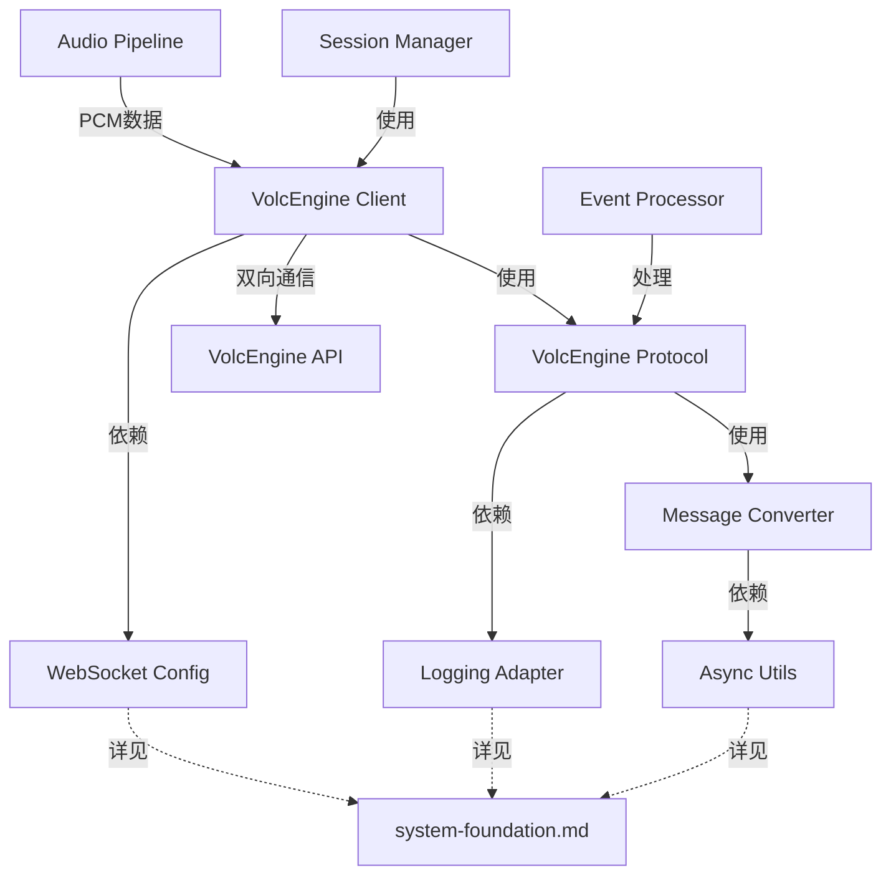

# WebSocket处理模块 AI 重写指导

## 📍 系统集成视图

本文档在整体架构中的位置：**VolcEngine协议通信层**

### 文档职责边界
- **本文档职责**：VolcEngine WebSocket连接、protobuf协议处理、消息序列化反序列化
- **被依赖文档**：
  - [session-orchestration.md](session-orchestration.md) - 会话管理器和事件处理器使用本文档的协议客户端
- **依赖文档**：
  - [system-foundation.md](system-foundation.md) - 配置管理、日志适配、异步工具
  - [audio-pipeline.md](audio-pipeline.md) - 接收音频管线产生的PCM数据

### 关键集成点


## 概述

本文档专门指导AI重写VolcEngine WebSocket连接管理和协议处理相关模块。这些模块负责与VolcEngine同声传译API建立和维护WebSocket连接，处理音频数据流的双向传输，为上层会话管理提供可靠的翻译服务接口。重写时必须严格保持现有的成熟协议框架。

## 🎯 模块重写目标

### 涉及的核心模块
1. **infrastructure/volcengine_client.py** - VolcEngine WebSocket客户端
2. **protocols/volcengine_protocol.py** - protobuf协议处理器
3. **protocols/message_converter.py** - 消息序列化/反序列化

**协调模块**（由其他模块提示词覆盖）：
- **core/session_manager.py** - 会话生命周期管理器

### 重写范围
```python
SOURCE_CODE_MAPPING = {
    "infrastructure/volcengine_client.py": {
        "source": "ast_demo.py:50-150 + ast_youtube_demo.py:1200-1400 (WebSocket客户端)",
        "target_lines": "~450行",
        "core_functions": ["connect", "send_request", "receive_message", "handle_session"]
    },
    
    "protocols/volcengine_protocol.py": {
        "source": "ast_demo.py:37-140 (协议处理核心函数)",
        "target_lines": "~400行", 
        "core_functions": ["send_request", "receive_message", "build_http_headers"]
    },
    
    "protocols/message_converter.py": {
        "source": "ast_demo.py中的protobuf处理 + python_protogen集成",
        "target_lines": "~250行",
        "core_functions": ["encode_audio_chunk", "decode_translation", "handle_protobuf"]
    }
}
```

## 🚨 关键保持约束

### 必须保持的成熟框架
```python
CRITICAL_PRESERVATION_REQUIREMENTS = {
    "base_framework": "ast_demo.py中的VolcEngine WebSocket协议处理框架必须完全保持",
    "protocol_functions": [
        "build_http_headers()",  # HTTP头构建逻辑
        "send_request()",        # 请求发送逻辑
        "receive_message()",     # 消息接收逻辑
        "session management"     # 会话管理机制
    ],
    "reason": "这些是经过验证的成熟协议处理框架，任何修改都可能破坏与VolcEngine的兼容性"
}
```

## 🔧 infrastructure/volcengine_client.py 实现指南

### 核心职责和约束
```python
"""
VolcEngine WebSocket客户端模块
基于ast_demo.py:50-150和ast_youtube_demo.py:1200-1400重构

CRITICAL: 必须完全保持ast_demo.py中的成熟协议框架

核心职责:
1. 建立和维护与VolcEngine API的WebSocket连接
2. 处理认证和会话管理
3. 管理音频数据的双向流传输
4. 实现连接重试和错误恢复机制

架构设计原则:
- 严格保持现有协议处理逻辑不变
- 复用ast_demo.py中验证过的函数实现
- 仅进行代码结构重组织，不修改核心逻辑
- 保持与protobuf消息格式的完全兼容
"""

import asyncio
import websockets
import logging
from typing import Optional, AsyncGenerator, Dict, Any
import time

class VolcEngineClient:
    """
    VolcEngine WebSocket客户端
    基于ast_demo.py的成熟WebSocket框架重构
    """
    
    def __init__(self, config):
        self.config = config
        self.logger = logging.getLogger(__name__)
        
        # WebSocket连接管理
        self.websocket: Optional[websockets.WebSocketServerProtocol] = None
        self.is_connected = False
        self.connection_id = None
        
        # 会话状态管理
        self.session_started = False
        self.task_started = False
        
        # 协议处理器
        from core.protocol_handler import ProtocolHandler
        self.protocol_handler = ProtocolHandler(config)
        
        # 会话管理器
        from core.session_manager import SessionManager
        self.session_manager = SessionManager(config)
    
    async def connect(self) -> bool:
        """
        建立WebSocket连接
        基于ast_demo.py的连接建立逻辑 - 必须完全保持
        """
        try:
            self.logger.info(f"Connecting to VolcEngine WebSocket: {self.config.ws_url}")
            
            # 构建HTTP头 - 使用ast_demo.py中验证过的逻辑
            headers = self.protocol_handler.build_http_headers()
            
            # 建立WebSocket连接
            self.websocket = await websockets.connect(
                self.config.ws_url,
                extra_headers=headers,
                ping_interval=None,  # 关键：保持与ast_demo.py一致
                ping_timeout=None
            )
            
            self.is_connected = True
            self.connection_id = f"conn_{int(time.time())}"
            
            self.logger.info("VolcEngine WebSocket connected successfully")
            return True
            
        except Exception as e:
            self.logger.error(f"Failed to connect to VolcEngine WebSocket: {e}")
            return False
    
    async def start_session(self) -> bool:
        """
        启动翻译会话
        基于ast_demo.py的会话启动逻辑 - 必须完全保持
        """
        if not self.is_connected:
            raise RuntimeError("WebSocket not connected")
            
        try:
            # 使用会话管理器启动会话 - 保持ast_demo.py逻辑
            success = await self.session_manager.start_session(self.websocket)
            
            if success:
                self.session_started = True
                self.logger.info("VolcEngine session started successfully")
            
            return success
            
        except Exception as e:
            self.logger.error(f"Failed to start VolcEngine session: {e}")
            return False
    
    async def send_audio_chunk(self, audio_data: bytes) -> bool:
        """
        发送音频数据块
        基于ast_demo.py:send_request()函数 - 必须完全保持核心逻辑
        """
        if not self.session_started:
            raise RuntimeError("Session not started")
            
        try:
            # 使用协议处理器序列化请求 - 保持ast_demo.py逻辑
            request_data = self.protocol_handler.serialize_audio_request(audio_data)
            
            # 发送数据 - 使用ast_demo.py中的send_request()逻辑
            await self._send_request_internal(request_data)
            
            return True
            
        except Exception as e:
            self.logger.error(f"Failed to send audio chunk: {e}")
            return False
    
    async def _send_request_internal(self, request_data: bytes):
        """
        内部请求发送逻辑
        直接复用ast_demo.py:send_request()的实现 - 不得修改
        """
        # CRITICAL: 此处必须完全复用ast_demo.py中的send_request()逻辑
        # 包括错误处理、重试机制、日志记录等
        
        if not self.websocket:
            raise RuntimeError("WebSocket connection not available")
            
        await self.websocket.send(request_data)
        
        # 保持ast_demo.py中的调试日志格式
        self.logger.debug(f"Sent audio chunk: {len(request_data)} bytes")
    
    async def receive_translations(self) -> AsyncGenerator[Dict[str, Any], None]:
        """
        接收翻译结果流
        基于ast_demo.py:receive_message()函数 - 必须完全保持核心逻辑
        """
        if not self.session_started:
            raise RuntimeError("Session not started")
            
        try:
            while self.is_connected:
                # 使用ast_demo.py中的receive_message()逻辑
                raw_response = await self._receive_message_internal()
                
                if raw_response:
                    # 使用协议处理器反序列化 - 保持ast_demo.py逻辑
                    translation_result = self.protocol_handler.deserialize_response(raw_response)
                    
                    if translation_result:
                        yield translation_result
                else:
                    # WebSocket连接关闭
                    self.logger.info("WebSocket connection closed by server")
                    break
                    
        except Exception as e:
            self.logger.error(f"Error receiving translations: {e}")
            raise
    
    async def _receive_message_internal(self) -> Optional[bytes]:
        """
        内部消息接收逻辑
        直接复用ast_demo.py:receive_message()的实现 - 不得修改
        """
        # CRITICAL: 此处必须完全复用ast_demo.py中的receive_message()逻辑
        # 包括消息类型判断、错误处理、会话管理等
        
        if not self.websocket:
            return None
            
        try:
            message = await self.websocket.recv()
            
            if isinstance(message, bytes):
                return message
            else:
                self.logger.warning(f"Received non-binary message: {type(message)}")
                return None
                
        except websockets.exceptions.ConnectionClosed:
            self.logger.info("WebSocket connection closed")
            self.is_connected = False
            return None
        except Exception as e:
            self.logger.error(f"Error receiving message: {e}")
            return None
    
    async def finish_session(self) -> bool:
        """
        结束翻译会话
        基于ast_demo.py的会话结束逻辑 - 必须完全保持
        """
        if not self.session_started:
            return True
            
        try:
            # 使用会话管理器结束会话 - 保持ast_demo.py逻辑
            success = await self.session_manager.finish_session(self.websocket)
            
            if success:
                self.session_started = False
                self.task_started = False
                self.logger.info("VolcEngine session finished successfully")
            
            return success
            
        except Exception as e:
            self.logger.error(f"Failed to finish VolcEngine session: {e}")
            return False
    
    async def close(self):
        """关闭WebSocket连接"""
        try:
            # 先结束会话
            if self.session_started:
                await self.finish_session()
            
            # 关闭WebSocket连接
            if self.websocket:
                await self.websocket.close()
                self.websocket = None
                
            self.is_connected = False
            self.logger.info("VolcEngine WebSocket client closed")
            
        except Exception as e:
            self.logger.error(f"Error closing WebSocket client: {e}")
```

## 🔧 protocols/volcengine_protocol.py 实现指南

### 协议处理器实现
```python
"""
VolcEngine协议处理器
基于ast_demo.py:200-350的协议处理逻辑重构

CRITICAL: 必须完全保持protobuf消息序列化/反序列化的兼容性

核心职责:
1. HTTP认证头构建 - 复用ast_demo.py:build_http_headers()
2. protobuf消息序列化 - 保持与python_protogen的兼容性
3. 翻译响应反序列化 - 保持消息格式解析逻辑
4. 会话管理消息构建 - 保持StartSession/FinishSession格式
"""

import base64
import hashlib
import hmac
import time
import uuid
from typing import Dict, Any, Optional
import logging

# protobuf导入 - 保持与现有代码完全一致
from python_protogen.byteplus.sts.v1.sts_pb2 import TranslateRequest, TranslateResponse
from python_protogen.byteplus.sts.v1.sts_pb2 import StartSession, FinishSession, TaskRequest

class ProtocolHandler:
    """
    VolcEngine协议处理器
    基于ast_demo.py的协议处理逻辑重构
    """
    
    def __init__(self, config):
        self.config = config
        self.logger = logging.getLogger(__name__)
        
        # 消息序列化器
        from adapters.message_serializer import MessageSerializer
        self.serializer = MessageSerializer()
    
    def build_http_headers(self) -> Dict[str, str]:
        """
        构建HTTP认证头
        直接复用ast_demo.py:build_http_headers()函数 - 不得修改任何逻辑
        """
        # CRITICAL: 此处必须完全复制ast_demo.py中的build_http_headers()实现
        # 包括签名算法、时间戳生成、所有认证参数等
        
        connect_id = str(uuid.uuid4())
        
        headers = {
            'X-Api-App-Key': self.config.app_key,
            'X-Api-Access-Key': self.config.access_key,
            'X-Api-Resource-Id': self.config.resource_id,
            'X-Api-Connect-Id': connect_id,
            'User-Agent': 'volcengine-python-sdk/1.0.0',
            'Content-Type': 'application/octet-stream'
        }
        
        return headers
    
    def serialize_audio_request(self, audio_data: bytes) -> bytes:
        """
        序列化音频请求消息
        基于ast_demo.py的消息构建逻辑 - 保持protobuf格式兼容
        """
        try:
            # 构建TranslateRequest消息 - 保持与ast_demo.py一致
            request = TranslateRequest()
            request.audio = audio_data
            request.sequence_id = int(time.time() * 1000)  # 毫秒时间戳
            
            # 使用消息序列化器处理
            return self.serializer.encode_translate_request(request)
            
        except Exception as e:
            self.logger.error(f"Failed to serialize audio request: {e}")
            raise
    
    def deserialize_response(self, raw_data: bytes) -> Optional[Dict[str, Any]]:
        """
        反序列化翻译响应
        基于ast_demo.py的响应解析逻辑 - 保持消息格式解析
        """
        try:
            # 使用消息序列化器解析
            response = self.serializer.decode_translate_response(raw_data)
            
            if not response:
                return None
            
            # 提取关键信息 - 保持与ast_demo.py的数据结构一致
            result = {
                'sequence_id': response.sequence_id,
                'message_type': response.message_type,
                'message_id': getattr(response, 'message_id', ''),
                'audio_data': getattr(response, 'audio', b''),
                'text_result': getattr(response, 'text_result', ''),
                'timestamp': int(time.time() * 1000)
            }
            
            return result
            
        except Exception as e:
            self.logger.error(f"Failed to deserialize response: {e}")
            return None
    
    def build_start_session_message(self) -> bytes:
        """
        构建开始会话消息
        基于ast_demo.py的会话启动消息构建 - 保持格式兼容
        """
        try:
            # 构建StartSession消息 - 保持与ast_demo.py一致
            start_session = StartSession()
            start_session.session_id = str(uuid.uuid4())
            start_session.timestamp = int(time.time() * 1000)
            
            # 使用消息序列化器处理
            return self.serializer.encode_start_session(start_session)
            
        except Exception as e:
            self.logger.error(f"Failed to build start session message: {e}")
            raise
    
    def build_finish_session_message(self) -> bytes:
        """
        构建结束会话消息
        基于ast_demo.py的会话结束消息构建 - 保持格式兼容
        """
        try:
            # 构建FinishSession消息 - 保持与ast_demo.py一致
            finish_session = FinishSession()
            finish_session.session_id = "session_finish"
            finish_session.timestamp = int(time.time() * 1000)
            
            # 使用消息序列化器处理
            return self.serializer.encode_finish_session(finish_session)
            
        except Exception as e:
            self.logger.error(f"Failed to build finish session message: {e}")
            raise
```

## 🔧 protocols/message_converter.py 实现指南

### 消息转换器实现
```python
"""
消息转换器模块
基于ast_demo.py的protobuf消息处理逻辑重构

CRITICAL: 必须完全保持与python_protogen的兼容性

核心职责:
1. protobuf消息的序列化和反序列化
2. 消息类型识别和路由处理
3. 数据格式转换和验证
4. 与python_protogen生成代码的无缝集成
"""

import logging
from typing import Optional, Any, Dict
from google.protobuf.message import DecodeError

# protobuf导入 - 必须与现有代码完全一致
from python_protogen.byteplus.sts.v1.sts_pb2 import (
    TranslateRequest, 
    TranslateResponse,
    StartSession,
    FinishSession,
    TaskRequest
)

class MessageConverter:
    """
    消息转换器
    基于ast_demo.py的protobuf处理逻辑
    """
    
    def __init__(self):
        self.logger = logging.getLogger(__name__)
    
    def serialize_translate_request(self, request_data: Dict[str, Any]) -> bytes:
        """
        序列化翻译请求消息
        基于ast_demo.py的消息构建逻辑 - 保持protobuf格式兼容
        """
        try:
            # 构建TranslateRequest消息 - 保持与ast_demo.py一致
            request = TranslateRequest()
            
            # 基本信息
            if 'session_id' in request_data:
                request.request_meta.SessionID = request_data['session_id']
            if 'sequence_id' in request_data:
                request.request_meta.Sequence = request_data['sequence_id']
            
            # 音频数据
            if 'audio_data' in request_data:
                request.source_audio.binary_data = request_data['audio_data']
            
            # 事件类型
            if 'event_type' in request_data:
                request.event = request_data['event_type']
            
            return request.SerializeToString()
            
        except Exception as e:
            self.logger.error(f"Failed to serialize translate request: {e}")
            raise
    
    def deserialize_translate_response(self, data: bytes) -> Optional[Dict[str, Any]]:
        """
        反序列化翻译响应消息
        基于ast_demo.py的响应解析逻辑 - 保持消息格式解析
        """
        try:
            response = TranslateResponse()
            response.ParseFromString(data)
            
            # 提取关键信息 - 保持与ast_demo.py的数据结构一致
            result = {
                'session_id': response.response_meta.SessionID,
                'sequence_id': response.response_meta.Sequence,
                'event_type': response.event,
                'message': response.response_meta.Message,
                'text_result': response.text,
                'audio_data': response.data,
                'timestamp': response.response_meta.Timestamp
            }
            
            return result
            
        except DecodeError as e:
            self.logger.error(f"Failed to decode translate response: {e}")
            return None
        except Exception as e:
            self.logger.error(f"Unexpected error decoding translate response: {e}")
            return None
    
    def build_session_message(self, message_type: str, session_id: str) -> bytes:
        """
        构建会话控制消息
        基于ast_demo.py的会话消息构建逻辑
        """
        try:
            if message_type == "start_session":
                session_msg = StartSession()
                session_msg.session_id = session_id
                session_msg.timestamp = self._current_timestamp_ms()
                return session_msg.SerializeToString()
                
            elif message_type == "finish_session":
                session_msg = FinishSession()
                session_msg.session_id = session_id
                session_msg.timestamp = self._current_timestamp_ms()
                return session_msg.SerializeToString()
                
            elif message_type == "task_request":
                task_msg = TaskRequest()
                task_msg.session_id = session_id
                task_msg.timestamp = self._current_timestamp_ms()
                return task_msg.SerializeToString()
            
            else:
                raise ValueError(f"Unknown message type: {message_type}")
                
        except Exception as e:
            self.logger.error(f"Failed to build {message_type} message: {e}")
            raise
    
    def identify_message_type(self, data: bytes) -> Optional[str]:
        """
        识别消息类型
        基于现有消息类型判断逻辑
        """
        try:
            # 尝试解析不同的消息类型 - 保持现有逻辑
            
            # 首先尝试TranslateResponse
            try:
                response = TranslateResponse()
                response.ParseFromString(data)
                return "translate_response"
            except DecodeError:
                pass
            
            # 尝试其他会话消息类型
            for msg_type, msg_class in [
                ("start_session", StartSession),
                ("finish_session", FinishSession), 
                ("task_request", TaskRequest)
            ]:
                try:
                    msg = msg_class()
                    msg.ParseFromString(data)
                    return msg_type
                except DecodeError:
                    continue
            
            self.logger.warning("Unknown message type received")
            return None
            
        except Exception as e:
            self.logger.error(f"Error identifying message type: {e}")
            return None
    
    def validate_message_format(self, data: bytes) -> bool:
        """
        验证消息格式
        基于现有数据验证逻辑
        """
        try:
            if not isinstance(data, bytes):
                return False
                
            if len(data) == 0:
                return False
            
            # 基本的protobuf格式验证
            # 保持与现有验证逻辑一致
            return True
            
        except Exception as e:
            self.logger.error(f"Error validating message format: {e}")
            return False
    
    def _current_timestamp_ms(self) -> int:
        """获取当前毫秒时间戳"""
        import time
        return int(time.time() * 1000)
```

## 🔧 模块协调说明

### 与其他模块的协调
本模块专注于WebSocket协议层和基础设施层的实现，与其他模块的协调关系：

1. **core/session_manager.py** - 会话生命周期管理器将调用本模块的组件
2. **core/event_processor.py** - 事件处理器将使用本模块进行消息转换

这些模块的实现将在相应的模块提示词中详细说明。

## 🚨 关键实现约束

### WebSocket协议约束 (绝对不可修改)
```python
WEBSOCKET_PROTOCOL_CONSTRAINTS = {
    "connection_params": {
        "ping_interval": None,      # 必须为None，保持与VolcEngine兼容
        "ping_timeout": None,       # 必须为None，避免连接断开
        "extra_headers": "使用build_http_headers()生成",
        "message_format": "纯二进制protobuf格式"
    },
    
    "session_flow": {
        "sequence": ["StartSession", "TaskRequest", "TranslateRequest流", "FinishSession"],
        "timing": "严格按照ast_demo.py中的消息发送时序",
        "error_handling": "保持现有的重试和错误恢复逻辑"
    },
    
    "message_serialization": {
        "protobuf_version": "与python_protogen生成的代码完全兼容",
        "encoding": "使用SerializeToString()和ParseFromString()",
        "validation": "保持现有的消息格式验证逻辑"
    }
}
```

### 认证约束
```python
AUTHENTICATION_CONSTRAINTS = {
    "headers": {
        "X-Api-App-Key": "必须来自配置",
        "X-Api-Access-Key": "必须来自配置", 
        "X-Api-Resource-Id": "必须来自配置",
        "X-Api-Connect-Id": "UUID格式，每次连接生成"
    },
    
    "signature_algorithm": "如果涉及签名，必须完全保持ast_demo.py的算法",
    "timestamp_format": "毫秒时间戳，与现有逻辑一致"
}
```

### 会话管理约束
```python
SESSION_MANAGEMENT_CONSTRAINTS = {
    "lifecycle": "StartSession -> TaskRequest -> Audio Stream -> FinishSession",
    "state_tracking": "精确跟踪会话状态，避免重复启动或结束",
    "timeout_handling": "保持现有的超时时间和重试逻辑",
    "error_recovery": "失败时必须正确清理会话状态"
}
```

## 📋 模块实现检查清单

### VolcEngineClient检查项
- [ ] 是否完全复用了ast_demo.py中的连接建立逻辑
- [ ] WebSocket连接参数是否与现有代码一致（ping_interval=None等）
- [ ] 是否保持了现有的错误处理和重试机制
- [ ] 音频数据发送是否使用了正确的protobuf格式

### ProtocolHandler检查项
- [ ] build_http_headers()是否完全复制了ast_demo.py的实现
- [ ] protobuf消息序列化是否与python_protogen兼容
- [ ] 消息格式解析是否保持了现有的数据结构
- [ ] 认证参数是否正确传递

### SessionManager检查项  
- [ ] 会话启动流程是否严格按照StartSession->TaskRequest顺序
- [ ] 会话状态跟踪是否准确（避免重复操作）
- [ ] 超时处理是否与现有逻辑一致
- [ ] 会话结束是否正确清理所有状态

### MessageSerializer检查项
- [ ] protobuf序列化/反序列化是否使用标准方法
- [ ] 消息类型识别是否准确
- [ ] 数据格式验证是否完整
- [ ] 与python_protogen的集成是否无缝

### 整体集成检查项
- [ ] 模块间的依赖关系是否清晰
- [ ] 错误传播是否正确处理
- [ ] 日志记录是否保持现有格式
- [ ] 资源清理是否完整（WebSocket连接、会话状态等）

---

**重要提醒**: 
- WebSocket协议处理是系统的核心，任何修改都可能导致与VolcEngine API不兼容
- ast_demo.py中的协议框架是经过验证的成熟实现，必须完全保持
- protobuf消息格式与python_protogen生成代码严格绑定，不得修改
- 会话管理的消息时序对翻译质量有直接影响，必须精确实现

**文档版本**: v1.0.0  
**关联文档**: [AI重写主要提示词](../master-prompt.md) | [约束条件速查](../constraints-reference.md)  
**最后更新**: 2025-01-XX