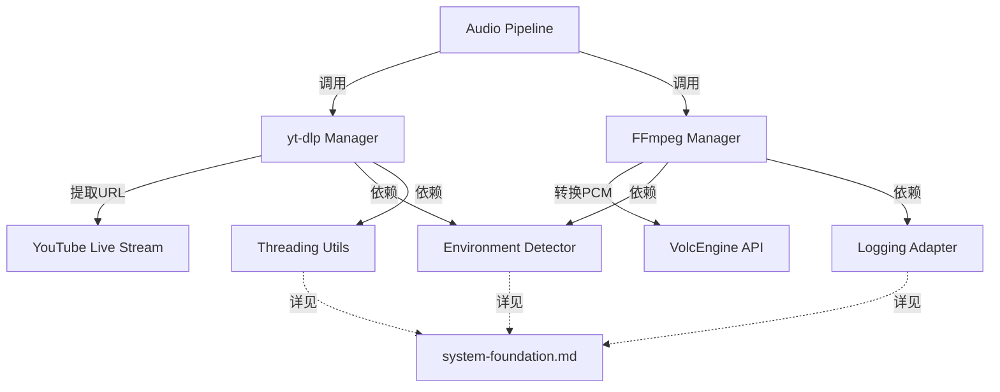

# YouTube/FFmpeg处理模块 AI 重写指导

## 📍 系统集成视图

本文档在整体架构中的位置：**音频基础设施层**

### 文档职责边界
- **本文档职责**：YouTube URL提取、FFmpeg进程管理、HLS协议处理、PCM数据生成
- **被依赖文档**：
  - [audio-pipeline.md](audio-pipeline.md) - 音频管线协调器调用本文档的组件
  - [session-orchestration.md](session-orchestration.md) - 会话管理器间接使用本文档组件
- **依赖文档**：
  - [system-foundation.md](system-foundation.md) - 环境检测、配置管理、日志适配

### 关键集成点


## 概述

本文档专门指导AI重写YouTube音频处理和FFmpeg管理相关模块。这些模块负责从YouTube直播流提取音频并转换为VolcEngine API所需的PCM格式，为上层音频管线提供稳定的音频数据流。重写时必须保持现有的并行处理策略和环境适配逻辑。

## 🎯 模块重写目标

### 涉及的核心模块
1. **infrastructure/ytdlp_manager.py** - yt-dlp库管理器
2. **infrastructure/ffmpeg_manager.py** - FFmpeg进程管理器  

**协调模块**（由其他模块提示词覆盖）：
- **core/audio_pipeline.py** - 音频处理管线协调器
- **adapters/environment_detector.py** - 环境检测和适配

### 重写范围
```python
SOURCE_CODE_MAPPING = {
    "infrastructure/ytdlp_manager.py": {
        "source": "ast_youtube_demo.py:150-250 (YtDlpManager class)",
        "target_lines": "~250行",
        "core_functions": ["extract_stream_url", "warmup", "cleanup"]
    },
    
    "infrastructure/ffmpeg_manager.py": {
        "source": "ast_youtube_demo.py:620-720 + 300-450 (FFmpeg相关)",
        "target_lines": "~350行", 
        "core_functions": ["start_streaming_pipeline", "_monitor_ffmpeg_health", "read_pcm_chunks"]
    }
}
```

## 🔧 infrastructure/ytdlp_manager.py 实现指南

### 核心职责和约束
```python
"""
yt-dlp管理器模块
基于ast_youtube_demo.py:150-250的YtDlpManager类重构

核心职责:
1. YouTube直播URL提取和验证
2. yt-dlp库的单线程池管理和预热机制（避免阻塞事件循环）
3. 提取失败的重试和错误处理
4. 支持多种YouTube URL格式(直播、VOD、短链接等)

架构设计原则:
- 使用单工作线程池（max_workers=1）避免阻塞asyncio事件循环
- 每个容器处理一个youtube_url，通过新容器实现业务并发
- yt-dlp工作特性：同步且I/O主导，偶尔有CPU峰值（签名解密）
- 常驻YoutubeDL实例，减少重复初始化开销
"""

import asyncio
import logging
import concurrent.futures
from typing import Optional, Dict, Any
import yt_dlp
from urllib.parse import urlparse

class YtDlpManager:
    """
    yt-dlp管理器
    基于ast_youtube_demo.py:150-250的实现重构
    """
    
    def __init__(self):
        # 单工作线程池 - 仅用于避免阻塞事件循环，不用于并发处理
        # 架构：一容器一链接，通过新容器实现业务并发
        self.thread_pool = concurrent.futures.ThreadPoolExecutor(
            max_workers=1,  # 关键：单线程池
            thread_name_prefix="ytdlp"
        )
        self.logger = logging.getLogger(__name__)
        self.is_warmed_up = False
        
        # yt-dlp配置 - 基于现有最佳实践
        self.ytdlp_opts = {
            'quiet': True,
            'no_warnings': True,
            'extractaudio': False,  # 我们需要视频流URL而不是音频文件
            'format': 'bestaudio[protocol^=m3u8]/bestaudio/140/91/92/93/94/95/96/best',  # 优先HLS协议
            'noplaylist': True,     # 不处理播放列表
        }
    
    async def initialize(self) -> bool:
        """
        初始化yt-dlp管理器
        """
        try:
            # 预热yt-dlp (基于ast_youtube_demo.py的预热逻辑)
            await self.warmup()
            
            self.logger.info("YtDlpManager initialized successfully")
            return True
            
        except Exception as e:
            self.logger.error(f"YtDlpManager initialization failed: {e}")
            return False
    
    async def warmup(self):
        """
        预热yt-dlp以减少首次使用延迟
        基于ast_youtube_demo.py:180-200的预热机制
        """
        if self.is_warmed_up:
            return
            
        self.logger.info("Warming up yt-dlp...")
        
        try:
            # 使用一个已知的测试URL进行预热
            warmup_url = "https://www.youtube.com/watch?v=dQw4w9WgXcQ"
            
            # 在线程池中执行预热
            loop = asyncio.get_event_loop()
            await loop.run_in_executor(
                self.thread_pool,
                self._extract_url_sync,
                warmup_url
            )
            
            self.is_warmed_up = True
            self.logger.info("yt-dlp warmed up successfully")
            
        except Exception as e:
            self.logger.warning(f"yt-dlp warmup failed (non-critical): {e}")
            # 预热失败不影响正常功能
            self.is_warmed_up = True
    
    async def extract_stream_url(self, youtube_url: str, retry_attempts: int = 3) -> str:
        """
        提取YouTube直播流URL
        基于ast_youtube_demo.py:220-250的URL提取逻辑
        
        Args:
            youtube_url: YouTube页面URL
            retry_attempts: 重试次数
            
        Returns:
            直播流的直接URL
            
        Raises:
            Exception: URL提取失败
        """
        if not self._validate_youtube_url(youtube_url):
            raise ValueError(f"Invalid YouTube URL: {youtube_url}")
            
        for attempt in range(retry_attempts):
            try:
                self.logger.info(f"Extracting stream URL (attempt {attempt + 1}/{retry_attempts})")
                
                # 在线程池中执行yt-dlp操作
                loop = asyncio.get_event_loop()
                stream_url = await loop.run_in_executor(
                    self.thread_pool,
                    self._extract_url_sync,
                    youtube_url
                )
                
                if stream_url:
                    self.logger.info("Stream URL extracted successfully")
                    return stream_url
                else:
                    raise Exception("yt-dlp returned empty URL")
                    
            except Exception as e:
                self.logger.warning(f"URL extraction attempt {attempt + 1} failed: {e}")
                
                if attempt < retry_attempts - 1:
                    # 重试前等待
                    await asyncio.sleep(2 ** attempt)  # 指数退避
                else:
                    # 最后一次尝试失败
                    raise Exception(f"Failed to extract stream URL after {retry_attempts} attempts: {e}")
    
    def _extract_url_sync(self, youtube_url: str) -> Optional[str]:
        """
        同步执行yt-dlp URL提取 (在线程池中运行)
        基于ast_youtube_demo.py的核心提取逻辑
        """
        try:
            with yt_dlp.YoutubeDL(self.ytdlp_opts) as ydl:
                # 提取视频信息
                info = ydl.extract_info(youtube_url, download=False)
                
                # 获取最佳格式的URL
                if 'formats' in info and info['formats']:
                    # 优先选择HLS协议的直播流
                    for fmt in info['formats']:
                        if (fmt.get('protocol', '').startswith('m3u8') and
                            fmt.get('url')):
                            return fmt['url']
                    
                    # 备选: 其他支持的协议格式
                    for fmt in info['formats']:
                        if fmt.get('url') and fmt.get('protocol') in ['https', 'http', 'hls']:
                            return fmt['url']
                
                # 尝试获取直接URL
                if info.get('url'):
                    return info['url']
                    
                return None
                
        except Exception as e:
            self.logger.error(f"yt-dlp extraction error: {e}")
            return None
    
    def _validate_youtube_url(self, url: str) -> bool:
        """
        验证YouTube URL格式
        """
        try:
            parsed = urlparse(url)
            valid_domains = ['youtube.com', 'www.youtube.com', 'm.youtube.com', 'youtu.be']
            
            return (parsed.scheme in ['http', 'https'] and 
                    any(domain in parsed.netloc for domain in valid_domains))
        except:
            return False
    
    async def cleanup(self):
        """清理资源"""
        if self.thread_pool:
            self.thread_pool.shutdown(wait=True)
            self.logger.info("YtDlpManager cleaned up")
```

## 🔧 infrastructure/ffmpeg_manager.py 实现指南  

### 核心实现要求
```python
"""
FFmpeg进程管理器
基于ast_youtube_demo.py:620-720和300-450的FFmpeg管理逻辑重构

CRITICAL CONSTRAINTS:
- PCM输出格式必须严格为: 16kHz, 16bit, mono, 640字节块
- 必须支持本地和Cloudflare环境的不同FFmpeg参数
- 必须实现进程健康监控和异常恢复
- 必须处理stderr日志输出的环境适配
"""

import asyncio
import subprocess
import logging
from typing import List, Optional, AsyncGenerator
from pathlib import Path
import os

class FFmpegManager:
    """
    FFmpeg进程管理器
    基于ast_youtube_demo.py的FFmpeg处理逻辑重构
    """
    
    def __init__(self, audio_config):
        self.audio_config = audio_config
        self.logger = logging.getLogger(__name__)
        
        # 进程管理
        self.ffmpeg_process: Optional[subprocess.Popen] = None
        self.stderr_log_file: Optional[object] = None
        
        # 状态管理
        self.is_initialized = False
        self.is_running = False
        
        # 监控任务
        self.health_monitor_task: Optional[asyncio.Task] = None
        self.stderr_monitor_task: Optional[asyncio.Task] = None
    
    async def initialize(self, stream_url: str) -> bool:
        """
        初始化FFmpeg管理器
        
        Args:
            stream_url: 来自yt-dlp的直播流URL
        """
        try:
            # 环境适配的FFmpeg命令构建
            self.ffmpeg_cmd, self.stderr_log_path = self._build_ffmpeg_command(stream_url)
            
            self.is_initialized = True
            self.logger.info("FFmpeg manager initialized")
            return True
            
        except Exception as e:
            self.logger.error(f"FFmpeg manager initialization failed: {e}")
            return False
    
    def _build_ffmpeg_command(self, stream_url: str) -> tuple[List[str], Optional[str]]:
        """
        构建环境适配的FFmpeg命令
        基于ast_youtube_demo.py:695-720的命令构建逻辑
        """
        from adapters.environment_detector import detect_environment
        
        env = detect_environment()
        
        # 基础命令参数
        base_cmd = [
            "ffmpeg",
            "-hide_banner",
            "-fflags", "nobuffer",  # 超低延迟
            "-flags", "low_delay",
            "-i", stream_url,
            
            # 音频输出参数 - CRITICAL: 这些参数不得修改
            "-ac", "1",                    # 单声道
            "-ar", str(self.audio_config.sample_rate),  # 16000 Hz
            "-acodec", "pcm_s16le",       # 16位小端PCM
            "-f", "s16le",                # 原始PCM输出格式
            
            # 性能优化参数
            "-preset", "ultrafast",
            "-tune", "zerolatency",
            "-bufsize", "32k",
            
            "pipe:1"  # 输出到stdout
        ]
        
        # 环境特定参数调整
        if env.startswith("cloudflare"):
            # Cloudflare环境: 简化参数，仅stderr输出
            cmd = base_cmd[:]
            cmd.insert(2, "-loglevel")
            cmd.insert(3, "error")  # 仅输出错误日志
            stderr_log_path = None
            
        else:
            # 本地环境: 详细参数，文件日志
            cmd = base_cmd[:]
            cmd.insert(2, "-loglevel")
            cmd.insert(3, "verbose")  # 详细日志
            
            # 创建日志目录
            log_dir = Path("logs/ffmpeg")
            log_dir.mkdir(parents=True, exist_ok=True)
            
            import time
            timestamp = int(time.time())
            stderr_log_path = str(log_dir / f"ffmpeg_stderr_{timestamp}.log")
            
        return cmd, stderr_log_path
    
    async def start_process(self) -> bool:
        """
        启动FFmpeg进程
        基于ast_youtube_demo.py:750-800的进程启动逻辑
        """
        if not self.is_initialized:
            raise RuntimeError("FFmpeg manager not initialized")
            
        try:
            # 打开stderr日志文件(如果需要)
            stderr_target = None
            if self.stderr_log_path:
                self.stderr_log_file = open(self.stderr_log_path, 'w')
                stderr_target = self.stderr_log_file
            else:
                stderr_target = subprocess.PIPE
            
            # 启动FFmpeg进程
            self.ffmpeg_process = await asyncio.create_subprocess_exec(
                *self.ffmpeg_cmd,
                stdout=asyncio.subprocess.PIPE,
                stderr=stderr_target,
                stdin=asyncio.subprocess.DEVNULL
            )
            
            self.is_running = True
            
            # 启动监控任务
            self._start_monitoring_tasks()
            
            self.logger.info(f"FFmpeg process started (PID: {self.ffmpeg_process.pid})")
            return True
            
        except Exception as e:
            self.logger.error(f"Failed to start FFmpeg process: {e}")
            await self._cleanup_process()
            return False
    
    def _start_monitoring_tasks(self):
        """启动FFmpeg进程监控任务"""
        # 健康监控
        self.health_monitor_task = asyncio.create_task(
            self._monitor_ffmpeg_health()
        )
        
        # stderr监控(仅Cloudflare环境)
        from adapters.environment_detector import detect_environment
        if detect_environment().startswith("cloudflare"):
            self.stderr_monitor_task = asyncio.create_task(
                self._monitor_stderr_stream()
            )
    
    async def read_pcm_chunks(self) -> AsyncGenerator[bytes, None]:
        """
        读取PCM音频块
        基于ast_youtube_demo.py:850-950的音频块读取逻辑
        
        CRITICAL: 每个块必须严格为640字节
        """
        if not self.ffmpeg_process or not self.is_running:
            raise RuntimeError("FFmpeg process not running")
            
        chunk_size = self.audio_config.chunk_size  # 640字节
        chunk_count = 0
        
        try:
            while self.is_running:
                # 读取固定大小的PCM块
                chunk = await asyncio.wait_for(
                    self.ffmpeg_process.stdout.read(chunk_size),
                    timeout=10  # 10秒超时
                )
                
                if not chunk:
                    self.logger.info("FFmpeg stdout ended")
                    break
                    
                if len(chunk) != chunk_size:
                    self.logger.warning(
                        f"Unexpected chunk size: {len(chunk)} (expected {chunk_size})"
                    )
                    continue
                
                chunk_count += 1
                
                # 第一个音频块的特殊处理
                if chunk_count == 1:
                    self.logger.info("First PCM chunk received from FFmpeg")
                
                yield chunk
                
        except asyncio.TimeoutError:
            self.logger.error("FFmpeg PCM read timeout")
        except Exception as e:
            self.logger.error(f"Error reading PCM chunks: {e}")
        finally:
            self.logger.info(f"Processed {chunk_count} PCM chunks total")
    
    async def _monitor_ffmpeg_health(self):
        """
        监控FFmpeg进程健康状态
        基于ast_youtube_demo.py:1450-1500的健康监控逻辑
        """
        try:
            while self.is_running and self.ffmpeg_process:
                # 检查进程是否仍在运行
                if self.ffmpeg_process.poll() is not None:
                    # 进程已终止
                    return_code = self.ffmpeg_process.returncode
                    self.logger.error(f"FFmpeg process terminated with code {return_code}")
                    self.is_running = False
                    break
                
                # 等待5秒后再次检查
                await asyncio.sleep(5)
                
        except asyncio.CancelledError:
            pass
        except Exception as e:
            self.logger.error(f"FFmpeg health monitoring error: {e}")
    
    async def _monitor_stderr_stream(self):
        """
        监控stderr流(Cloudflare环境)
        基于ast_youtube_demo.py的stderr监控逻辑
        """
        try:
            if not self.ffmpeg_process or not self.ffmpeg_process.stderr:
                return
                
            while self.is_running:
                line = await self.ffmpeg_process.stderr.readline()
                if not line:
                    break
                    
                line_str = line.decode('utf-8', errors='ignore').strip()
                if line_str:
                    # Cloudflare环境输出到stderr with prefix
                    import sys
                    print(f"CLOUDFLARE_FFMPEG: {line_str}", file=sys.stderr)
                    
                    # 检查错误关键词
                    if any(keyword in line_str.lower() 
                           for keyword in ['error', 'fatal', 'failed']):
                        self.logger.error(f"FFmpeg error detected: {line_str}")
                        
        except asyncio.CancelledError:
            pass
        except Exception as e:
            self.logger.error(f"FFmpeg stderr monitoring error: {e}")
    
    async def stop(self):
        """停止FFmpeg进程"""
        self.is_running = False
        
        # 取消监控任务
        if self.health_monitor_task:
            self.health_monitor_task.cancel()
        if self.stderr_monitor_task:
            self.stderr_monitor_task.cancel()
            
        await self._cleanup_process()
    
    async def _cleanup_process(self):
        """清理FFmpeg进程和相关资源"""
        if self.ffmpeg_process:
            try:
                # 尝试优雅终止
                self.ffmpeg_process.terminate()
                
                try:
                    await asyncio.wait_for(self.ffmpeg_process.wait(), timeout=5)
                except asyncio.TimeoutError:
                    # 强制杀死
                    self.ffmpeg_process.kill()
                    await self.ffmpeg_process.wait()
                    
            except Exception as e:
                self.logger.error(f"Error cleaning up FFmpeg process: {e}")
            finally:
                self.ffmpeg_process = None
        
        # 关闭日志文件
        if self.stderr_log_file:
            try:
                self.stderr_log_file.close()
            except:
                pass
            self.stderr_log_file = None
            
        self.logger.info("FFmpeg process cleaned up")
```

## 🔧 模块协调说明

### 与其他模块的协调
本模块专注于基础设施层的实现，与其他模块的协调关系：

1. **core/audio_pipeline.py** - 音频管线协调器将调用本模块的组件
2. **adapters/environment_detector.py** - 环境检测器为本模块提供环境适配信息

这些模块的实现将在相应的模块提示词中详细说明。

## 🚨 关键实现约束

### 音频参数约束 (绝对不可修改)
```python
CRITICAL_AUDIO_CONSTRAINTS = {
    "chunk_size": 640,              # 精确640字节，与VolcEngine协议绑定
    "sample_rate": 16000,           # 精确16kHz，协议要求
    "bit_depth": 16,                # 16位PCM，协议要求
    "channels": 1,                  # 单声道，协议要求
    "send_interval": 0.02,          # 20毫秒间隔，协议同步要求
    "audio_format": "pcm_s16le"     # 小端16位PCM，不得更改
}
```

### 环境适配约束
```python
ENVIRONMENT_ADAPTATION_CONSTRAINTS = {
    "local_environment": {
        "ffmpeg_log_level": "verbose",
        "stderr_to_file": True,
        "silence_timeout": 8,
        "file_monitoring": True
    },
    "cloudflare_environment": {
        "ffmpeg_log_level": "error",
        "stderr_to_pipe": True,
        "stderr_prefix": "CLOUDFLARE_FFMPEG:",
        "silence_timeout": 18,
        "file_monitoring": False
    }
}
```

### 静音桥接约束
```python
SILENCE_BRIDGE_CONSTRAINTS = {
    "purpose": "在FFmpeg就绪前保持VolcEngine连接活跃",
    "mechanism": "发送640字节零值数据块",
    "coordination": "使用asyncio.Event同步真实音频到达",
    "timeout_strategy": "环境适配超时(本地8s，Cloudflare18s)",
    "critical_timing": "首个真实音频块到达时立即停止静音发送"
}
```

## 📋 模块实现检查清单

### YtDlpManager检查项
- [ ] 是否实现了单线程池管理（max_workers=1，避免阻塞事件循环）
- [ ] 是否实现了预热机制  
- [ ] 是否支持多种YouTube URL格式
- [ ] 是否实现了重试和错误处理
- [ ] 是否正确提取了直播流URL（优先HLS/m3u8协议）
- [ ] 是否避免了不必要的并发处理逻辑（一容器一链接架构）

### FFmpegManager检查项
- [ ] PCM输出参数是否严格为640字节/16kHz/16bit/mono
- [ ] 是否实现了环境适配的命令构建
- [ ] 是否实现了进程健康监控
- [ ] 是否正确处理了stderr日志输出
- [ ] 是否实现了优雅的进程终止

### AudioPipeline检查项  
- [ ] 是否实现了组件并行初始化
- [ ] 静音桥接协调是否精确实现
- [ ] 音频块读取是否严格20ms间隔
- [ ] 首个音频块是否正确触发静音停止
- [ ] 错误处理和资源清理是否完整

### 环境适配检查项
- [ ] 本地环境是否支持文件日志
- [ ] Cloudflare环境是否仅stderr输出
- [ ] 超时参数是否环境适配
- [ ] 资源限制是否符合环境约束

---

**重要提醒**: 
- 音频处理参数(640字节、16kHz等)是与VolcEngine API协议绑定的，任何修改都会导致协议错误
- 静音桥接机制是系统稳定性的关键，必须精确实现时机控制
- 环境适配逻辑必须正确实现，确保本地和Cloudflare环境都能正常工作

**文档版本**: v1.0.0  
**关联文档**: [AI重写主要提示词](../master-prompt.md) | [约束条件速查](../constraints-reference.md)  
**最后更新**: 2025-01-XX